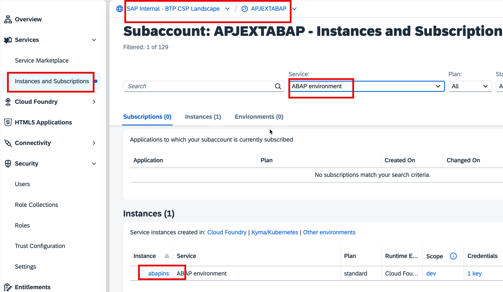
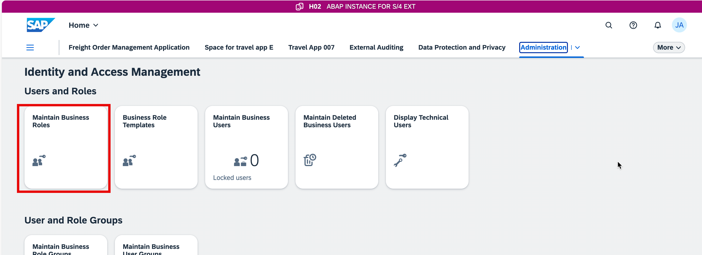
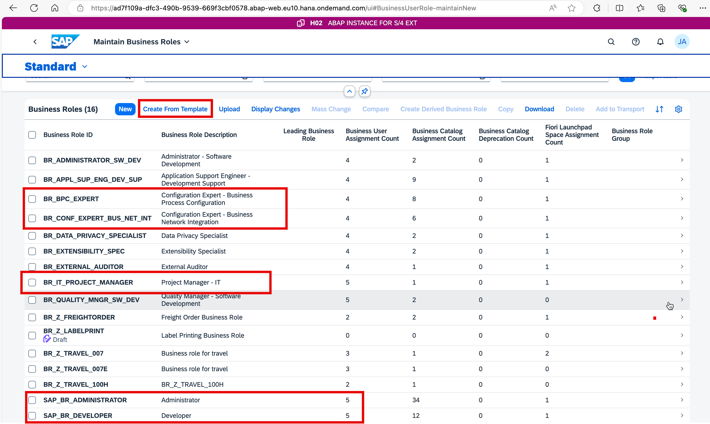
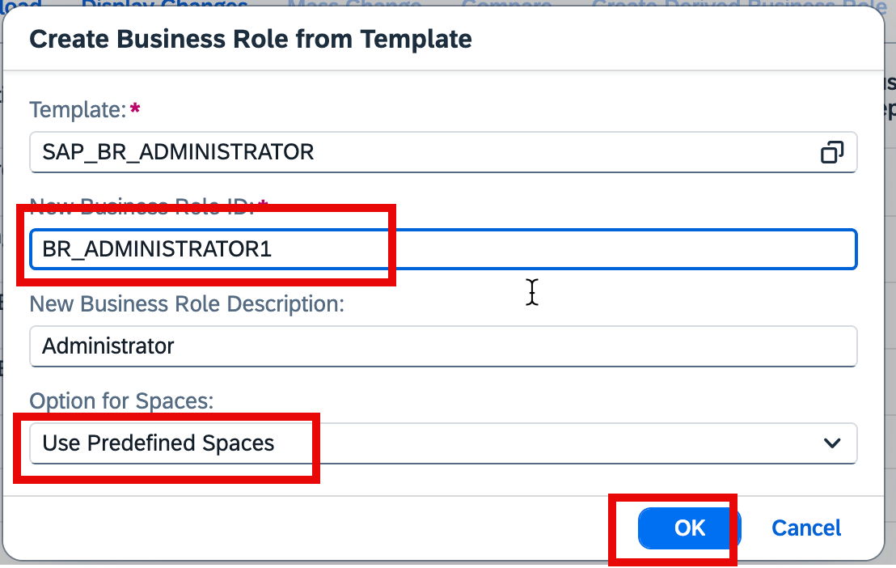
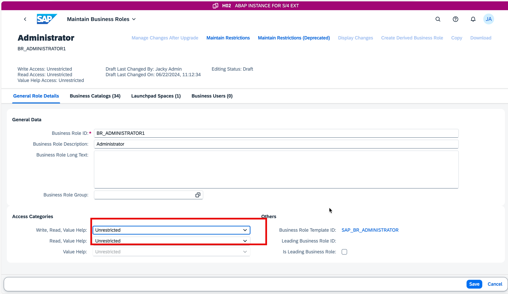
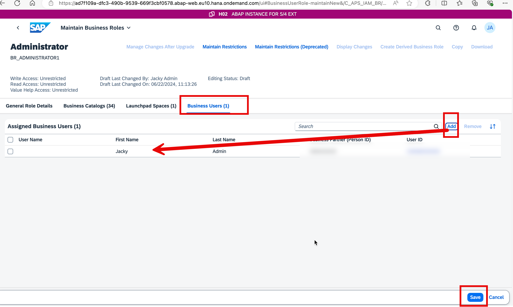
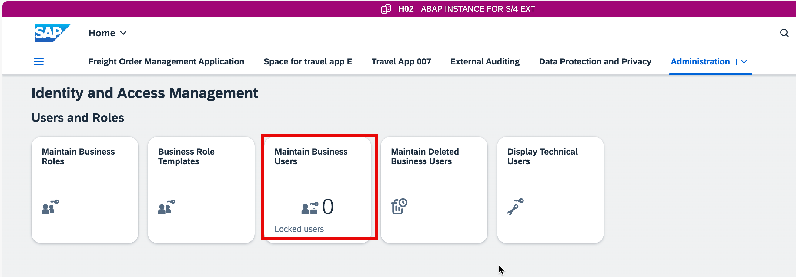
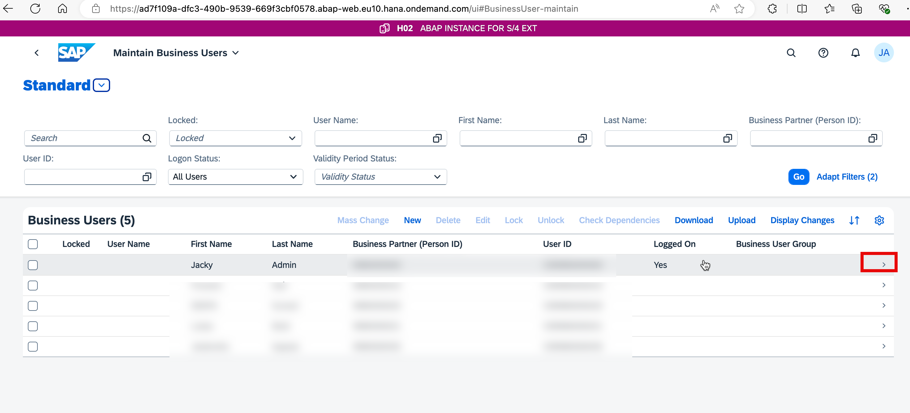
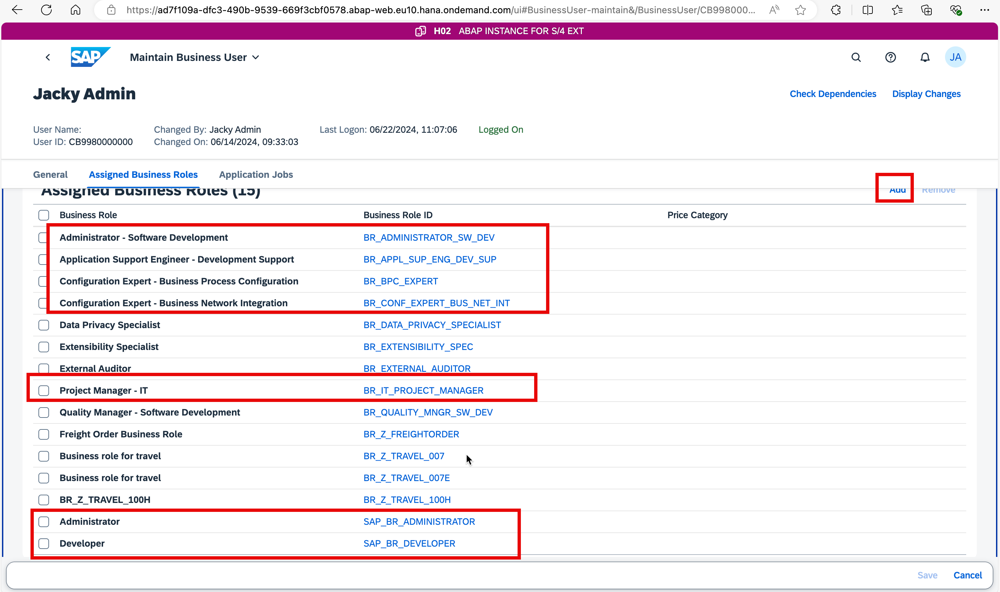

## Step 1: Check your prerequisites:

- Your SAP S/4HANA Cloud has gone alive or is planned to go live.
- [SAP BTP ABAP environment](https://discovery-center.cloud.sap/serviceCatalog/abap-environment?region=all&tab=service_plan) under SAP BTPEA/PayAsYouGo
- [SAP Business Application Studio](https://discovery-center.cloud.sap/serviceCatalog/business-application-studio?region=all&tab=service_plan) under SAP BTPEA/PayAsYouGo/Subscription/Trial
- [SAP Forms Service by Adobe](https://discovery-center.cloud.sap/serviceCatalog/forms-service-by-adobe?region=all) under SAP BTPEA/PayAsYouGo
- You have downloaded and installed the latest [ABAP Development Tools (ADT)](https://tools.hana.ondemand.com/#abap) on the latest Eclipse© platform.
- You have created an[ABAP Cloud Project](https://developers.sap.com/tutorials/abap-environment-create-abap-cloud-project.html).
- You have [set up your SAP Business Application Studio for Development](https://developers.sap.com/tutorials/appstudio-onboarding.html)

## Step 2: Create roles from role template in SAP BTP ABAP Environment:

After input your username and password:

Make sure the following roles exist,if they are missing ,click **Create From Template** to create them.

## Step 3: Assign the roles to your user account in SAP BTP ABAP Environment.

Make sure the following roles has been assigned to your user account. If not, click **Add** to add the missing roles.

