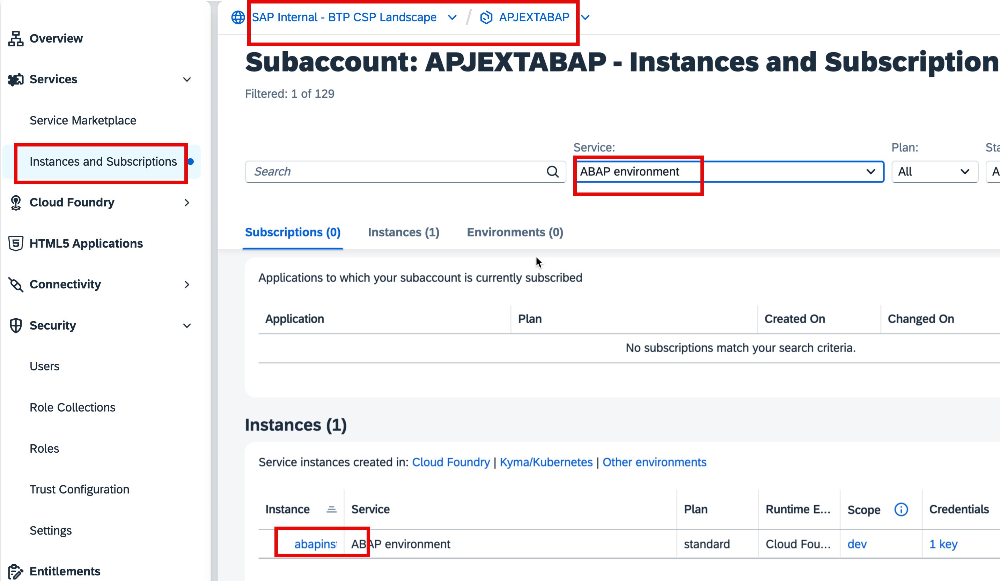
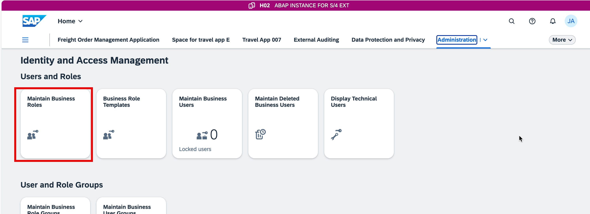
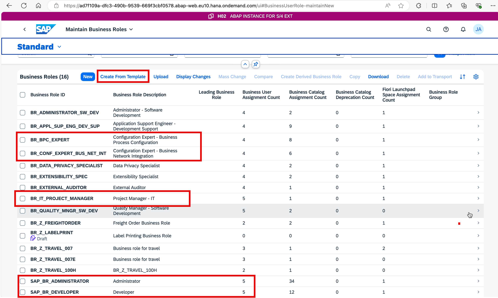
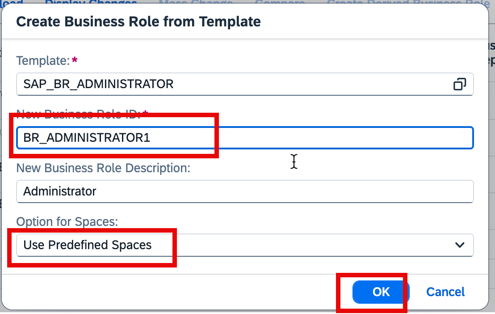
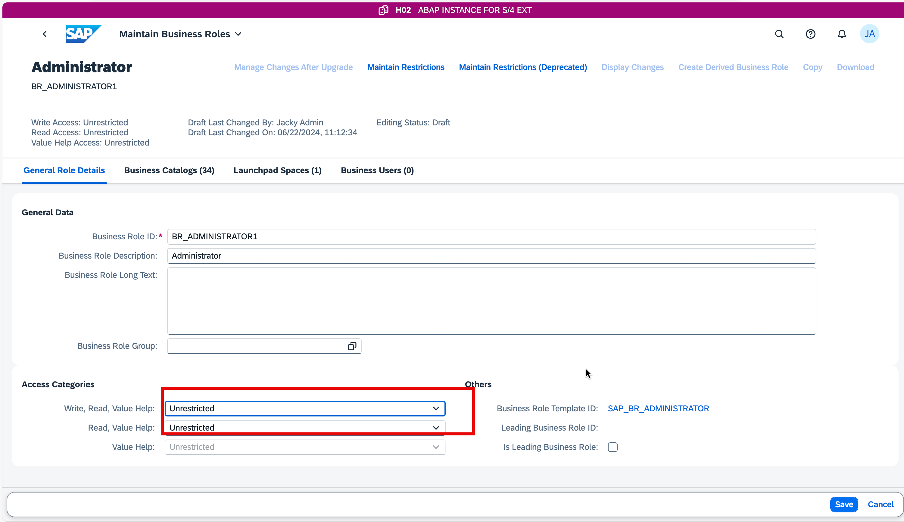
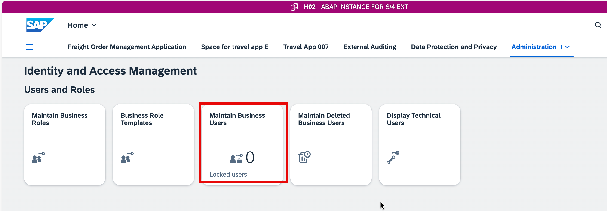
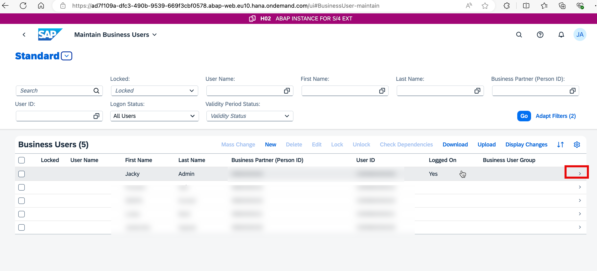
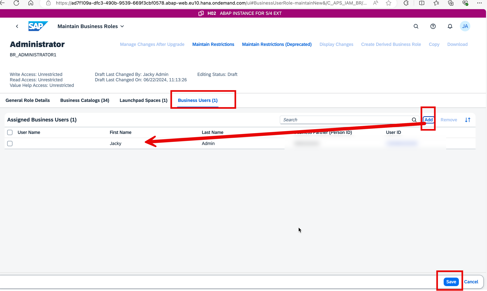
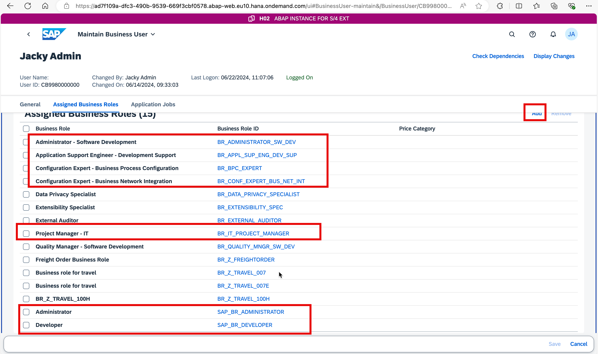

# Prerequisites

Before starting the exercises, make sure all of the following requirements are in place. Skipping any of these will block you at a later step.

---

## Step 1: Verify Service and Tool Requirements

Confirm that each of the following is available in your landscape:

| Requirement | Notes |
|-------------|-------|
| SAP S/4HANA Cloud | Your system has gone live or is planned to go live |
| [SAP BTP ABAP Environment](https://discovery-center.cloud.sap/serviceCatalog/abap-environment?region=all&tab=service_plan) | Available under SAP BTPEA or Pay-As-You-Go |
| [SAP Business Application Studio](https://discovery-center.cloud.sap/serviceCatalog/business-application-studio?region=all&tab=service_plan) | Available under SAP BTPEA, Pay-As-You-Go, Subscription, or Trial |
| [SAP Forms Service by Adobe](https://discovery-center.cloud.sap/serviceCatalog/forms-service-by-adobe?region=all) | Available under SAP BTPEA or Pay-As-You-Go |
| [ABAP Development Tools (ADT)](https://tools.hana.ondemand.com/#abap) | Latest version installed on the latest Eclipse platform |
| [ABAP Cloud Project](https://developers.sap.com/tutorials/abap-environment-create-abap-cloud-project.html) | Connected to your BTP ABAP Environment instance |
| [SAP Business Application Studio](https://developers.sap.com/tutorials/appstudio-onboarding.html) | Set up and ready for development |

---

## Step 2: Create Business Roles from Templates in the BTP ABAP Environment

The BTP ABAP Environment requires certain business roles to exist before you can perform administrative tasks. In this step you will verify that the required roles are present and create any that are missing from the standard templates.

### Open the BTP ABAP Environment Fiori Launchpad

In the BTP Cockpit, navigate to **Services → Instances and Subscriptions**, find your ABAP Environment instance and open its Fiori Launchpad.

Sign in with your username and password. Once logged in, go to **Administration → Maintain Business Roles**.

### Check Which Roles Exist

The **Maintain Business Roles** app lists all business roles currently defined in the system. Check that the following roles are present:

| Business Role ID | Description |
|-----------------|-------------|
| `BR_Z_LABELPRINT` | Label Printing Business Role |
| `SAP_BR_ADMINISTRATOR` | Administrator |
| `SAP_BR_DEVELOPER` | Developer |

If any of these roles are missing, click **Create From Template**, select the corresponding template, accept the suggested Role ID and description, and click **OK**.

After creating a role from a template, open it and set both **Write, Read, Value Help** and **Read, Value Help** access categories to **Unrestricted**, then click **Save**.

---

## Step 3: Assign Business Roles to Your User Account

Once the required roles exist, you need to assign them to your user account so that the Fiori Launchpad shows the correct apps.

### Open the Maintain Business Users App

In the **Administration** section of the Fiori Launchpad, click **Maintain Business Users**.

Find your user in the list and click the arrow (`>`) on the right to open the user details.

### Assign the Required Roles

Go to the **Assigned Business Roles** tab and click **Add**. Assign all roles listed in Step 2, then click **Save**.

### Verify the Assigned Roles

After saving, confirm that your user's **Assigned Business Roles** tab shows all required roles. If any are still missing, click **Add** again to add them.

| Business Role ID | Purpose |
|-----------------|---------|
| `BR_Z_LABELPRINT` | Grants access to the label printing Fiori app |
| `SAP_BR_ADMINISTRATOR` | Grants access to Communication Systems, Communication Arrangements, and Print Queue apps |
| `SAP_BR_DEVELOPER` | Grants access to developer tools used in later exercises |

---

## Result

Your BTP ABAP Environment is now configured with the correct business roles and your user account has the permissions needed to complete all subsequent exercises. You are ready to begin with **Exercise 01**.
