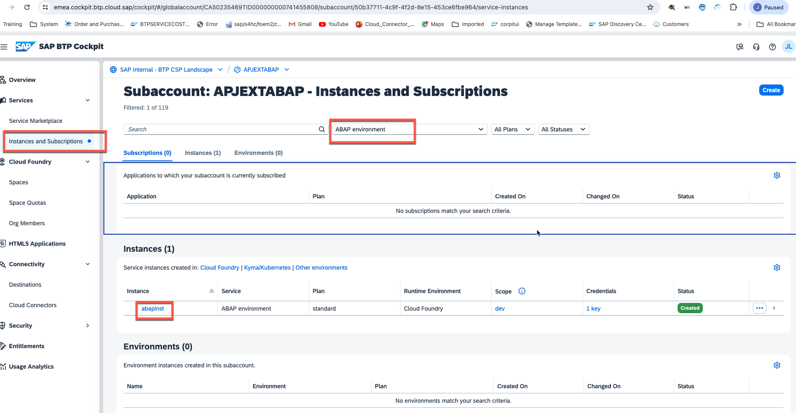
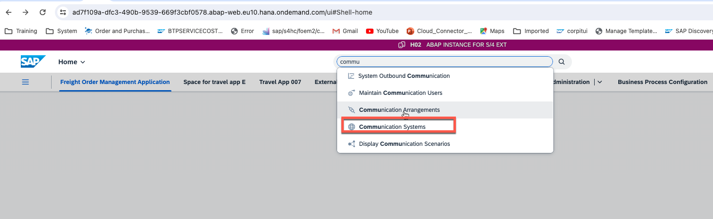
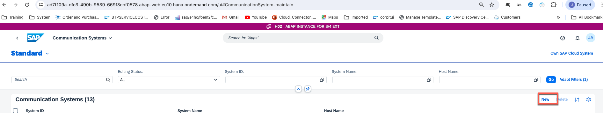
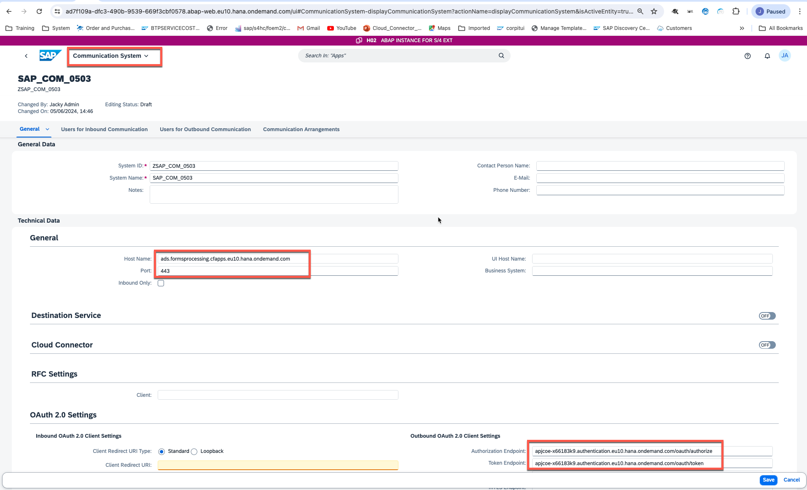
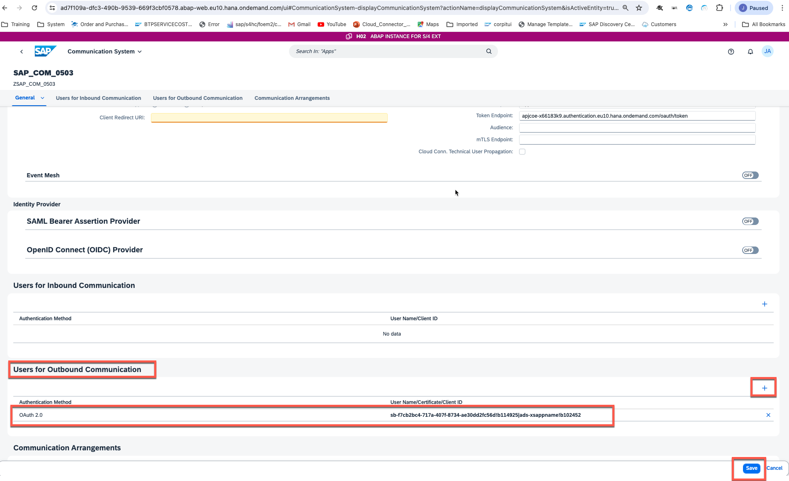
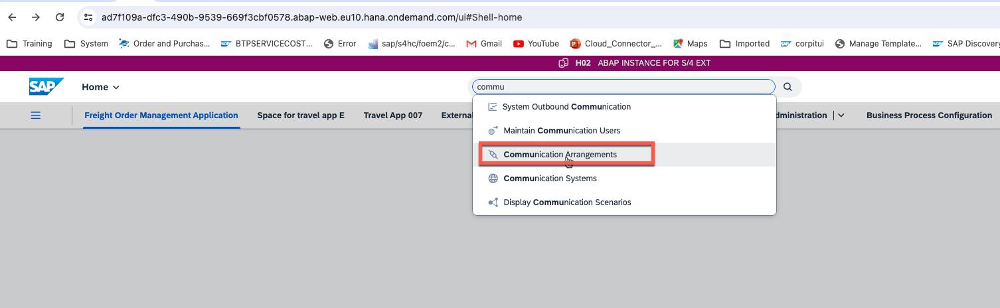
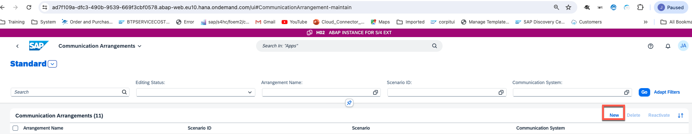
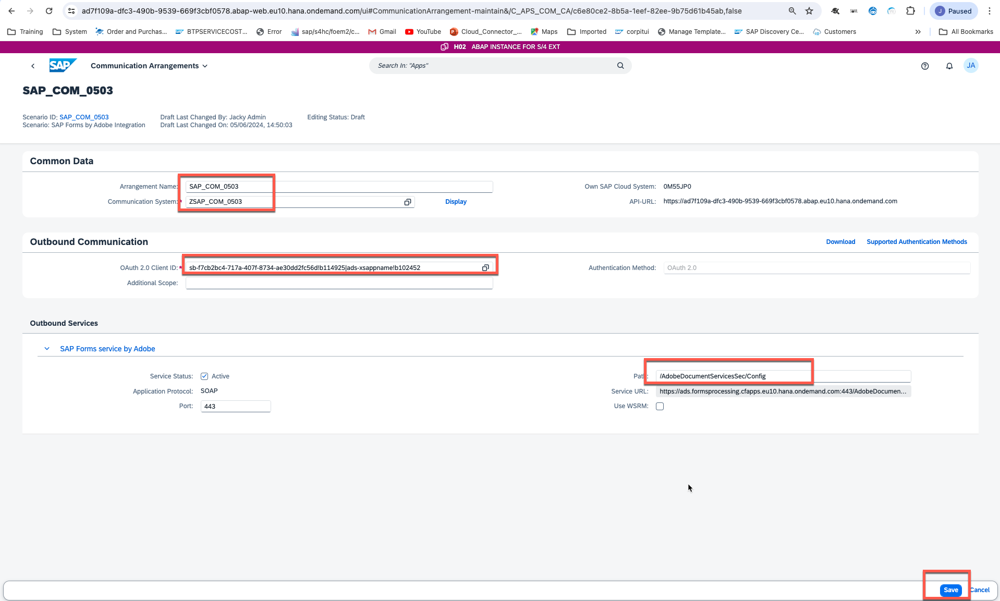

### Prerequisites:
- You have [Created an SAP BTP ABAP Environment](https://developers.sap.com/tutorials/abap-environment-trial-onboarding.html) 
You have downloaded and installed the latest [ABAP Development Tools (ADT)](https://developers.sap.com/tutorials/abap-install-adt.html).

Navigate to app: Maintain Communication Users and create a new user with username + password (used for accessing the print queue)
Navigate to app: Communication Systems
Create a new communication system (to connect to Forms Service by Adobe service instance)
System ID: any name
System Name: any name
Host Name: uri in service key
Auth. Endpoint: uaa.url in service key>/oauth/authorize
Token Endpoint: uaa.url in service key>/oauth/token
Create new Users for Outbound Communication:
Authentication Method: OAuth 2.0
OAuth 2.0 Client ID: uaa.clientid in service key
Client Secret: uaa.clientsecret in service key
Save the system

Navigate to app: Communication Arrangement
Create a new communication arrangement (scenario: SAP_COM_0503):
Communication System: System that connects to Forms Service by Adobe service instance
OAuth 2.0 Client ID: Should be auto selected
Path: /AdobeDocumentServicesSec/Config

