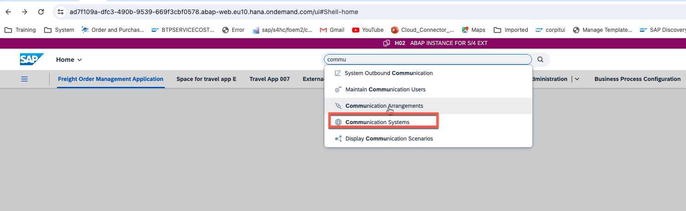
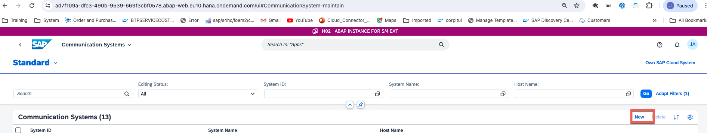
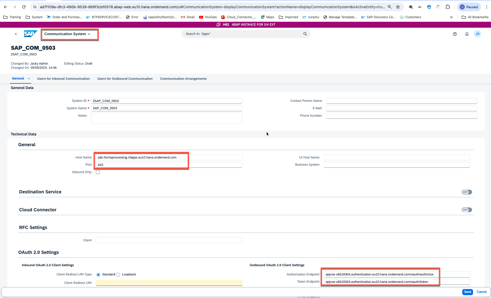
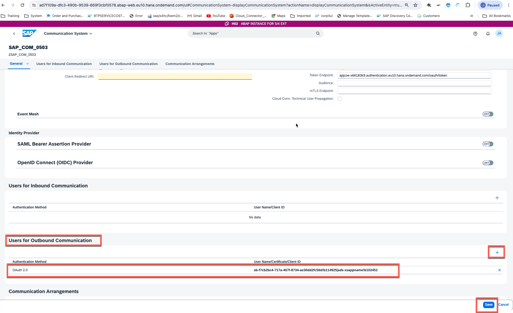
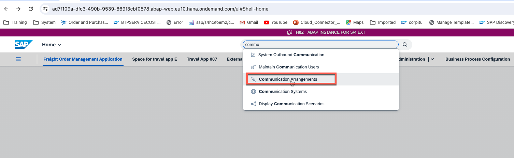
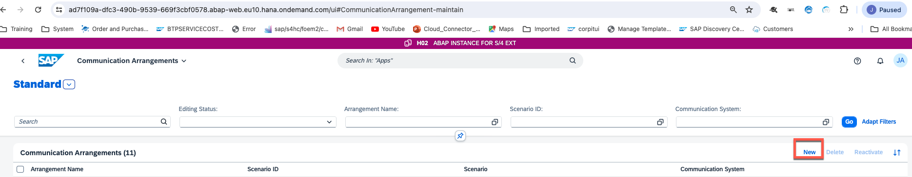
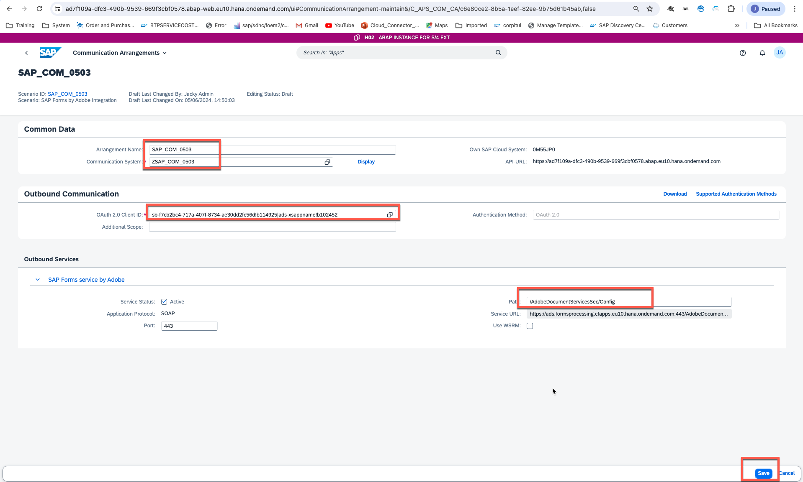

# Exercise 02: Configure the BTP ABAP Environment for SAP Forms Service by Adobe

In this exercise you will configure your **BTP ABAP Environment** Fiori Launchpad so that it can call the SAP Forms Service by Adobe. This requires two tasks:

1. **Create a Communication System** — registers the Forms Service endpoint and its OAuth 2.0 credentials
2. **Create a Communication Arrangement** — binds the Communication System to scenario `SAP_COM_0503` (SAP Forms by Adobe Integration)

You will need the **service key** of your SAP Forms Service by Adobe instance from the BTP cockpit. Keep it open — several field values are copied directly from it.

---

## Prerequisites

- You have [created a BTP ABAP Environment](https://developers.sap.com/tutorials/abap-environment-trial-onboarding.html) instance.
- You have downloaded and installed the latest [ABAP Development Tools (ADT)](https://developers.sap.com/tutorials/abap-install-adt.html).
- You have a service key for your SAP Forms Service by Adobe instance. The key contains the following values you will need:
  - `uri` — the host name of the Forms Service
  - `uaa.url` — the base URL for OAuth 2.0 endpoints
  - `uaa.clientid` — the OAuth 2.0 client ID
  - `uaa.clientsecret` — the OAuth 2.0 client secret

---

## Part 1: Create a Communication System

The Communication System entry registers the Forms Service host and its OAuth 2.0 credentials so the BTP ABAP Environment knows how to authenticate outbound calls.

### Step 1: Open the Communication Systems App

Open the BTP ABAP Environment Fiori Launchpad. In the search bar, type `commu` and select **Communication Systems** from the results.

On the **Communication Systems** list page, click **New**.

---

### Step 2: Fill in the General and Technical Data

Enter a **System ID** and **System Name** of your choice, then fill in the **Technical Data** fields using values from your Forms Service service key:

| Field | Value |
|-------|-------|
| System ID | Any descriptive name (e.g. `ZSAP_COM_0503`) |
| System Name | Any descriptive name |
| Host Name | `uri` value from the service key |
| Port | `443` |
| Authorization Endpoint | `<uaa.url>/oauth/authorize` |
| Token Endpoint | `<uaa.url>/oauth/token` |

---

### Step 3: Add a User for Outbound Communication

Scroll down to the **Users for Outbound Communication** section and click **+** to add a new entry.

| Field | Value |
|-------|-------|
| Authentication Method | `OAuth 2.0` |
| OAuth 2.0 Client ID | `uaa.clientid` value from the service key |
| Client Secret | `uaa.clientsecret` value from the service key |

Click **Save** to create the Communication System.

---

## Part 2: Create a Communication Arrangement

The Communication Arrangement links the Communication System you just created to the standard SAP scenario `SAP_COM_0503`, which represents the SAP Forms by Adobe integration contract.

### Step 4: Open the Communication Arrangements App

In the Fiori Launchpad search bar, type `commu` and select **Communication Arrangements**.

On the **Communication Arrangements** list page, click **New**.

---

### Step 5: Configure the Communication Arrangement

In the new arrangement form, fill in the fields as follows:

| Field | Value |
|-------|-------|
| Scenario | `SAP_COM_0503` (SAP Forms by Adobe Integration) |
| Arrangement Name | `SAP_COM_0503` (or any descriptive name) |
| Communication System | The Communication System created in Part 1 |
| OAuth 2.0 Client ID | Auto-populated from the Communication System |
| Path | `/AdobeDocumentServicesSec/Config` |

Confirm that the **Service Status** under **Outbound Services** shows **Active** and that the **Service URL** resolves to your Forms Service host.

Click **Save**.

---

## Result

You have connected your BTP ABAP Environment to the SAP Forms Service by Adobe. The Communication Arrangement `SAP_COM_0503` will be used in **Exercise 11** when the `render` function in the behavior implementation class `ZBP_OBJ_DN` calls `cl_fp_ads_util=>render_4_pq` to generate label PDFs.
