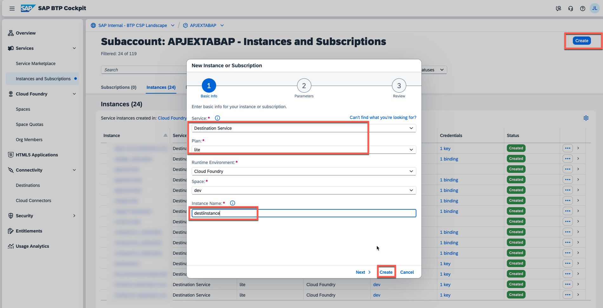
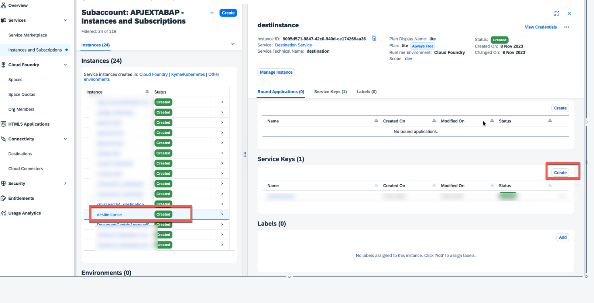
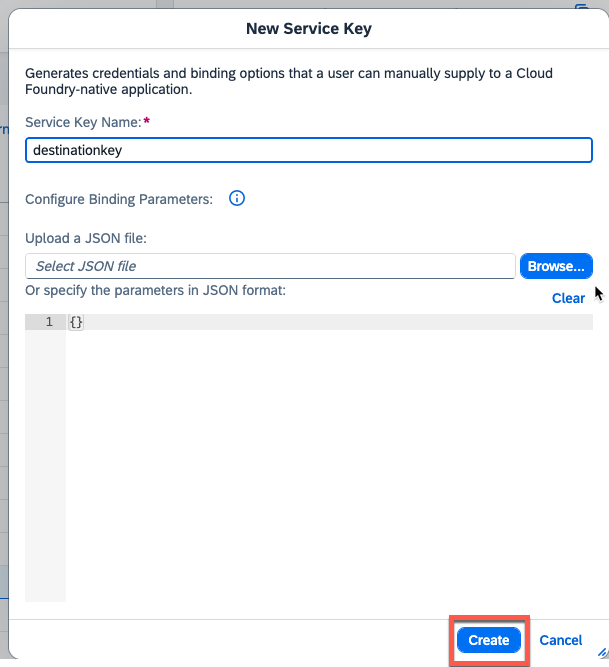
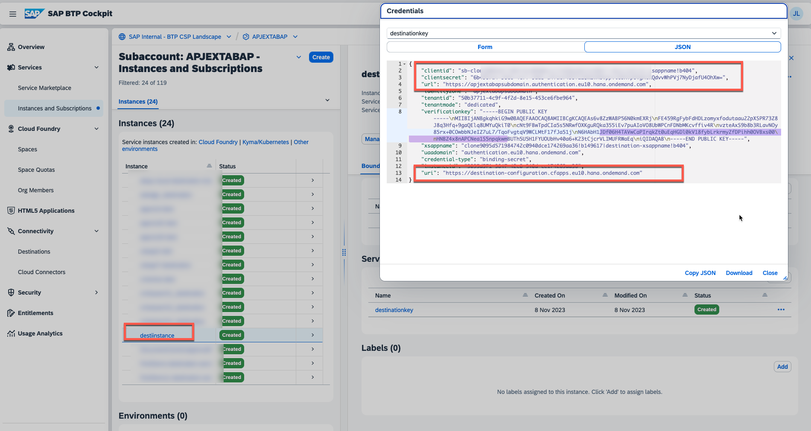
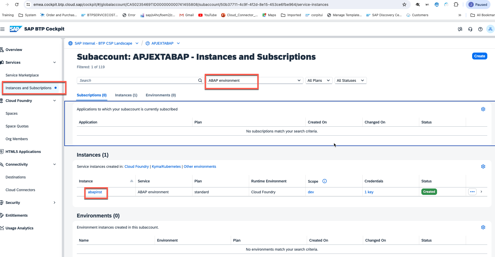
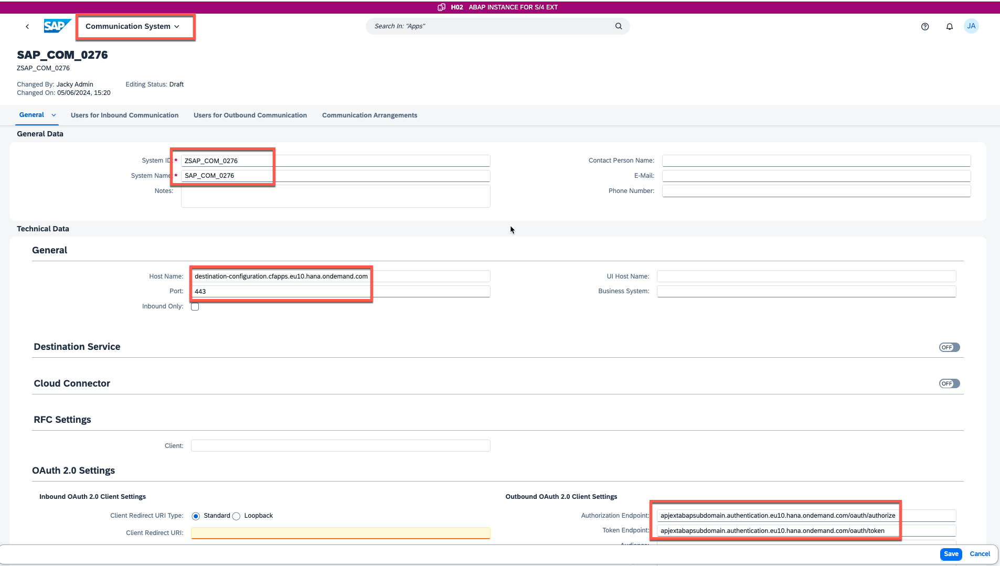
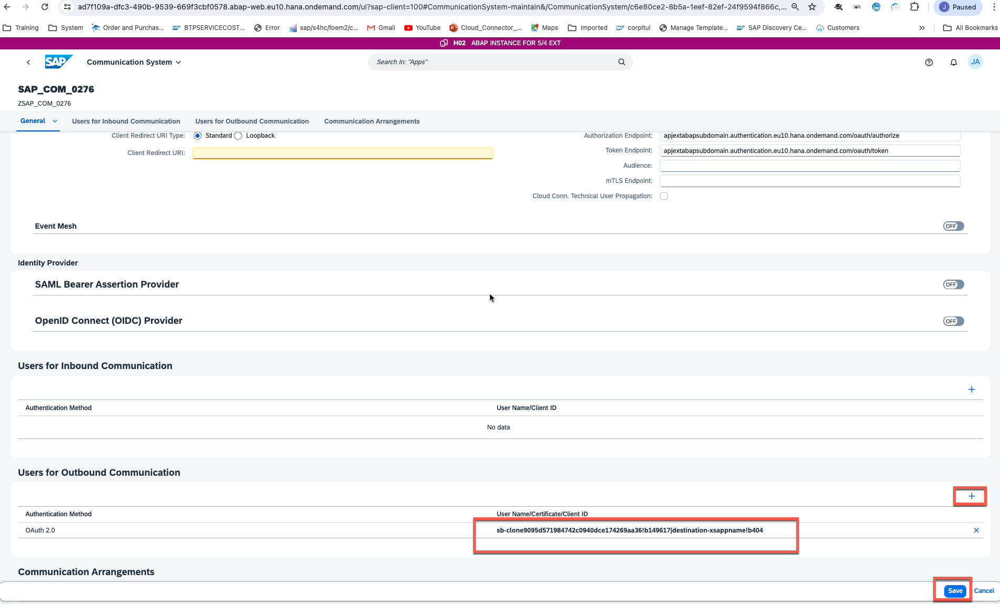
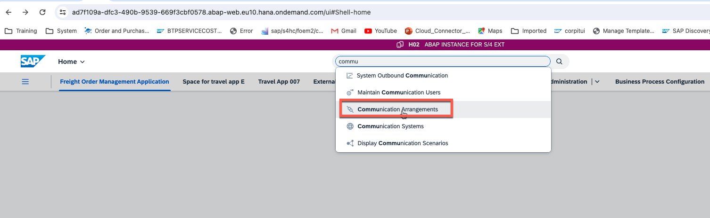
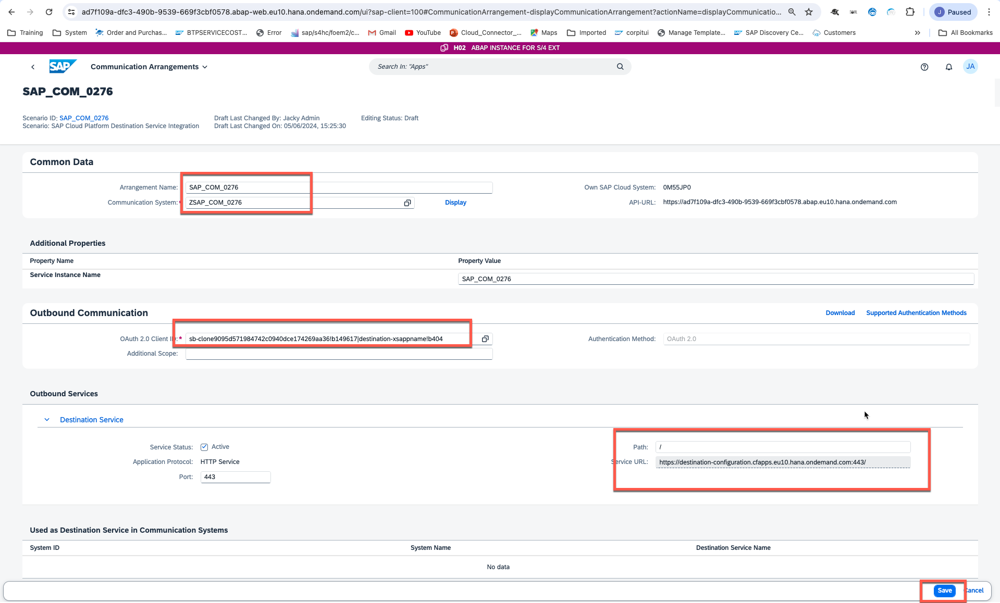

# Exercise 03: Set Up the SAP Destination Service

In this exercise you will set up the **SAP Destination Service** so that the BTP ABAP Environment can resolve named HTTP destinations at runtime. This is required by `ZCL_FP_TMPL_STORE_CLIENT` (Exercise 15), which uses the Destination Service to locate the SAP Forms Template Store endpoint.

The exercise has two parts:

1. **Create a Destination Service instance and service key** in the SAP BTP Cockpit
2. **Create a Communication System and Communication Arrangement** (`SAP_COM_0276`) in the BTP ABAP Environment Fiori Launchpad

You will need the **service key** generated in Part 1 throughout Part 2 — keep it open in a browser tab.

---

## Part 1: Create a Destination Service Instance and Service Key in the BTP Cockpit

### Step 1: Create a New Destination Service Instance

In the **SAP BTP Cockpit**, navigate to your subaccount and go to **Services → Instances and Subscriptions**. Click **Create**.

In the **New Instance or Subscription** dialog, fill in the fields as follows and click **Create**.

| Field | Value |
|-------|-------|
| Service | `Destination Service` |
| Plan | `lite` |
| Runtime Environment | `Cloud Foundry` |
| Instance Name | Any descriptive name (e.g. `destinstance`) |

---

### Step 2: Create a Service Key

Once the instance is created, select it from the **Instances** list. In the detail panel on the right, go to the **Service Keys** tab and click **Create**.

In the **New Service Key** dialog, enter a name (e.g. `destinationkey`) and click **Create**. Leave the binding parameters empty.

---

### Step 3: Copy the Service Key Credentials

After the key is created, click on it to view the **Credentials** panel. You will need the following values in Part 2:

| Key | Where used |
|-----|-----------|
| `uri` | Host Name in the Communication System |
| `uaa.url` | Authorization and Token Endpoint base URL |
| `uaa.clientid` | OAuth 2.0 Client ID |
| `uaa.clientsecret` | OAuth 2.0 Client Secret |

Copy or download the credentials and keep them available for the next steps.

---

## Part 2: Configure the BTP ABAP Environment

### Step 4: Open the BTP ABAP Environment Fiori Launchpad

In the BTP Cockpit, navigate to **Services → Instances and Subscriptions**, find your **ABAP Environment** instance and click on it to open the Fiori Launchpad.

---

### Step 5: Create a Communication System

In the Fiori Launchpad search bar, type `commu` and select **Communication Systems**.

On the **Communication Systems** list page, click **New**.

In the new Communication System form, fill in the fields using values from the Destination Service service key:

| Field | Value |
|-------|-------|
| System ID | `ZSAP_COM_0276` (or any descriptive name) |
| System Name | `SAP_COM_0276` (or any descriptive name) |
| Host Name | `uri` value from the service key |
| Port | `443` |
| Authorization Endpoint | `<uaa.url>/oauth/authorize` |
| Token Endpoint | `<uaa.url>/oauth/token` |

Then scroll down to **Users for Outbound Communication**, click **+** and add an OAuth 2.0 user:

| Field | Value |
|-------|-------|
| Authentication Method | `OAuth 2.0` |
| OAuth 2.0 Client ID | `uaa.clientid` value from the service key |
| Client Secret | `uaa.clientsecret` value from the service key |

Click **Save**.

---

### Step 6: Create a Communication Arrangement

In the Fiori Launchpad search bar, type `commu` and select **Communication Arrangements**.

On the **Communication Arrangements** list page, click **New**.

In the new arrangement form, fill in the fields as follows:

| Field | Value |
|-------|-------|
| Scenario | `SAP_COM_0276` (Destination Service Integration) |
| Arrangement Name | `SAP_COM_0276` (or any descriptive name) |
| Communication System | The Communication System created in Step 5 |
| OAuth 2.0 Client ID | Auto-populated from the Communication System |

Confirm that the **Outbound Services** section shows the **Destination Service** entry with **Service Status: Active** and a resolved **Service URL**.

Click **Save**.

---

## Result

You have connected your BTP ABAP Environment to the SAP Destination Service via Communication Arrangement `SAP_COM_0276`. This arrangement is referenced in **Exercise 15** when `ZCL_FP_TMPL_STORE_CLIENT` is instantiated with `iv_service_instance_name = 'SAP_COM_0276'`, allowing it to resolve the Forms Template Store HTTP destination at runtime.
