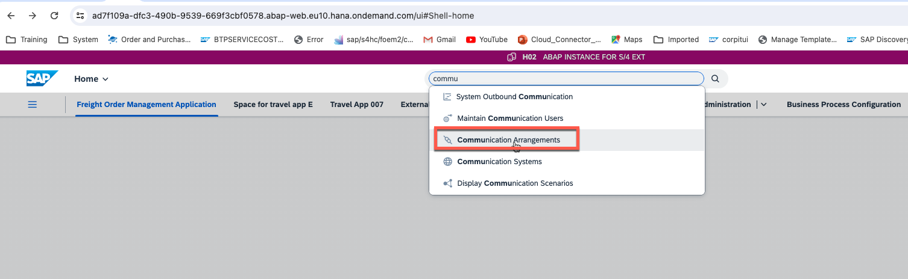

## 1. Create new instance and service key for service: Destination in SAP BTP Sub-account

## 2. In SAP BTP ABAP Environment

- Create a new communication system  with service key of destination service instance

- Create a new communication arrangement (scenario: SAP_COM_0276) with service key of destination service instance

