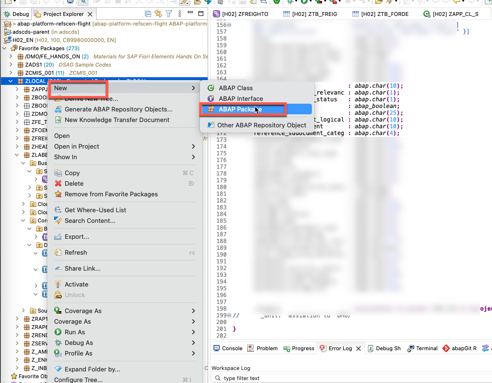
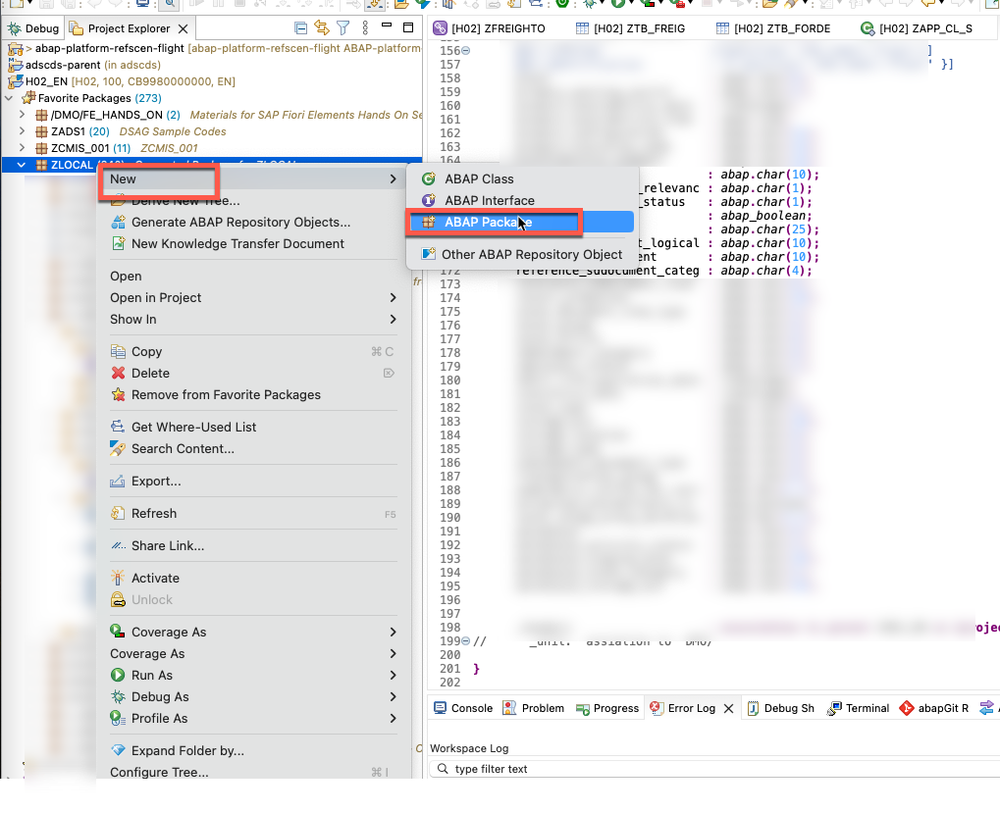
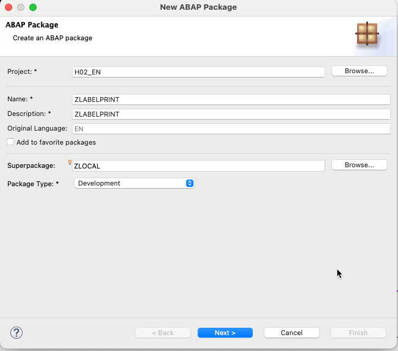
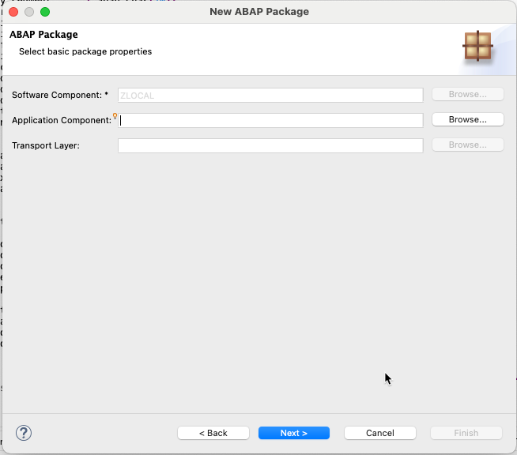
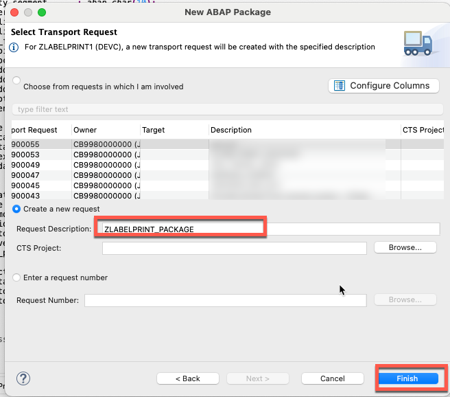

# Exercise 04: Create an ABAP Package in Eclipse

In this exercise you will create the ABAP package `ZLABELPRINT` in Eclipse ADT. All custom objects built throughout the remaining exercises — CDS views, classes, service definitions, and behavior definitions — will be stored in this package. A new transport request is also created at this step to carry all those objects.

---

## Step 1: Open the New ABAP Package Wizard

In the **Project Explorer**, right-click the superpackage `ZLOCAL` and choose **New → ABAP Package**.

> If you do not see **ABAP Package** directly in the menu, choose **New → Other ABAP Repository Object**, type `package` in the search box, select **ABAP Package**, and click **Next**.

---

## Step 2: Enter the Package Details

Fill in the wizard fields as follows, then click **Next**.

| Field | Value |
|-------|-------|
| Name | `ZLABELPRINT` |
| Description | `ZLABELPRINT` |
| Superpackage | `ZLOCAL` |
| Package Type | `Development` |

---

## Step 3: Confirm the Software Component

The next page shows the software component inherited from `ZLOCAL`. Leave all fields as pre-populated and click **Next**.

| Field | Value |
|-------|-------|
| Software Component | `ZLOCAL` (pre-filled) |
| Application Component | *(leave blank)* |
| Transport Layer | *(leave blank)* |

---

## Step 4: Create a Transport Request

Select **Create a new request** and enter the description `ZLABELPRINT_PACKAGE`. Click **Finish**.

| Field | Value |
|-------|-------|
| Option | `Create a new request` |
| Request Description | `ZLABELPRINT_PACKAGE` |

> Note the transport request number assigned (e.g. `H02K900053`). All subsequent objects created in this workshop will be assigned to this same request.

---

## Result

The package `ZLABELPRINT` now appears under `ZLOCAL` in the **Project Explorer**. From **Exercise 05** onwards, every new ABAP object you create should be placed in this package and assigned to the `ZLABELPRINT_PACKAGE` transport request.
