### 1. Create communication user in SAP S/4HANA Cloud.

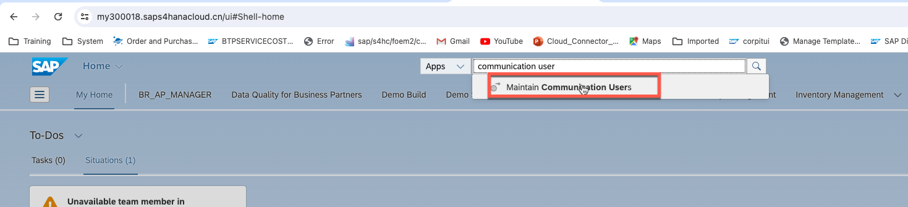
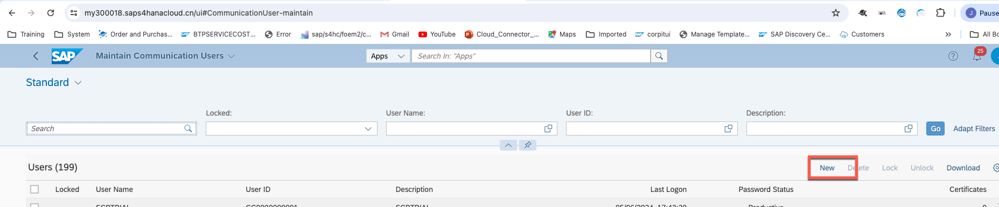
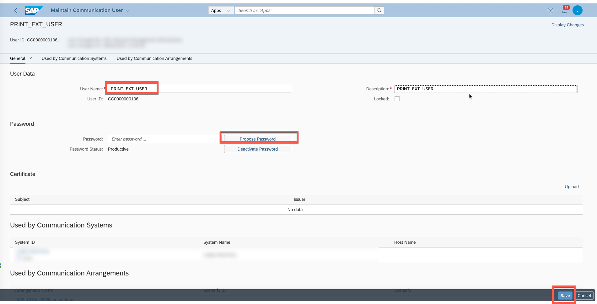

### 2. Create communication system in SAP S/4HANA Cloud.
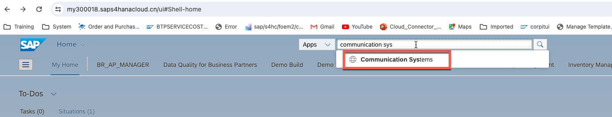
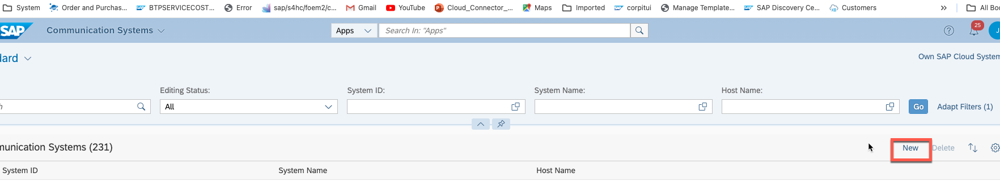
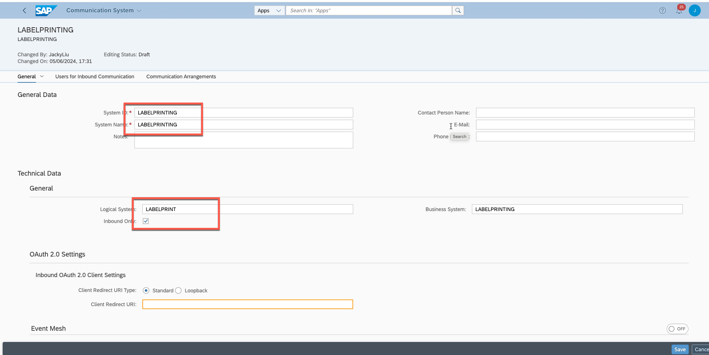
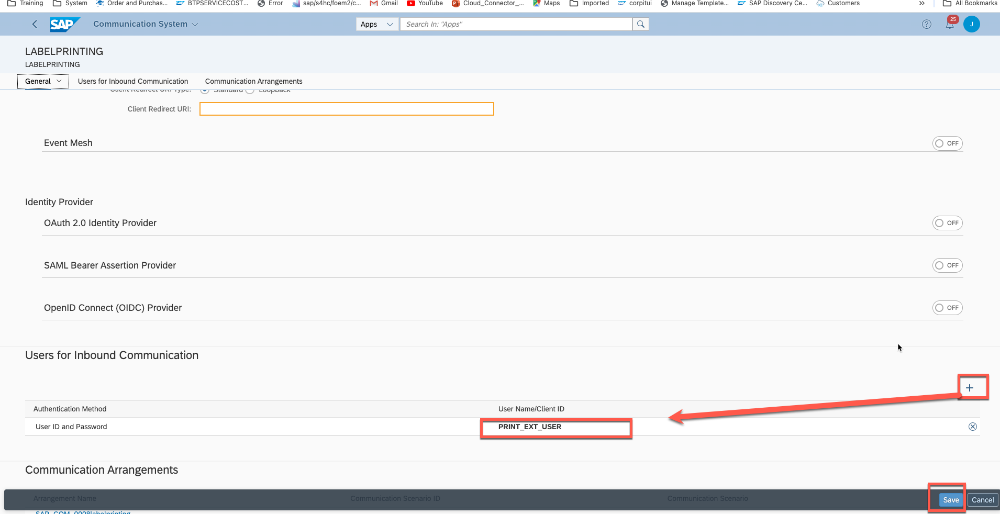

### 3, Create communication arrangement SAP S/4HANA Cloud.

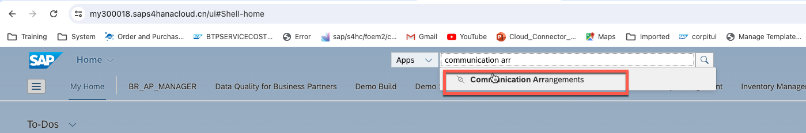
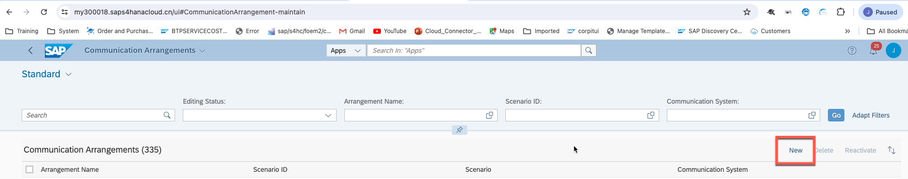
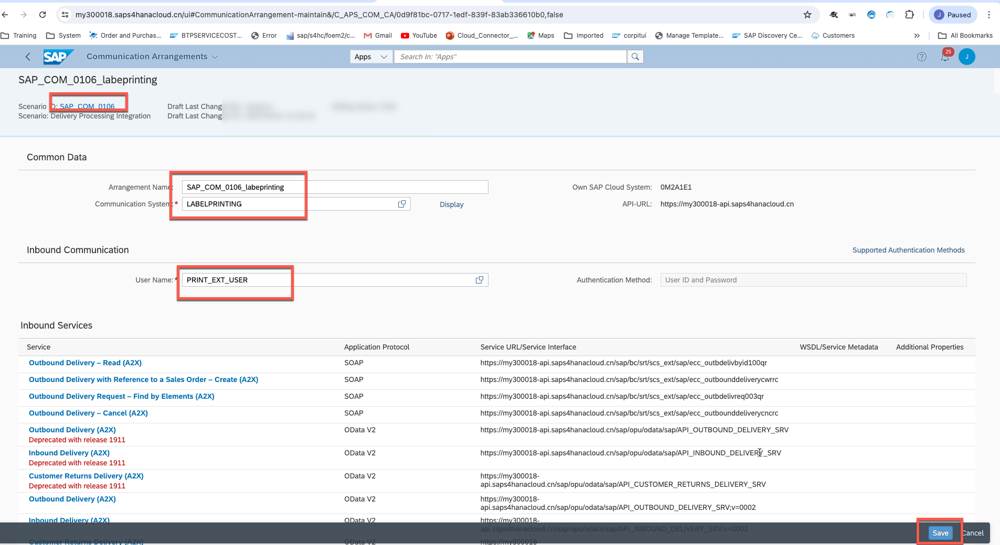

### Step 4, Download metadata for outbound delivery odata api.

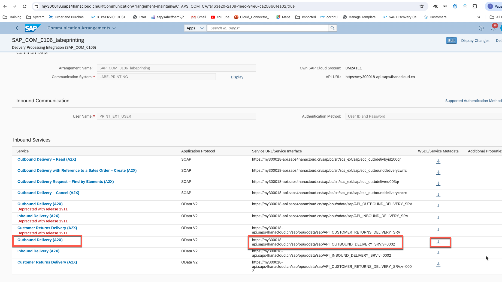

This file will be used in creating consumption model in Eclipse Adt.

