# Exercise 06: Configure Communication in S/4HANA Cloud to Expose the Outbound Delivery API

In this exercise you will configure your **SAP S/4HANA Cloud** system to expose the Outbound Delivery OData V2 API to an external consumer. By the end, the BTP ABAP Environment will be able to call `API_OUTBOUND_DELIVERY_SRV` using the credentials and endpoint you set up here.

The exercise has four parts:

| Part | What you do |
|------|-------------|
| 1 | Create a dedicated **Communication User** (`PRINT_EXT_USER`) |
| 2 | Create a **Communication System** (`LABELPRINTING`) and assign the user |
| 3 | Create a **Communication Arrangement** (`SAP_COM_0036`) and enable the API |
| 4 | **Download the OData metadata file** for use in Exercise 07 |

---

## Part 1: Create a Communication User

A communication user is a technical user that the external system will authenticate with when calling the inbound API.

### Step 1: Open the Maintain Communication Users App

In the S/4HANA Cloud Fiori Launchpad search bar, type `communication user` and select **Maintain Communication Users**.

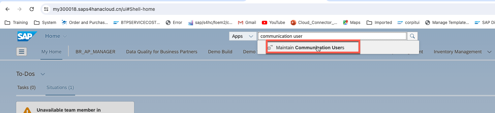

---

### Step 2: Create a New User

On the **Maintain Communication Users** list page, click **New**.

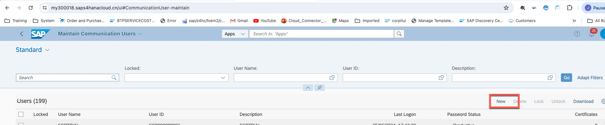

Fill in the form as follows, then click **Propose Password** to generate a password. Note the generated password — you will need it when configuring the Communication System in the BTP ABAP Environment (Exercise 09). Click **Save**.

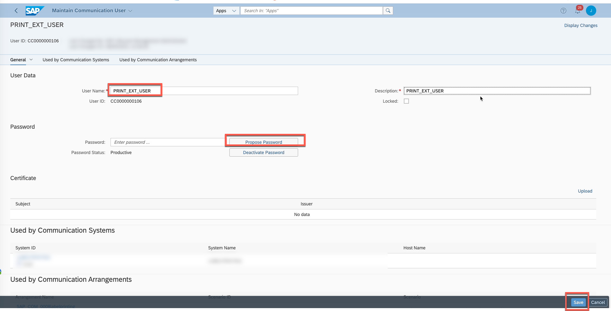

| Field | Value |
|-------|-------|
| User Name | `PRINT_EXT_USER` |
| Description | `Communication User for Label Printing` |
| Password | Click **Propose Password** |

> Save the generated password now. You will not be able to retrieve it later.

---

## Part 2: Create a Communication System

A Communication System represents the external system (your BTP ABAP Environment) that will connect to S/4HANA Cloud.

### Step 3: Open the Communication Systems App

In the Fiori Launchpad search bar, type `communication sys` and select **Communication Systems**.

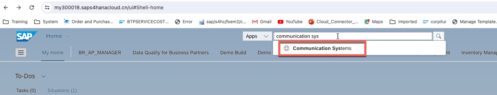

---

### Step 4: Create a New System

On the **Communication Systems** list page, click **New**.

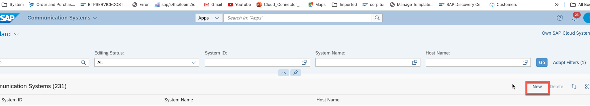

---

### Step 5: Enter the System Details

In the new Communication System form, fill in the following fields:

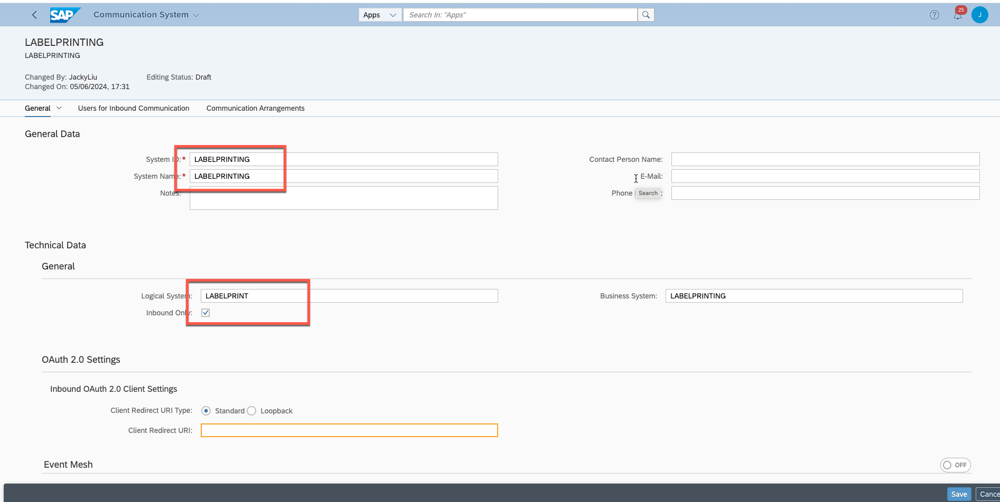

| Field | Value |
|-------|-------|
| System ID | `LABELPRINTING` |
| System Name | `LABELPRINTING` |
| Logical System | `LABELPRINT` |
| Inbound Only | ✓ (checked) |

> Check **Inbound Only** because S/4HANA Cloud will only receive calls — it does not need to initiate outbound connections to the BTP system.

Scroll down to the **Users for Inbound Communication** section, click **+**, and add the communication user you created in Part 1:

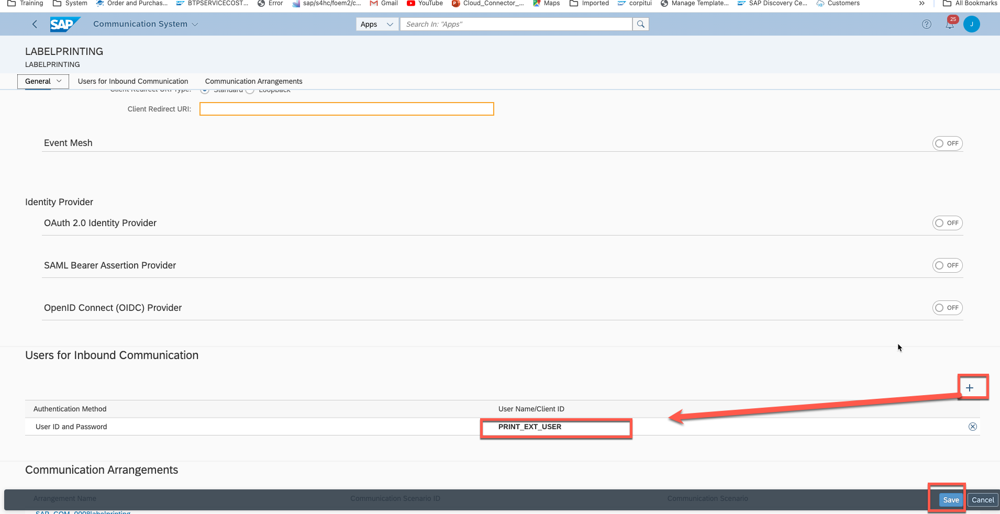

| Field | Value |
|-------|-------|
| User Name | `PRINT_EXT_USER` |
| Authentication Method | `User ID and Password` |

Click **Save**.

---

## Part 3: Create a Communication Arrangement

A Communication Arrangement links a predefined communication scenario (which defines which APIs are available) to the Communication System you just created.

### Step 6: Open the Communication Arrangements App

In the Fiori Launchpad search bar, type `communication arr` and select **Communication Arrangements**.

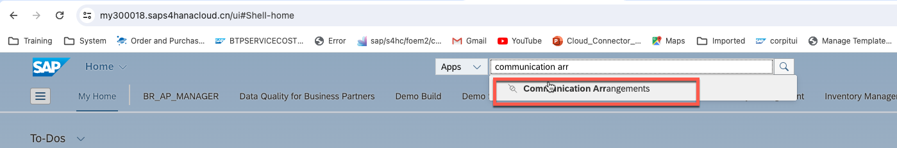

---

### Step 7: Create a New Arrangement

On the **Communication Arrangements** list page, click **New**.

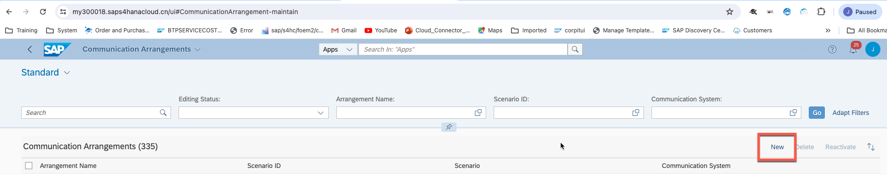

---

### Step 8: Configure the Arrangement

Fill in the form using the values below:

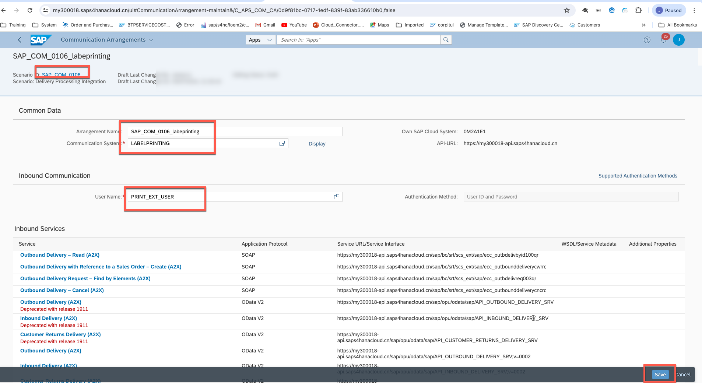

| Field | Value |
|-------|-------|
| Scenario | `SAP_COM_0036` — Delivery Outbound Integration |
| Arrangement Name | `SAP_COM_0036_labelprinting` |
| Communication System | `LABELPRINTING` (the system created in Part 2) |
| Inbound User | `PRINT_EXT_USER` (auto-populated) |

Confirm that the **Inbound Services** section lists `API_OUTBOUND_DELIVERY_SRV` among the available services. Click **Save**.

---

## Part 4: Download the OData Metadata File

The metadata file (`.edmx`) describes the structure of the Outbound Delivery OData service. You will import it in Exercise 07 to generate the Service Consumption Model in Eclipse.

### Step 9: Download the Metadata File

In the saved Communication Arrangement, locate the **Inbound Services** table. Find the row for `API_OUTBOUND_DELIVERY_SRV;v=0002` and click the **download metadata** icon on the right side of that row.

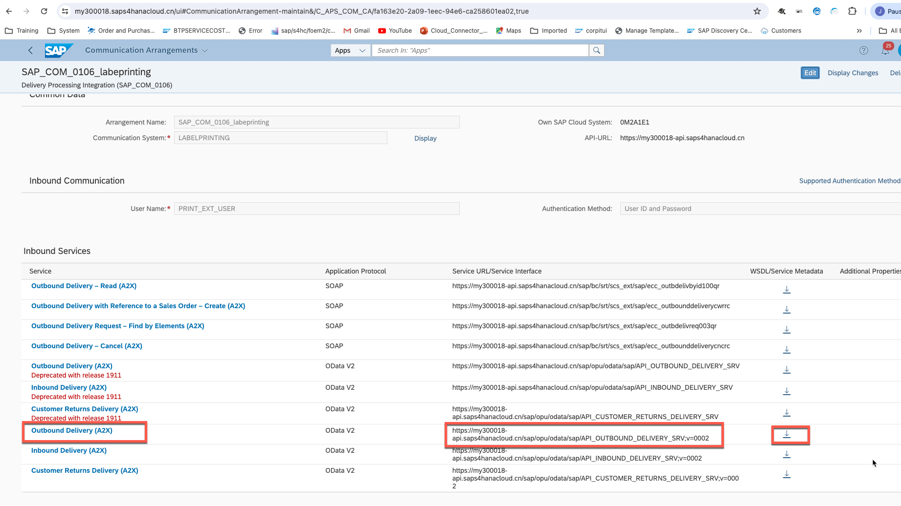

Save the downloaded file as:

```
API_OUTBOUND_DELIVERY_SRV_0002.edmx
```

> This exact filename is referenced in Exercise 07 when creating the Service Consumption Model `ZDN_SRV`.

---

## Result

Your S/4HANA Cloud system is now configured to expose the Outbound Delivery API to external consumers. You have:

- A communication user (`PRINT_EXT_USER`) with a known password
- A communication system (`LABELPRINTING`) representing the BTP ABAP Environment
- A communication arrangement (`SAP_COM_0036_labelprinting`) activating the `API_OUTBOUND_DELIVERY_SRV` OData V2 endpoint
- The metadata file `API_OUTBOUND_DELIVERY_SRV_0002.edmx` ready for import

In **Exercise 07**, you will import the `.edmx` file into Eclipse to generate the Service Consumption Model `ZDN_SRV` and its proxy class `ZCL_DN_SRV`, which the query class `ZCL_DN_QUERY` uses to call this API at runtime.
