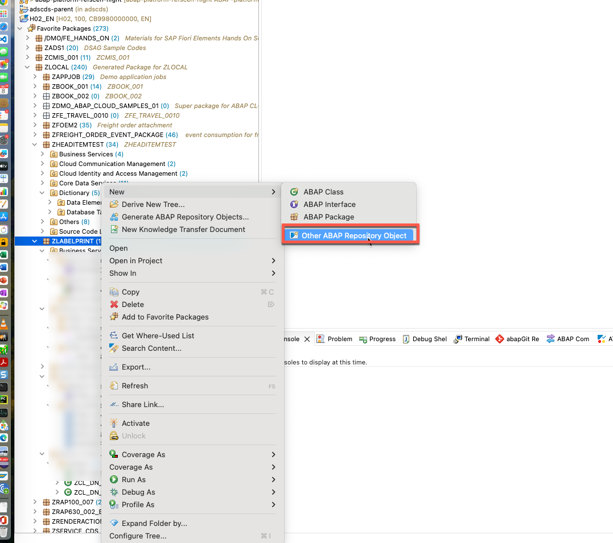
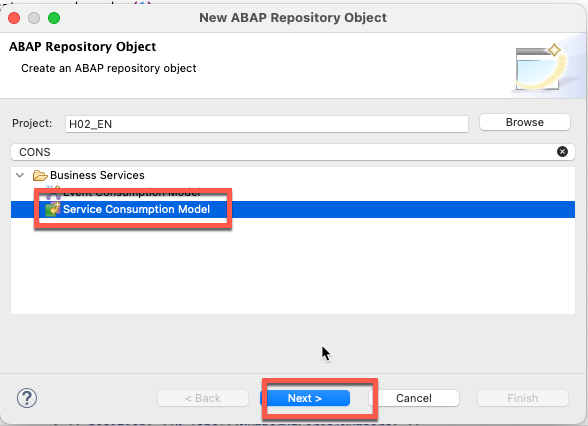
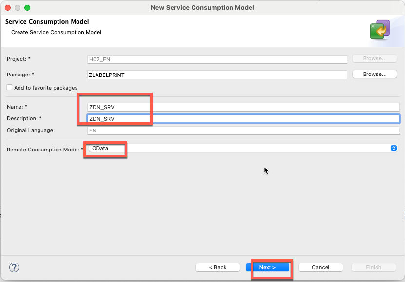
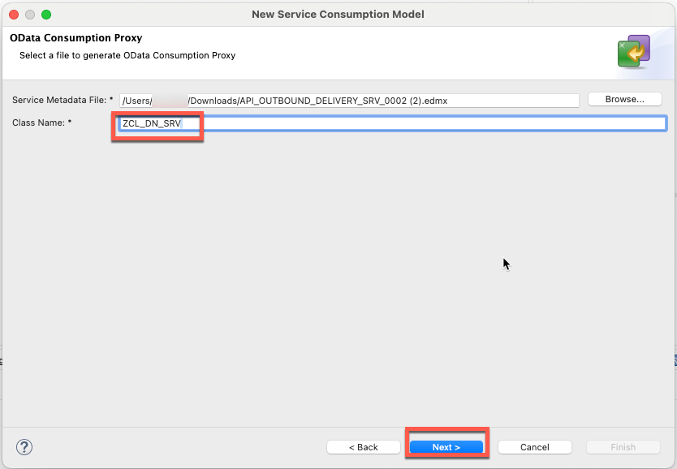
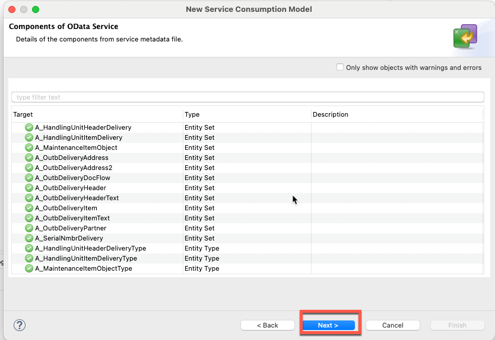
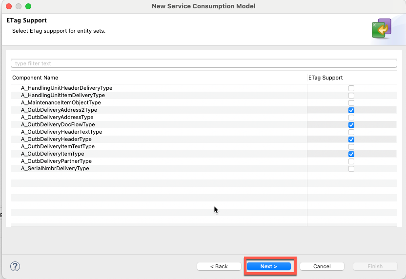
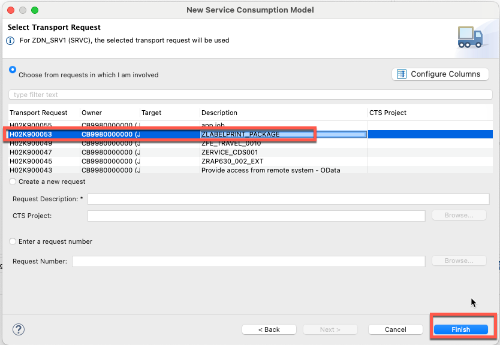
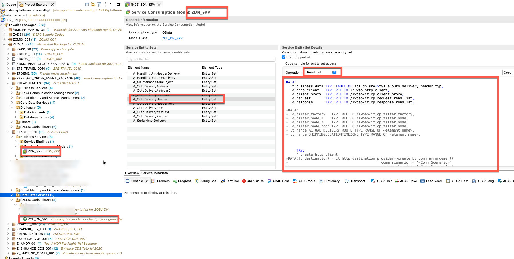

# Exercise 07: Create a Service Consumption Model for the Outbound Delivery API in Eclipse

In this exercise you will create a **Service Consumption Model** in Eclipse ADT. This model generates a typed ABAP proxy class (`ZCL_DN_SRV`) from the S/4HANA Outbound Delivery OData V2 metadata file, allowing BTP ABAP code to call the S/4HANA API in a strongly-typed way.

---

## Prerequisites

Before starting, download the OData metadata file for the Outbound Delivery API from your S/4HANA Cloud system:

- File: `API_OUTBOUND_DELIVERY_SRV_0002.edmx`

Save it locally — you will need to browse to it during the wizard.

---

## Step 1: Open the New ABAP Repository Object Wizard

In the **Project Explorer**, right-click your package and choose **New → Other ABAP Repository Object**.

In the search box, type `CONS` to filter the list. Under **Business Services**, select **Service Consumption Model** and click **Next**.

---

## Step 2: Enter the Service Consumption Model Details

Fill in the wizard fields as follows, then click **Next**.

| Field                   | Value         |
| ----------------------- | ------------- |
| Package                 | `ZLABELPRINT` |
| Name                    | `ZDN_SRV`     |
| Description             | `ZDN_SRV`     |
| Remote Consumption Mode | `OData`       |

---

## Step 3: Select the OData Metadata File

Browse to the `API_OUTBOUND_DELIVERY_SRV_0002.edmx` file you downloaded in the prerequisites. Set the **Class Name** to `ZCL_DN_SRV`, then click **Next**.

| Field                 | Value                                 |
| --------------------- | ------------------------------------- |
| Service Metadata File | `API_OUTBOUND_DELIVERY_SRV_0002.edmx` |
| Class Name            | `ZCL_DN_SRV`                          |

---

## Step 4: Review OData Service Components

The wizard parses the metadata file and displays all entity sets and types it found. Review the list to confirm the expected Outbound Delivery entities are present (for example `A_OutbDeliveryHeader`, `A_OutbDeliveryItem`), then click **Next**.

---

## Step 5: Configure ETag Support

Select ETag support for the entity types that require optimistic concurrency control. Enable ETag for the following types, then click **Next**.

| Entity Type                  | ETag Support |
| ---------------------------- | :----------: |
| `A_OutbDeliveryAddress2Type` |      ✓       |
| `A_OutbDeliveryDocFlowType`  |      ✓       |
| `A_OutbDeliveryHeaderType`   |      ✓       |
| `A_OutbDeliveryItemType`     |      ✓       |

---

## Step 6: Select a Transport Request

Choose the transport request associated with your label printing package (`ZLABELPRINT_PACKAGE`), then click **Finish**.

---

## Step 7: Verify the Generated Model

The wizard generates the Service Consumption Model `ZDN_SRV` and the proxy class `ZCL_DN_SRV`. The ADT editor opens automatically and displays the entity sets, entity types, and a preview of the generated ABAP proxy code.

Confirm that:

- The model name shown in the editor header is **ZDN_SRV**
- Entity sets such as `A_OutbDeliveryHeader` and `A_OutbDeliveryItem` appear in the **Service Entity Sets** list
- The generated proxy class `ZCL_DN_SRV` is visible under your package in the Project Explorer

---

## Result

You now have a Service Consumption Model `ZDN_SRV` with proxy class `ZCL_DN_SRV` in your BTP ABAP package. In **Exercise 10**, the query class `ZCL_DN_QUERY` will use this proxy to call the S/4HANA Outbound Delivery API via the communication arrangement configured in Exercise 08 and Exercise 09.
