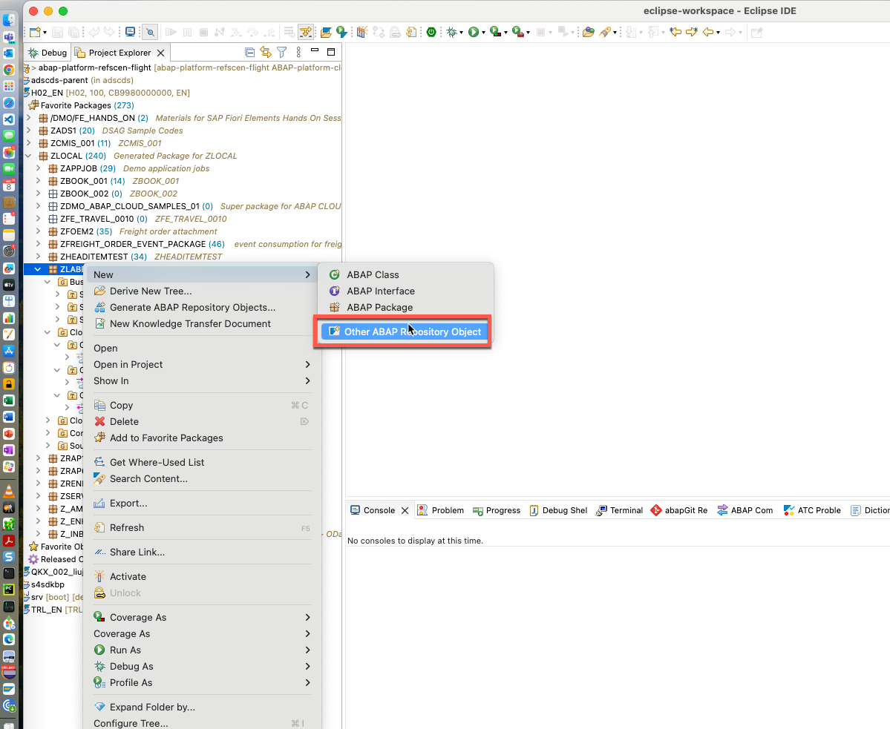
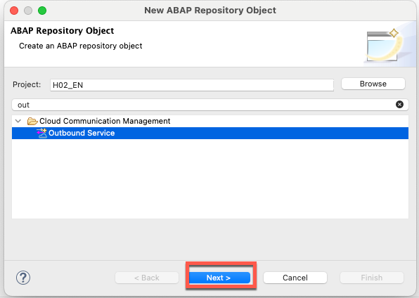
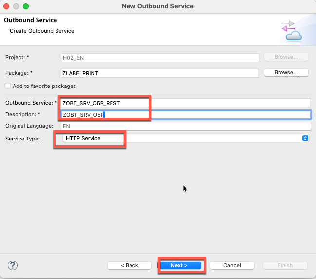
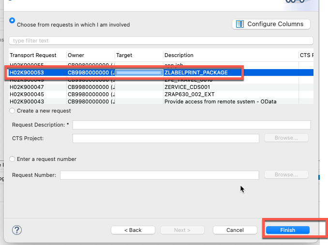
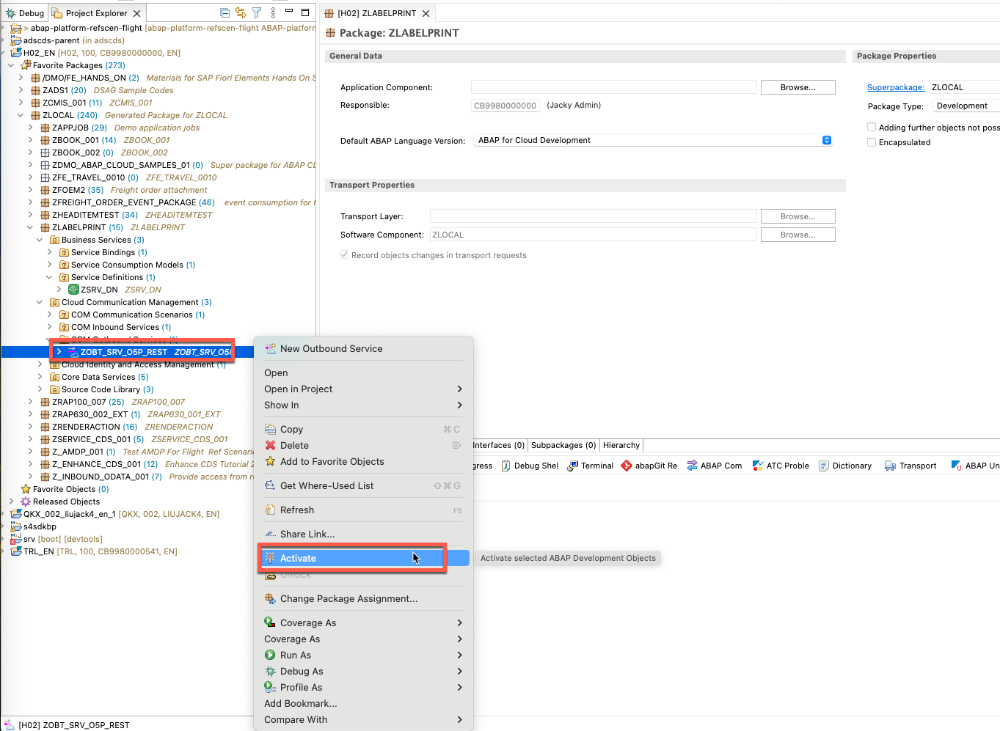
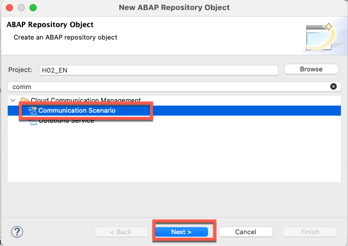
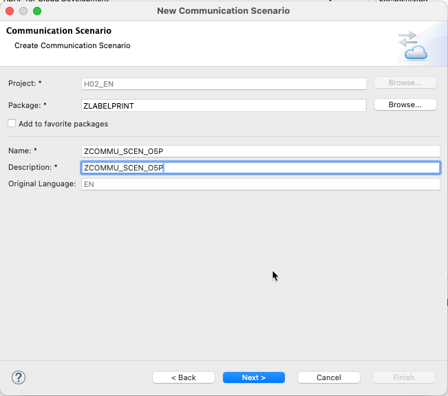
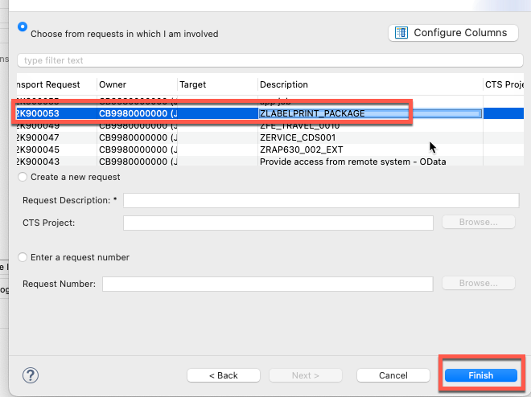
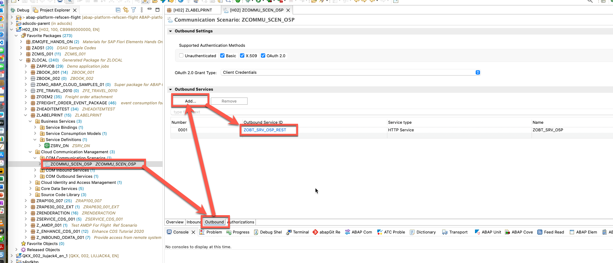
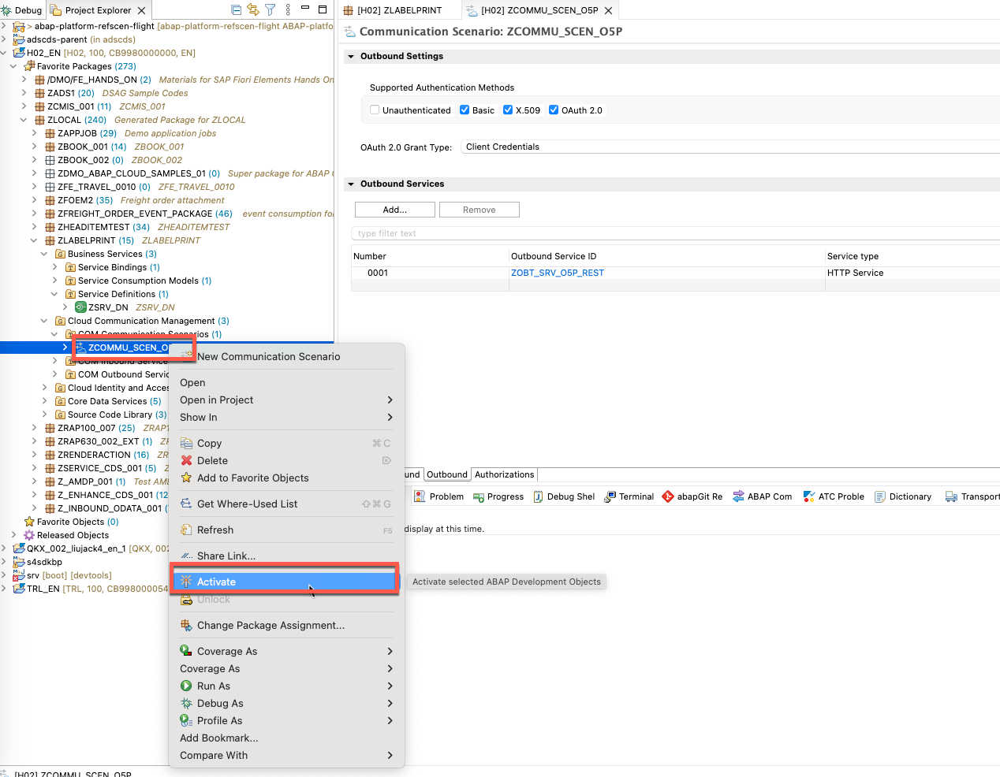

# Exercise 08: Create an Outbound Service and Communication Scenario in Eclipse

In this exercise you will create two ABAP objects in Eclipse ADT that together define how the BTP ABAP Environment connects outbound to the S/4HANA Cloud Outbound Delivery API:

1. **Outbound Service** (`ZOBT_SRV_O5P_REST`) — declares the HTTP endpoint that will be called
2. **Communication Scenario** (`ZCOMMU_SCEN_O5P`) — groups the outbound service so it can be assigned to a Communication System in Exercise 09

---

## Part 1: Create the Outbound Service

### Step 1: Open the New ABAP Repository Object Wizard

In the **Project Explorer**, right-click your package and choose **New → Other ABAP Repository Object**.

In the search box, type `out` to filter the list. Under **Cloud Communication Management**, select **Outbound Service** and click **Next**.

---

### Step 2: Enter the Outbound Service Details

Fill in the wizard fields as follows, then click **Next**.

| Field | Value |
|-------|-------|
| Package | `ZLABELPRINT` |
| Outbound Service | `ZOBT_SRV_O5P_REST` |
| Description | `ZOBT_SRV_O5P` |
| Service Type | `HTTP Service` |

---

### Step 3: Select a Transport Request

Choose the transport request associated with your label printing package (`ZLABELPRINT_PACKAGE`), then click **Finish**.

---

### Step 4: Verify the Outbound Service

The Outbound Service `ZOBT_SRV_O5P_REST` is created and appears under **Cloud Communication Management** in the Project Explorer.

---

## Part 2: Create the Communication Scenario

### Step 5: Open the New ABAP Repository Object Wizard Again

Right-click your package and choose **New → Other ABAP Repository Object**.

In the search box, type `comm` to filter the list. Under **Cloud Communication Management**, select **Communication Scenario** and click **Next**.

---

### Step 6: Enter the Communication Scenario Details

Fill in the wizard fields as follows, then click **Next**.

| Field | Value |
|-------|-------|
| Package | `ZLABELPRINT` |
| Name | `ZCOMMU_SCEN_O5P` |
| Description | `ZCOMMU_SCEN_O5P` |

---

### Step 7: Select a Transport Request

Choose the same `ZLABELPRINT_PACKAGE` transport request and click **Finish**.

---

### Step 8: Add the Outbound Service to the Communication Scenario

The Communication Scenario editor opens. In the **Outbound Services** section, click **Add** and select `ZOBT_SRV_O5P_REST` (the outbound service created in Part 1).

Confirm that the entry appears in the **Outbound Services** table with Service Type `HTTP Service`.

| Field | Value |
|-------|-------|
| Outbound Service ID | `ZOBT_SRV_O5P_REST` |
| Service Type | `HTTP Service` |

---

### Step 9: Activate the Communication Scenario

Right-click `ZCOMMU_SCEN_O5P` in the Project Explorer and choose **Activate** (`Cmd+F3`).

Confirm that the status indicator in the editor changes to active (no pending changes marker).

---

## Result

You have created and activated two objects in your BTP ABAP package:

| Object | Type | Purpose |
|--------|------|---------|
| `ZOBT_SRV_O5P_REST` | Outbound Service | Declares the HTTP endpoint for the S/4HANA Outbound Delivery API |
| `ZCOMMU_SCEN_O5P` | Communication Scenario | Groups the outbound service for assignment to a Communication System |

In **Exercise 09**, you will create a Communication System and Communication Arrangement in the BTP ABAP Fiori Launchpad that binds `ZCOMMU_SCEN_O5P` to the actual S/4HANA Cloud endpoint. The query class `ZCL_DN_QUERY` (Exercise 10) then references `ZCOMMU_SCEN_O5P` at runtime to resolve the HTTP destination.
