# Exercise 09: Configure Communication in the BTP ABAP Environment

In this exercise you will configure your **BTP ABAP Environment** to connect outbound to the S/4HANA Cloud Outbound Delivery API. This mirrors what you did in Exercise 06 on the S/4HANA side — here you set up the matching objects on the BTP side so the two systems can communicate.

The exercise has three parts:

| Part | What you do |
|------|-------------|
| 1 | Create a **Communication User** (`BTPPRINT`) in the BTP ABAP Environment |
| 2 | Create a **Communication System** (`S4HC_O5P`) pointing to the S/4HANA host |
| 3 | Create a **Communication Arrangement** (`ZCOMMU_SCEN_O5P`) linking the scenario to the system |

> **Prerequisite:** You need the S/4HANA Cloud host name and the credentials for communication user `PRINT_EXT_USER` that you created in Exercise 06.

---

## Part 1: Create a Communication User

This user will be stored in the Communication System and used to authenticate outbound calls to S/4HANA Cloud.

### Step 1: Open the BTP ABAP Environment Fiori Launchpad

In the **SAP BTP Cockpit**, navigate to **Services → Instances and Subscriptions**, find your ABAP Environment instance, and open its Fiori Launchpad.

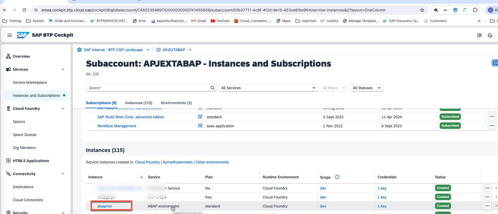

---

### Step 2: Open the Maintain Communication Users App

In the Fiori Launchpad search bar, type `comm` and select **Maintain Communication Users**.

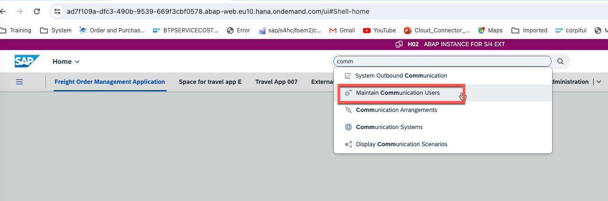

---

### Step 3: Create a New User

On the **Maintain Communication Users** list page, click **New**.

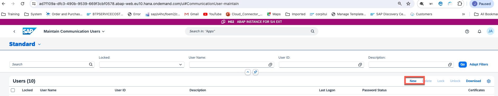

Fill in the form as follows, then click **Propose Password** to generate a password. Note the password — you will enter it in the Communication System in Step 6. Click **Save**.

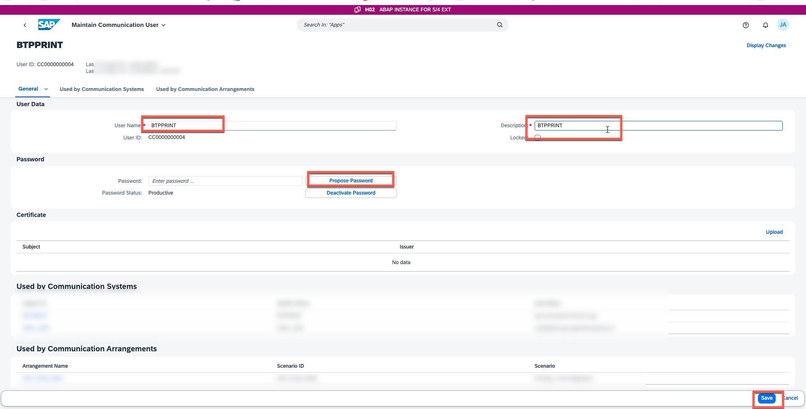

| Field | Value |
|-------|-------|
| User Name | `BTPPRINT` |
| Description | `BTPPRINT` |
| Password | Click **Propose Password** |

> Save the generated password now. You will need it in Step 6 when adding this user to the Communication System.

---

## Part 2: Create a Communication System

The Communication System represents your S/4HANA Cloud system from the BTP ABAP side. It stores the host name and the credentials used for outbound calls.

### Step 4: Open the Communication Systems App

In the Fiori Launchpad search bar, type `comm` and select **Communication Systems**.

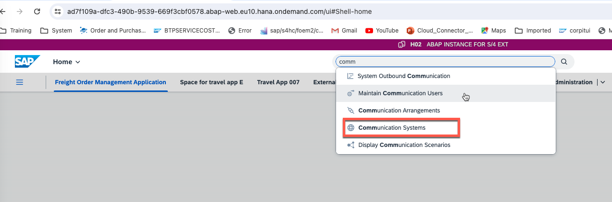

---

### Step 5: Create a New System

On the **Communication Systems** list page, click **New**.

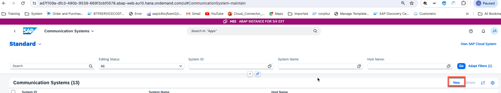

---

### Step 6: Enter the System Details

Fill in the **General Data** section. The host name comes from your S/4HANA Cloud system URL.

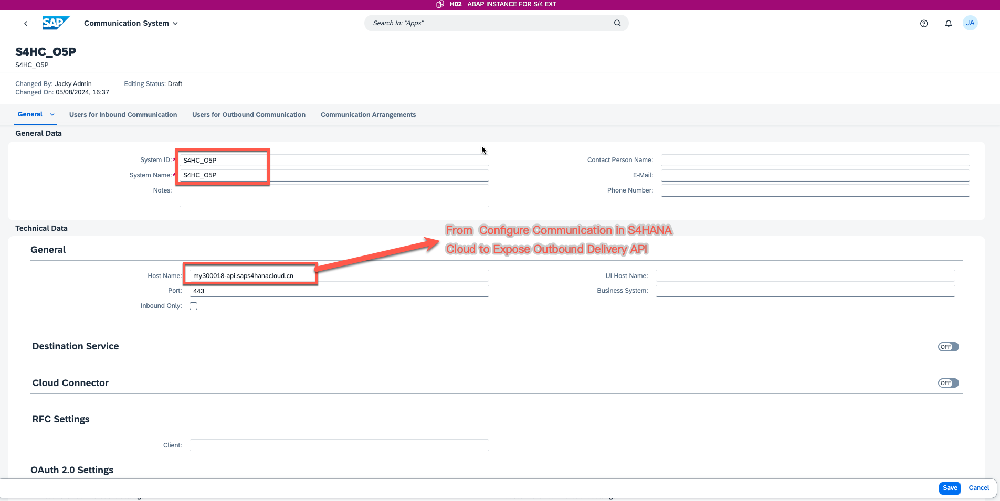

| Field | Value |
|-------|-------|
| System ID | `S4HC_O5P` |
| System Name | `S4HC_O5P` |
| Host Name | Your S/4HANA Cloud API host (e.g. `my300018-api.s4hana.cloud.cn`) |
| Port | `443` |
| Inbound Only | *(leave unchecked)* |

> The host name is the API endpoint of your S/4HANA Cloud system — it comes from the Communication Arrangement you created in Exercise 06.

---

### Step 7: Add the Outbound Communication User

Scroll down to the **Users for Inbound Communication** section, click **+**, and add the communication user you created in Part 1. In the **New Outbound User** dialog, enter the S/4HANA communication user credentials from Exercise 06.

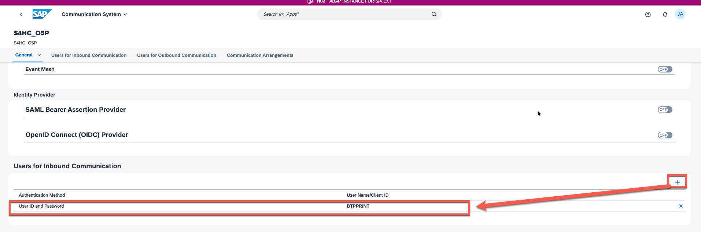

| Field | Value |
|-------|-------|
| Authentication Method | `User ID and Password` |
| User Name/Client ID | `PRINT_EXT_USER` (the S/4HANA communication user from Exercise 06) |
| Password | Password for `PRINT_EXT_USER` from Exercise 06 |

After saving the dialog, the **Users for Inbound Communication** section should show `BTPPRINT` with Authentication Method `User ID and Password`.

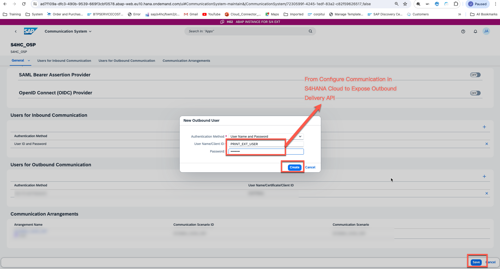

Click **Save**.

---

## Part 3: Create a Communication Arrangement

The Communication Arrangement binds the custom communication scenario `ZCOMMU_SCEN_O5P` (created in Exercise 08) to the Communication System `S4HC_O5P`. This tells the ABAP runtime which endpoint and credentials to use when the outbound service `ZOBT_SRV_O5P_REST` is called.

### Step 8: Open the Communication Arrangements App

In the Fiori Launchpad search bar, type `comm` and select **Communication Arrangements**.

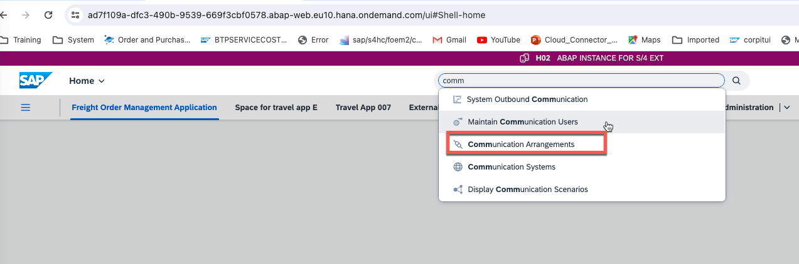

---

### Step 9: Create a New Arrangement

On the **Communication Arrangements** list page, click **New**.

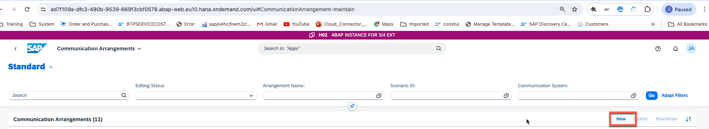

---

### Step 10: Configure the Arrangement

Fill in the form as follows:

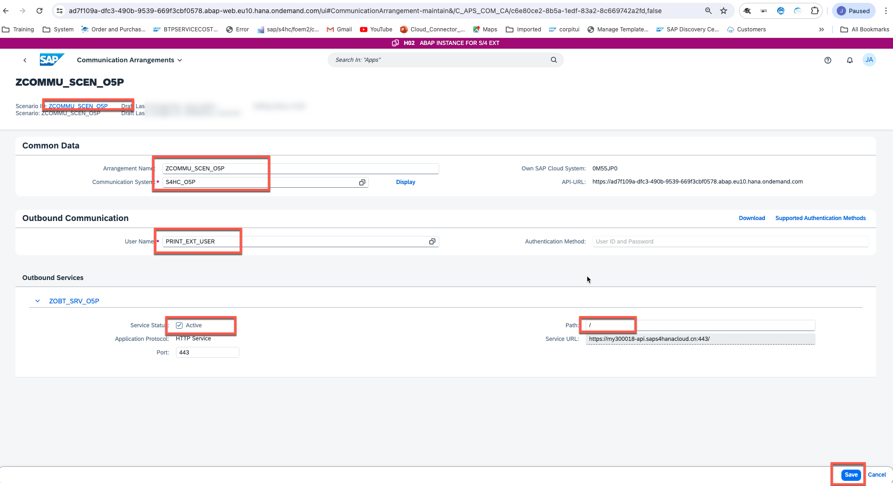

| Field | Value |
|-------|-------|
| Scenario | `ZCOMMU_SCEN_O5P` (the scenario created in Exercise 08) |
| Arrangement Name | `ZCOMMU_SCEN_O5P` |
| Communication System | `S4HC_O5P` (the system created in Part 2) |
| User Name | `PRINT_EXT_USER` (auto-populated from the Communication System) |

Verify that the **Outbound Services** section shows:

| Field | Expected Value |
|-------|----------------|
| Service | `ZOBT_SRV_O5P_REST` |
| Service Status | `Active` |
| Application Protocol | `HTTP Service` |
| Path | `/` |
| Port | `443` |
| Service URL | Resolved S/4HANA Cloud host URL |

Click **Save**.

---

## Result

Your BTP ABAP Environment is now connected to S/4HANA Cloud. The arrangement `ZCOMMU_SCEN_O5P` resolves the outbound service `ZOBT_SRV_O5P_REST` to the S/4HANA API host using the `PRINT_EXT_USER` credentials.

In **Exercise 10**, the query class `ZCL_DN_QUERY` will use this arrangement to instantiate `ZCL_DN_SRV` and fetch outbound delivery data from S/4HANA Cloud at runtime.
