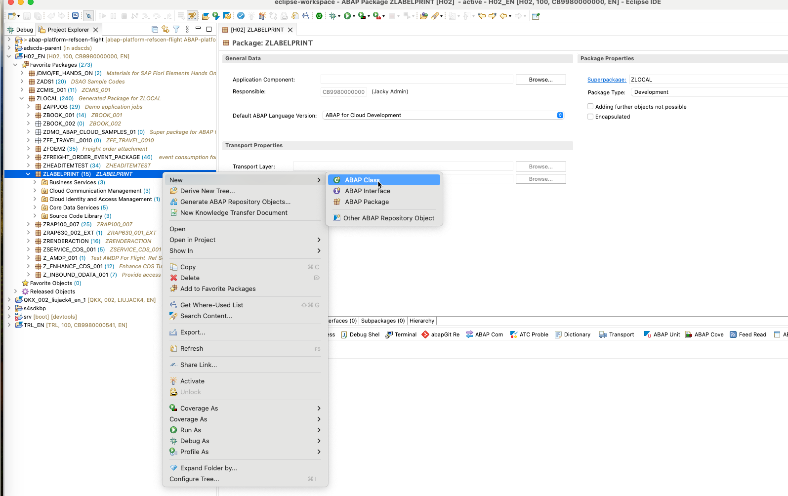
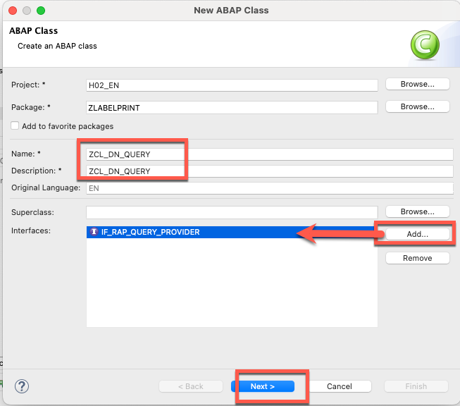
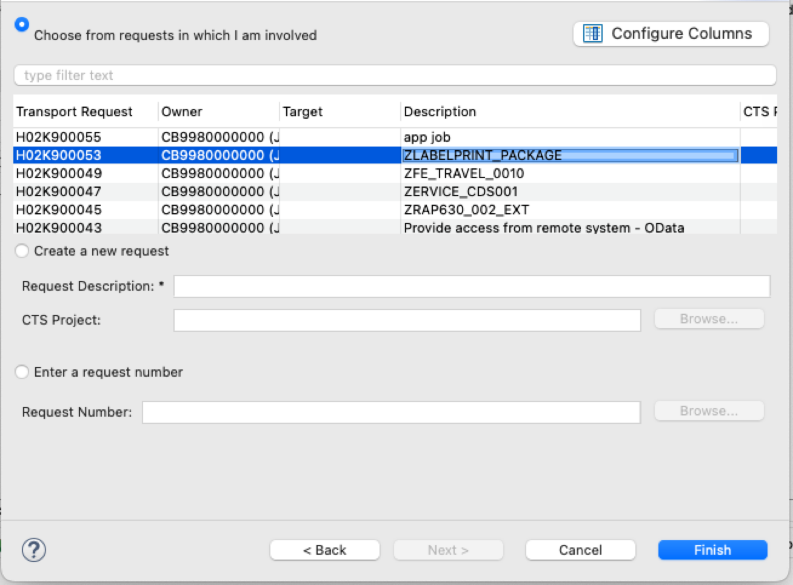
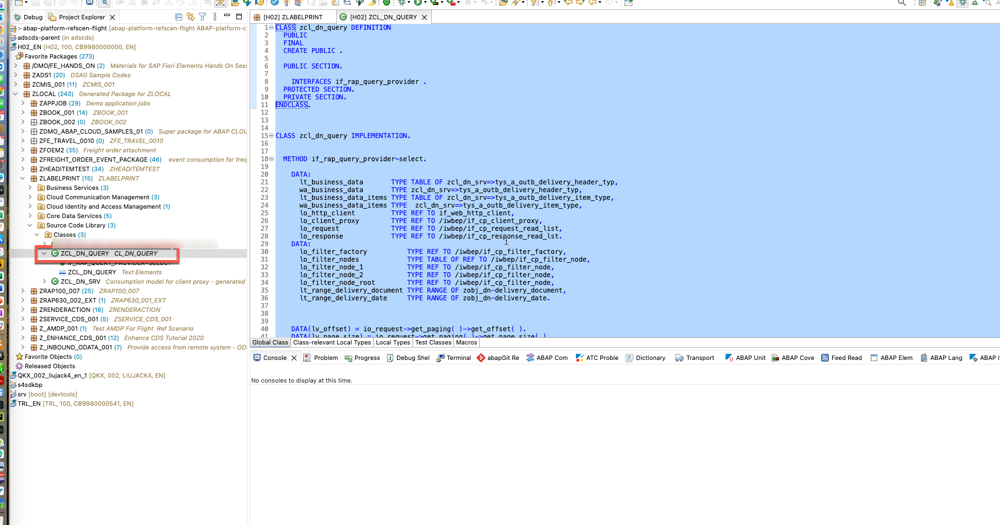
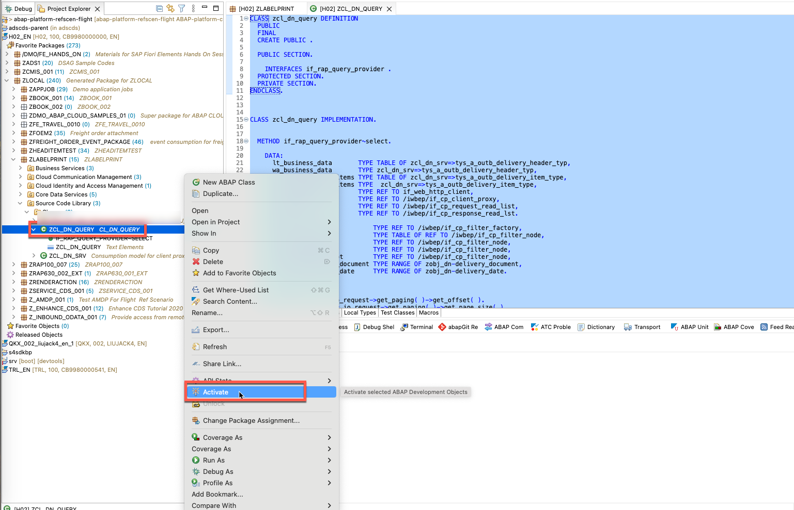

### 1. Create query class ZCL_DN_QUERY in Eclipse






### 2. Adjust the code of class ZCL_DN_QUERY  like the following:

```
CLASS zcl_dn_query DEFINITION
  PUBLIC
  FINAL
  CREATE PUBLIC .

  PUBLIC SECTION.

    INTERFACES if_rap_query_provider .
  PROTECTED SECTION.
  PRIVATE SECTION.
ENDCLASS.


CLASS zcl_dn_query IMPLEMENTATION.


  METHOD if_rap_query_provider~select.

    DATA:
      lt_business_data       TYPE TABLE OF zcl_dn_srv=>tys_a_outb_delivery_header_typ,
      wa_business_data       TYPE zcl_dn_srv=>tys_a_outb_delivery_header_typ,
      lt_business_data_items TYPE TABLE OF zcl_dn_srv=>tys_a_outb_delivery_item_type,
      wa_business_data_items TYPE  zcl_dn_srv=>tys_a_outb_delivery_item_type,
      lo_http_client         TYPE REF TO if_web_http_client,
      lo_client_proxy        TYPE REF TO /iwbep/if_cp_client_proxy,
      lo_request             TYPE REF TO /iwbep/if_cp_request_read_list,
      lo_response            TYPE REF TO /iwbep/if_cp_response_read_lst.
    DATA:
      lo_filter_factory          TYPE REF TO /iwbep/if_cp_filter_factory,
      lo_filter_nodes            TYPE TABLE OF REF TO /iwbep/if_cp_filter_node,
      lo_filter_node_1           TYPE REF TO /iwbep/if_cp_filter_node,
      lo_filter_node_2           TYPE REF TO /iwbep/if_cp_filter_node,
      lo_filter_node_root        TYPE REF TO /iwbep/if_cp_filter_node,
      lt_range_delivery_document TYPE RANGE OF zobj_dn-delivery_document,
      lt_range_delivery_date     TYPE RANGE OF zobj_dn-delivery_date.


    DATA(lv_offset) = io_request->get_paging( )->get_offset( ).
    DATA(lv_page_size) = io_request->get_paging( )->get_page_size( ).
    DATA(lv_max_rows) = COND #( WHEN lv_page_size = if_rap_query_paging=>page_size_unlimited
                                THEN 0 ELSE lv_page_size ).
    DATA(lt_req_elements) = io_request->get_requested_elements( ).
    DATA(lv_req_elements)  = concat_lines_of( table = lt_req_elements sep = `,` ).
    DATA(lv_sql_filter) = io_request->get_filter( )->get_as_sql_string( ).


    DATA(lv_parameters) = io_request->get_parameters( ).
    DATA(lv_entities) = io_request->get_entity_id( ).
    DATA :it_dn_response       TYPE STANDARD TABLE OF zobj_dn,
          wa_dn_response       TYPE zobj_dn,
          it_dn_items_response TYPE STANDARD TABLE OF zobj_dn_items,
          wa_dn_items_response TYPE  zobj_dn_items,
          lv_offset_i type i,
          lv_max_rows_i type i .

         lv_offset_i = lv_offset .
         lv_max_rows_i = lv_max_rows .


    TRY.
        DATA(lo_destination) = cl_http_destination_provider=>create_by_comm_arrangement(
                                                     comm_scenario  = 'ZCOMMU_SCEN_O5P'
                                                     comm_system_id = 'S4HC_O5P'
                                                     service_id     = 'ZOBT_SRV_O5P_REST' ).
        lo_http_client = cl_web_http_client_manager=>create_by_http_destination( lo_destination ).

        lo_client_proxy = /iwbep/cl_cp_factory_remote=>create_v2_remote_proxy(
  EXPORTING
     is_proxy_model_key       = VALUE #( repository_id       = 'DEFAULT'
                                         proxy_model_id      = 'ZDN_SRV'
                                         proxy_model_version = '0001' )
    io_http_client             = lo_http_client
    iv_relative_service_root   = '/sap/opu/odata/sap/API_OUTBOUND_DELIVERY_SRV;v=0002' ).
        ASSERT lo_http_client IS BOUND.
        CASE io_request->get_entity_id( ).
          WHEN 'ZOBJ_DN'.


            IF io_request->is_data_requested( ).
              lo_request = lo_client_proxy->create_resource_for_entity_set( 'A_OUTB_DELIVERY_HEADER' )->create_request_for_read( ).

              IF lv_sql_filter IS NOT INITIAL .
                DATA(lv_range) = io_request->get_filter( )->get_as_ranges( ) .
                lo_filter_factory = lo_request->create_filter_factory( ).

                LOOP AT lv_range ASSIGNING FIELD-SYMBOL(<wa>).
                  IF sy-tabix = 1 .
                    lo_filter_node_root = lo_filter_factory->create_by_range( iv_property_path     = <wa>-name it_range = <wa>-range ) .
                  ELSE .
                    lo_filter_node_root =  lo_filter_node_root->and( lo_filter_factory->create_by_range( iv_property_path     = <wa>-name it_range = <wa>-range )  ) .

                  ENDIF.

                ENDLOOP.
                lo_request->set_filter( lo_filter_node_root ).
              ENDIF.

*


              lo_request->set_top( lv_max_rows_i )->set_skip(  lv_offset_i ).
              lo_request->request_count( ).
*              CATCH /iwbep/cx_gateway.
              lo_response = lo_request->execute( ).
              lo_response->get_business_data( IMPORTING et_business_data = lt_business_data ).

              LOOP AT lt_business_data INTO  wa_business_data.
                MOVE-CORRESPONDING wa_business_data TO wa_dn_response .
                APPEND wa_dn_response TO it_dn_response.
              ENDLOOP.
              io_response->set_data( it_dn_response ).

              IF io_request->is_total_numb_of_rec_requested( ).
                io_response->set_total_number_of_records( iv_total_number_of_records = lo_response->get_count( ) ).

              ENDIF .

            ENDIF .

          WHEN 'ZOBJ_DN_ITEMS'.
            IF io_request->is_data_requested( ).
              lo_request = lo_client_proxy->create_resource_for_entity_set( 'A_OUTB_DELIVERY_ITEM' )->create_request_for_read( ).
                IF lv_sql_filter IS NOT INITIAL .
                lv_range = io_request->get_filter( )->get_as_ranges( ) .
                lo_filter_factory = lo_request->create_filter_factory( ).

                LOOP AT lv_range ASSIGNING FIELD-SYMBOL(<wa1>).
                  IF sy-tabix = 1 .
                    lo_filter_node_root = lo_filter_factory->create_by_range( iv_property_path     = <wa1>-name it_range = <wa1>-range ) .
                  ELSE .
                    lo_filter_node_root =  lo_filter_node_root->and( lo_filter_factory->create_by_range( iv_property_path     = <wa1>-name it_range = <wa1>-range )  ) .

                  ENDIF.

                ENDLOOP.
                lo_request->set_filter( lo_filter_node_root ).
              ENDIF.


              lo_request->request_count( ).

              lo_request->set_top( 30 )->set_skip( 0 ).
              lo_response = lo_request->execute( ).
              lo_response->get_business_data( IMPORTING et_business_data = lt_business_data_items ).
              LOOP AT lt_business_data_items INTO WA_business_data_items .
                MOVE-CORRESPONDING WA_business_data_items TO wa_dn_items_response .
                APPEND wa_dn_items_response TO it_dn_items_response .

              ENDLOOP.
              io_response->set_data( it_dn_items_response ).
*              CATCH cx_rap_query_response_set_twic.
              IF io_request->is_total_numb_of_rec_requested( ) .
                io_response->set_total_number_of_records( lo_response->get_count( )  ).
              ENDIF.


            ENDIF.
        ENDCASE .
      CATCH /iwbep/cx_cp_remote INTO DATA(lx_remote).
        " Handle remote Exception
        " It contains details about the problems of your http(s) connection

      CATCH /iwbep/cx_gateway INTO DATA(lx_gateway).
        " Handle Exception

      CATCH cx_web_http_client_error INTO DATA(lx_web_http_client_error).
        " Handle Exception
        RAISE SHORTDUMP lx_web_http_client_error.
    ENDTRY.
  ENDMETHOD.
ENDCLASS.
```

Activate the class.



