# Exercise 11: Create the Behavior Definition for `ZOBJ_DN` in Eclipse

In this exercise you will define the RAP behavior for the custom entities `ZOBJ_DN` and `ZOBJ_DN_ITEMS`, and implement the `render` function that generates a PDF label and pushes it to the print queue.

The exercise has three parts:

| Part | What you create |
|------|----------------|
| 1 | Abstract entity `ZRENDERPARAM` — input parameters for the `render` function |
| 2 | Abstract entity `ZPDF_CNT` — result type (PDF byte stream) for the `render` function |
| 3 | Behavior definition `ZOBJ_DN` and its implementation class `ZBP_OBJ_DN` |

---

## Part 1: Create the Abstract Entity `ZRENDERPARAM`

`ZRENDERPARAM` defines the three input parameters the Fiori app passes when the user triggers a label print: material number, quantity, and package number.

### Step 1: Open the New ABAP Repository Object Wizard

In the **Project Explorer**, right-click the package `ZLABELPRINT` and choose **New → Other ABAP Repository Objects**.

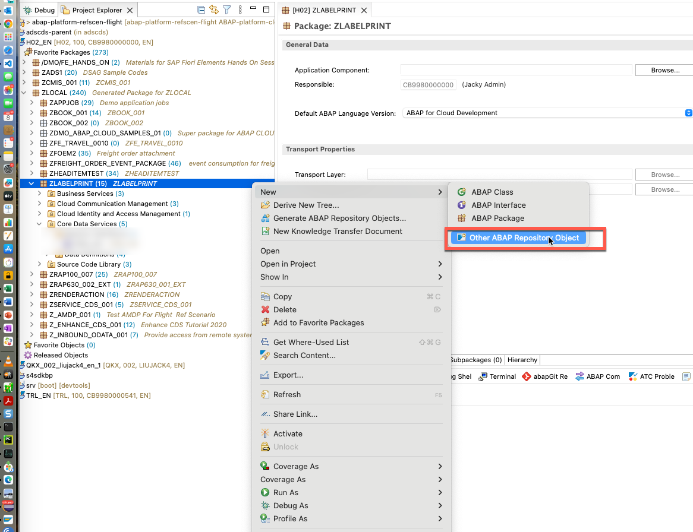

---

### Step 2: Select Data Definition

In the search box type `data def`, select **Data Definition** under **Core Data Services**, and click **Next**.

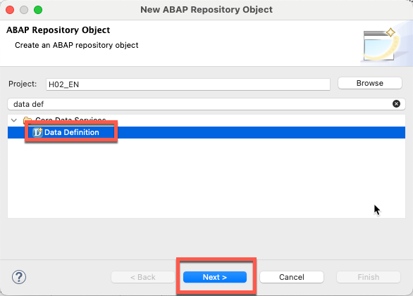

---

### Step 3: Enter the Name

Fill in the fields as follows and click **Next**.

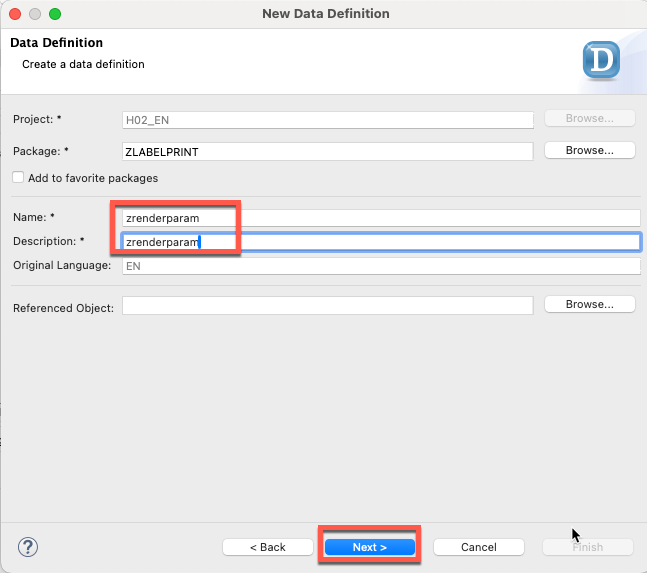

| Field | Value |
|-------|-------|
| Package | `ZLABELPRINT` |
| Name | `zrenderparam` |
| Description | `zrenderparam` |

---

### Step 4: Assign the Transport Request

Select the `ZLABELPRINT_PACKAGE` transport request and click **Next**.

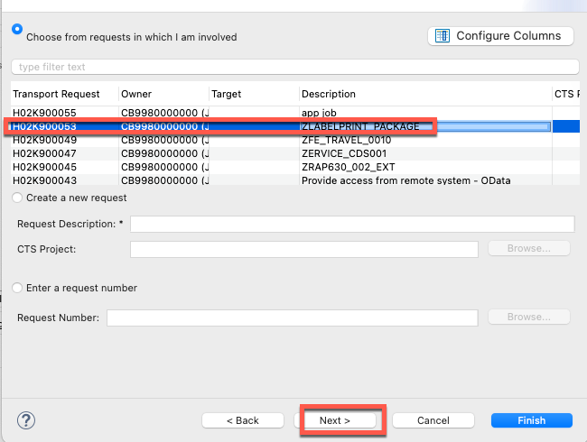

---

### Step 5: Select the Template

On the **Templates** page, select **Define Abstract Entity with Parameters** and click **Finish**.

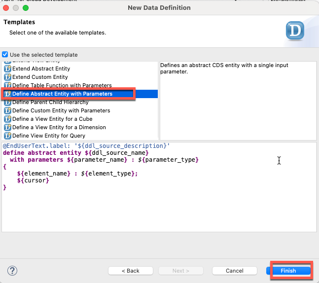

---

### Step 6: Replace the CDS Code

Replace the generated content with the following, then save (`Cmd+S`) and activate (`Cmd+F3`).

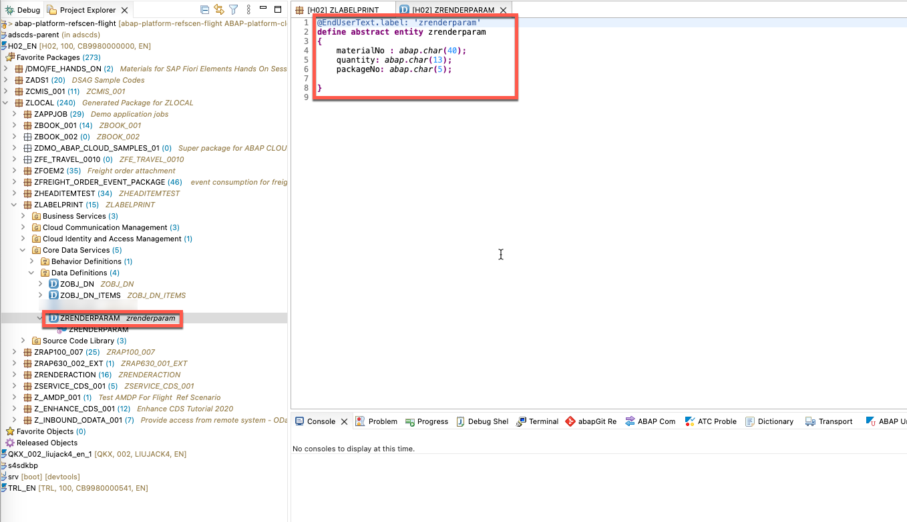

```cds
@EndUserText.label: 'zrenderparam'
define abstract entity zrenderparam
{
    materialNo : abap.char(40);
    quantity: abap.char(13);
    packageNo: abap.char(5);
    
}
```

---

## Part 2: Create the Abstract Entity `ZPDF_CNT`

`ZPDF_CNT` defines the result type of the `render` function: a single raw-string field that holds the rendered PDF bytes.

### Step 7: Create a Second Data Definition

Repeat Steps 1–5 with the following name, again selecting the **Define Abstract Entity with Parameters** template.

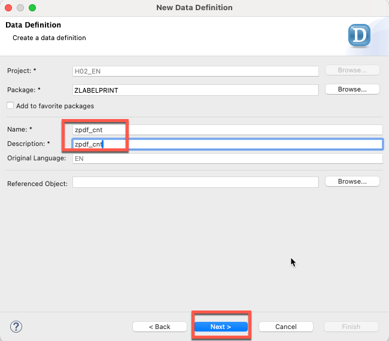

| Field | Value |
|-------|-------|
| Package | `ZLABELPRINT` |
| Name | `zpdf_cnt` |
| Description | `zpdf_cnt` |

---

### Step 8: Replace the CDS Code

Replace the generated content with the following, then save and activate.

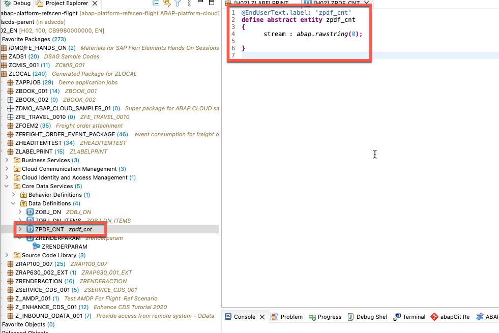

```cds
@EndUserText.label: 'zpdf_cnt'
define abstract entity zpdf_cnt
{
      stream : abap.rawstring(0);
    
}
```

---

## Part 3: Create the Behavior Definition and Implementation

### Step 9: Open the New Behavior Definition Wizard

In the **Project Explorer**, right-click `ZOBJ_DN` under **Core Data Services → Data Definitions** and choose **New → New Behavior Definition**.

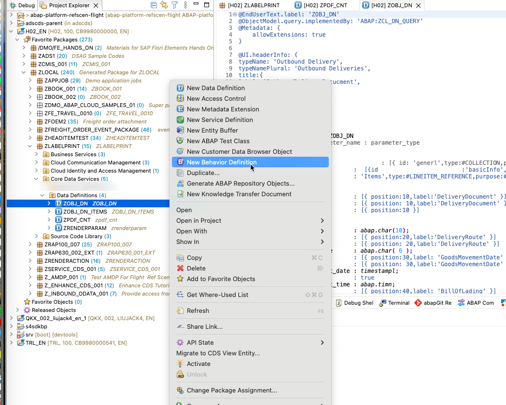

---

### Step 10: Enter the Behavior Definition Details

The wizard pre-fills **Root Entity** with `ZOBJ_DN`. Set the **Implementation Type** to `Unmanaged` and click **Next**, then proceed through the transport request page and click **Finish**.

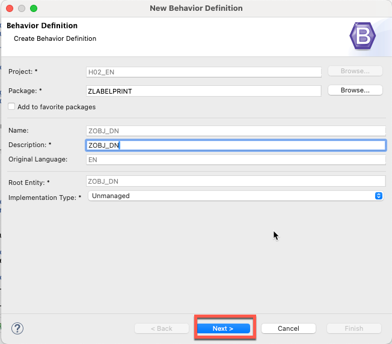

| Field | Value |
|-------|-------|
| Package | `ZLABELPRINT` |
| Name | `ZOBJ_DN` |
| Description | `ZOBJ_DN` |
| Root Entity | `ZOBJ_DN` |
| Implementation Type | `Unmanaged` |

---

### Step 11: Replace the Behavior Definition Code

Eclipse opens the behavior definition editor with a skeleton. Replace it with the following, then save.

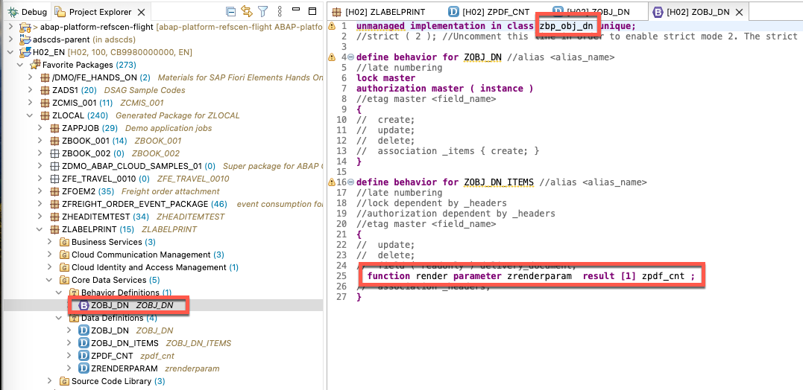

```abap
unmanaged implementation in class zbp_obj_dn unique;

define behavior for ZOBJ_DN //alias <alias_name>
//late numbering
lock master
authorization master ( instance )
//etag master <field_name>
{
//  create;
//  update;
//  delete;
//  association _items { create; }
}

define behavior for ZOBJ_DN_ITEMS //alias <alias_name>
//late numbering
//lock dependent by _headers
//authorization dependent by _headers
//etag master <field_name>
{
//  update;
//  delete;
//  field ( readonly ) delivery_document;
  function render1 parameter zrenderparam  result [1] zpdf_cnt ;
//  association _headers;
}
```

> The `function render1` line declares the `render` action on `ZOBJ_DN_ITEMS`. It takes `ZRENDERPARAM` as input and returns a single `ZPDF_CNT` result.

---

### Step 12: Replace the Behavior Implementation Code

Eclipse also opens the behavior implementation class `ZBP_OBJ_DN`. Replace its entire content with the following, then save.

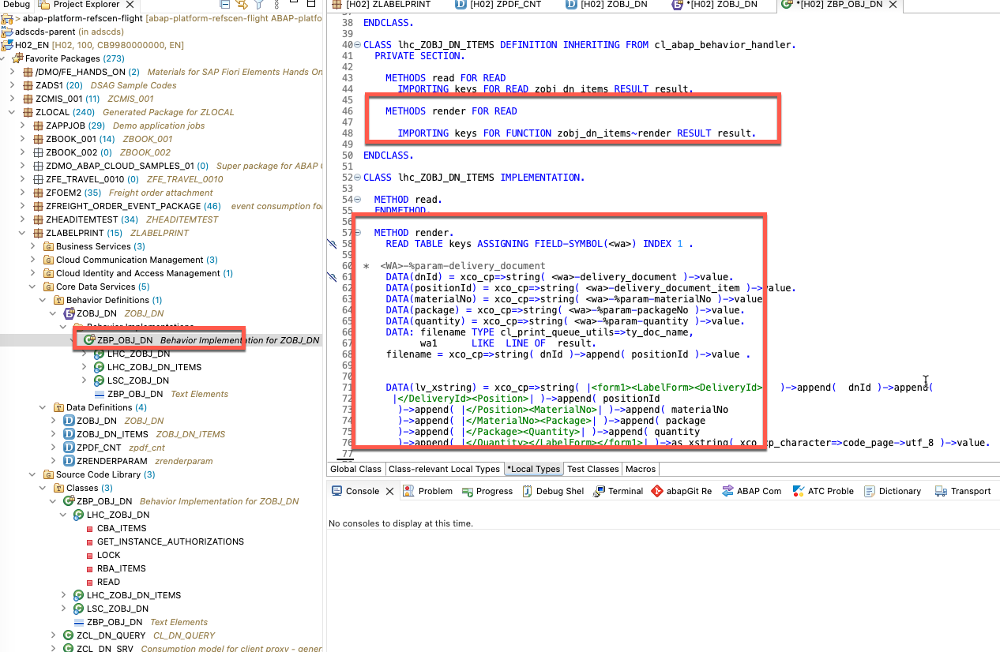

```abap
CLASS lhc_ZOBJ_DN DEFINITION INHERITING FROM cl_abap_behavior_handler.
  PRIVATE SECTION.

    METHODS get_instance_authorizations FOR INSTANCE AUTHORIZATION
      IMPORTING keys REQUEST requested_authorizations FOR zobj_dn RESULT result.

    METHODS read FOR READ
      IMPORTING keys FOR READ zobj_dn RESULT result.

    METHODS lock FOR LOCK
      IMPORTING keys FOR LOCK zobj_dn.

    METHODS rba_Items FOR READ
      IMPORTING keys_rba FOR READ zobj_dn\_Items FULL result_requested RESULT result LINK association_links.

    METHODS cba_Items FOR MODIFY
      IMPORTING entities_cba FOR CREATE zobj_dn\_Items.

ENDCLASS.

CLASS lhc_ZOBJ_DN IMPLEMENTATION.

  METHOD get_instance_authorizations.
  ENDMETHOD.

  METHOD read.
  ENDMETHOD.

  METHOD lock.
  ENDMETHOD.

  METHOD rba_Items.
  ENDMETHOD.

  METHOD cba_Items.
  ENDMETHOD.

ENDCLASS.

CLASS lhc_ZOBJ_DN_ITEMS DEFINITION INHERITING FROM cl_abap_behavior_handler.
  PRIVATE SECTION.

    METHODS read FOR READ
      IMPORTING keys FOR READ zobj_dn_items RESULT result.

    METHODS render FOR READ

      IMPORTING keys FOR FUNCTION zobj_dn_items~render RESULT result.

ENDCLASS.

CLASS lhc_ZOBJ_DN_ITEMS IMPLEMENTATION.

  METHOD read.
  ENDMETHOD.

  METHOD render.
    READ TABLE keys ASSIGNING FIELD-SYMBOL(<wa>) INDEX 1 .

*  <WA>-%param-delivery_document
    DATA(dnId) = xco_cp=>string( <wa>-delivery_document )->value.
    DATA(positionId) = xco_cp=>string( <wa>-delivery_document_item )->value.
    DATA(materialNo) = xco_cp=>string( <wa>-%param-materialNo )->value.
    DATA(package) = xco_cp=>string( <wa>-%param-packageNo )->value.
    DATA(quantity) = xco_cp=>string( <wa>-%param-quantity )->value.
    DATA: filename TYPE cl_print_queue_utils=>ty_doc_name,
          wa1      LIKE  LINE OF  result.
    filename = xco_cp=>string( dnId )->append( positionId )->value .


    DATA(lv_xstring) = xco_cp=>string( |<form1><LabelForm><DeliveryId>|  )->append(  dnId )->append(
     |</DeliveryId><Position>| )->append( positionId
      )->append( |</Position><MaterialNo>| )->append( materialNo
      )->append( |</MaterialNo><Package>| )->append( package
      )->append( |</Package><Quantity>| )->append( quantity
      )->append( |</Quantity></LabelForm></form1>| )->as_xstring( xco_cp_character=>code_page->utf_8 )->value.


    TRY.

        DATA(lo_store) = NEW zcl_fp_tmpl_store_client(
         iv_name = 'adobeapi'
         iv_service_instance_name = 'SAP_COM_0276'
       ).


        DATA(ls_template) = lo_store->get_template_by_name(
   iv_get_binary     = abap_true
   iv_form_name      = 'labelprint'
   iv_template_name  = 'PrintLabel'
 ).
        cl_fp_ads_util=>render_4_pq(
          EXPORTING
            iv_locale       = 'en_US'
            iv_pq_name      = 'PRINT_QUEUE'
            iv_xml_data     = lv_xstring
            iv_xdp_layout   = ls_template-xdp_template
            is_options      = VALUE #(
              trace_level = 4 "Use 0 in production environment
            )
          IMPORTING
            ev_trace_string = DATA(lv_trace)
            ev_pdl          = DATA(lv_pdf)
        ).

        cl_print_queue_utils=>create_queue_item_by_data(
    iv_qname = 'PRINT_QUEUE'
    iv_print_data = lv_pdf
    iv_name_of_main_doc = filename
  ).


      wa1-%tky = <wa>-%tky .
      wa1-%param-stream = lv_pdf .
      APPEND wa1 TO result .

      CATCH cx_fp_fdp_error zcx_fp_tmpl_store_error cx_fp_ads_util INTO DATA(lo_err).

    ENDTRY.


  ENDMETHOD.

ENDCLASS.

CLASS lsc_ZOBJ_DN DEFINITION INHERITING FROM cl_abap_behavior_saver.
  PROTECTED SECTION.

    METHODS finalize REDEFINITION.

    METHODS check_before_save REDEFINITION.

    METHODS save REDEFINITION.

    METHODS cleanup REDEFINITION.

    METHODS cleanup_finalize REDEFINITION.

ENDCLASS.

CLASS lsc_ZOBJ_DN IMPLEMENTATION.

  METHOD finalize.
  ENDMETHOD.

  METHOD check_before_save.
  ENDMETHOD.

  METHOD save.
  ENDMETHOD.

  METHOD cleanup.
  ENDMETHOD.

  METHOD cleanup_finalize.
  ENDMETHOD.

ENDCLASS.
```

---

### Step 13: Activate Both Objects

Right-click `ZOBJ_DN` in the Project Explorer and choose **Activate**, or press `Cmd+F3`. Eclipse will prompt you to save both `ZBP_OBJ_DN` and `ZOBJ_DN` before activating — make sure both are checked and click **OK**.

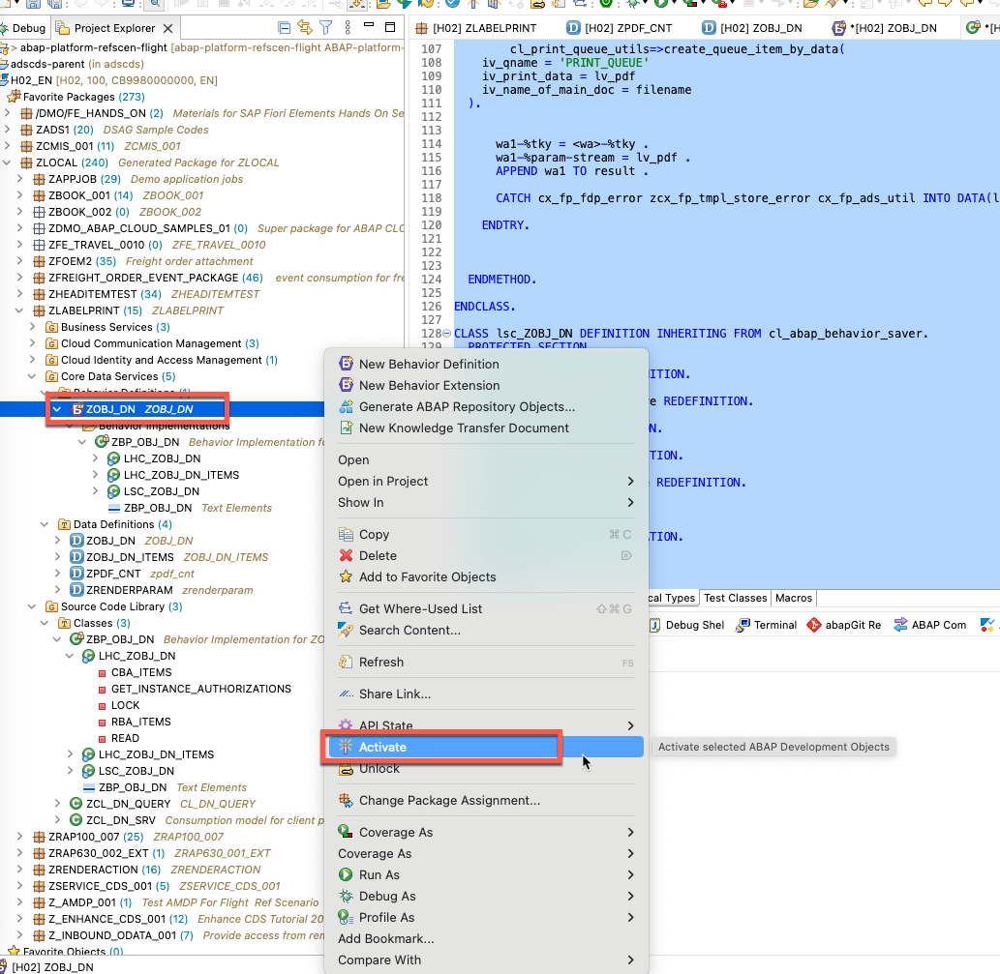

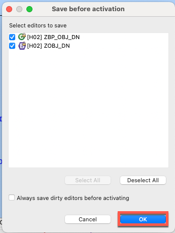

Both objects must activate without errors before you proceed.

---

## How the `render` Method Works

When the user clicks the **Render** button in the Fiori app, the RAP framework calls `lhc_ZOBJ_DN_ITEMS~render` with the selected delivery item key and the parameters from the dialog. The method:

1. **Builds the XML data payload** — a `<form1><LabelForm>` structure containing the delivery ID, position, material number, package, and quantity.
2. **Fetches the XDP template** — calls `ZCL_FP_TMPL_STORE_CLIENT` (via `SAP_COM_0276`) to download the `PrintLabel` template from the `labelprint` form in the Forms Template Store.
3. **Renders the PDF** — passes the XML data and XDP template to `cl_fp_ads_util=>render_4_pq`, which calls the SAP Forms Service by Adobe (`SAP_COM_0503`) and returns the rendered PDF bytes.
4. **Queues the print job** — calls `cl_print_queue_utils=>create_queue_item_by_data` to push the PDF to `PRINT_QUEUE`.

> Set `trace_level = 0` when deploying to production (currently `4` for debugging).

---

## Result

The behavior definition `ZOBJ_DN` and implementation class `ZBP_OBJ_DN` are now active in package `ZLABELPRINT`. The `render` action is available on `ZOBJ_DN_ITEMS` and is wired to the Forms Service by Adobe pipeline.

In **Exercise 12**, you will create the service definition `ZSRV_DN` and a UI service binding to expose `ZOBJ_DN` and `ZOBJ_DN_ITEMS` as an OData V4 service for the Fiori Elements app.
