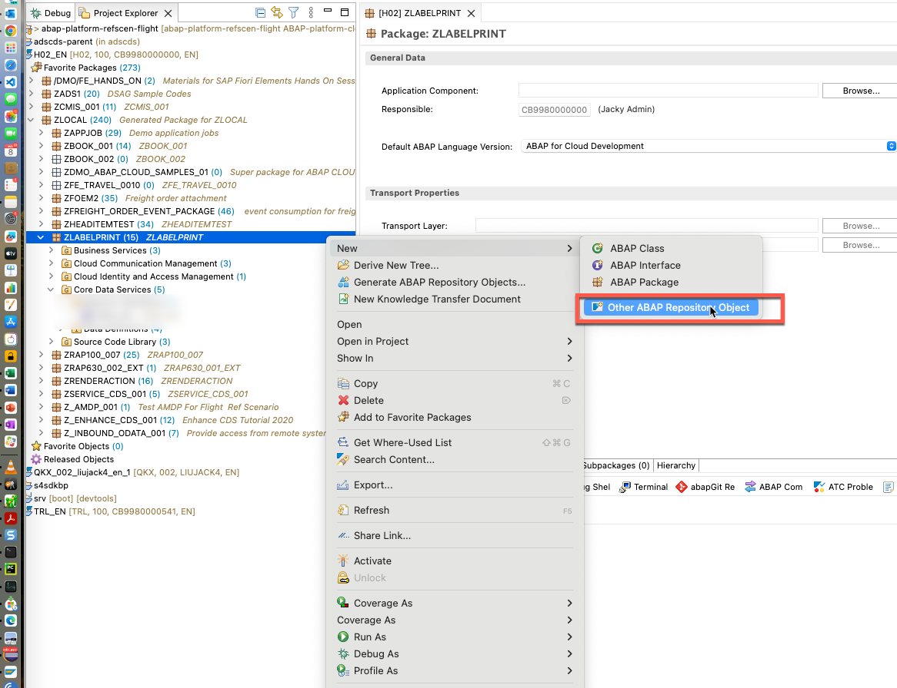
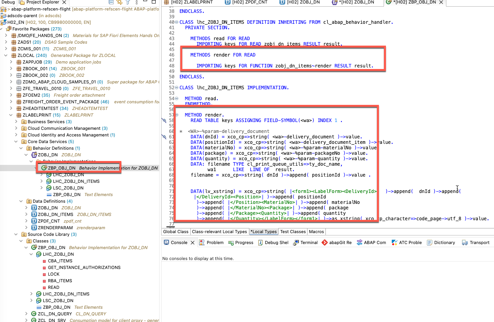

## Create behavior definition for data definition ZOBJ_DN in Eclipse.

### Step 1, Create abstract entity for render function  input parameters

zrenderparam




update the abstract entity zrenderparam with the following code:

```
@EndUserText.label: 'zrenderparam'
define abstract entity zrenderparam
{
    materialNo : abap.char(40);
    quantity: abap.char(13);
    packageNo: abap.char(5);
    
}
```
Activate the abstract entity zrenderparam


### Step 2, Create abstract entity for render function result


update the abstract entity zpdf_cnt with the following code:

```
@EndUserText.label: 'zpdf_cnt'
define abstract entity zpdf_cnt
{
      stream : abap.rawstring(0);
    
}
```
Activate the abstract entity zpdf_cnt


### Step 3, Create behavior definition for data definition ZOBJ_DN


Click Next until finish.


Adjust the behavior definition as the following:

```
unmanaged implementation in class zbp_obj_dn unique;

define behavior for ZOBJ_DN //alias <alias_name>
//late numbering
lock master
authorization master ( instance )
//etag master <field_name>
{
//  create;
//  update;
//  delete;
//  association _items { create; }
}

define behavior for ZOBJ_DN_ITEMS //alias <alias_name>
//late numbering
//lock dependent by _headers
//authorization dependent by _headers
//etag master <field_name>
{
//  update;
//  delete;
//  field ( readonly ) delivery_document;
  function render1 parameter zrenderparam  result [1] zpdf_cnt ;
//  association _headers;
}

```




```

CLASS lhc_ZOBJ_DN DEFINITION INHERITING FROM cl_abap_behavior_handler.
  PRIVATE SECTION.

    METHODS get_instance_authorizations FOR INSTANCE AUTHORIZATION
      IMPORTING keys REQUEST requested_authorizations FOR zobj_dn RESULT result.

    METHODS read FOR READ
      IMPORTING keys FOR READ zobj_dn RESULT result.

    METHODS lock FOR LOCK
      IMPORTING keys FOR LOCK zobj_dn.

    METHODS rba_Items FOR READ
      IMPORTING keys_rba FOR READ zobj_dn\_Items FULL result_requested RESULT result LINK association_links.

    METHODS cba_Items FOR MODIFY
      IMPORTING entities_cba FOR CREATE zobj_dn\_Items.

ENDCLASS.

CLASS lhc_ZOBJ_DN IMPLEMENTATION.

  METHOD get_instance_authorizations.
  ENDMETHOD.

  METHOD read.
  ENDMETHOD.

  METHOD lock.
  ENDMETHOD.

  METHOD rba_Items.
  ENDMETHOD.

  METHOD cba_Items.
  ENDMETHOD.

ENDCLASS.

CLASS lhc_ZOBJ_DN_ITEMS DEFINITION INHERITING FROM cl_abap_behavior_handler.
  PRIVATE SECTION.

    METHODS read FOR READ
      IMPORTING keys FOR READ zobj_dn_items RESULT result.

    METHODS render FOR READ

      IMPORTING keys FOR FUNCTION zobj_dn_items~render RESULT result.

ENDCLASS.

CLASS lhc_ZOBJ_DN_ITEMS IMPLEMENTATION.

  METHOD read.
  ENDMETHOD.

  METHOD render.
    READ TABLE keys ASSIGNING FIELD-SYMBOL(<wa>) INDEX 1 .

*  <WA>-%param-delivery_document
    DATA(dnId) = xco_cp=>string( <wa>-delivery_document )->value.
    DATA(positionId) = xco_cp=>string( <wa>-delivery_document_item )->value.
    DATA(materialNo) = xco_cp=>string( <wa>-%param-materialNo )->value.
    DATA(package) = xco_cp=>string( <wa>-%param-packageNo )->value.
    DATA(quantity) = xco_cp=>string( <wa>-%param-quantity )->value.
    DATA: filename TYPE cl_print_queue_utils=>ty_doc_name,
          wa1      LIKE  LINE OF  result.
    filename = xco_cp=>string( dnId )->append( positionId )->value .


    DATA(lv_xstring) = xco_cp=>string( |<form1><LabelForm><DeliveryId>|  )->append(  dnId )->append(
     |</DeliveryId><Position>| )->append( positionId
      )->append( |</Position><MaterialNo>| )->append( materialNo
      )->append( |</MaterialNo><Package>| )->append( package
      )->append( |</Package><Quantity>| )->append( quantity
      )->append( |</Quantity></LabelForm></form1>| )->as_xstring( xco_cp_character=>code_page->utf_8 )->value.


    TRY.

        DATA(lo_store) = NEW zcl_fp_tmpl_store_client(
         iv_name = 'adobeapi'
         iv_service_instance_name = 'SAP_COM_0276'
       ).


        DATA(ls_template) = lo_store->get_template_by_name(
   iv_get_binary     = abap_true
   iv_form_name      = 'labelprint'
   iv_template_name  = 'PrintLabel'
 ).
        cl_fp_ads_util=>render_4_pq(
          EXPORTING
            iv_locale       = 'en_US'
            iv_pq_name      = 'PRINT_QUEUE'
            iv_xml_data     = lv_xstring
            iv_xdp_layout   = ls_template-xdp_template
            is_options      = VALUE #(
              trace_level = 4 "Use 0 in production environment
            )
          IMPORTING
            ev_trace_string = DATA(lv_trace)
            ev_pdl          = DATA(lv_pdf)
        ).

        cl_print_queue_utils=>create_queue_item_by_data(
    iv_qname = 'PRINT_QUEUE'
    iv_print_data = lv_pdf
    iv_name_of_main_doc = filename
  ).


      wa1-%tky = <wa>-%tky .
      wa1-%param-stream = lv_pdf .
      APPEND wa1 TO result .

      CATCH cx_fp_fdp_error zcx_fp_tmpl_store_error cx_fp_ads_util INTO DATA(lo_err).

    ENDTRY.


  ENDMETHOD.

ENDCLASS.

CLASS lsc_ZOBJ_DN DEFINITION INHERITING FROM cl_abap_behavior_saver.
  PROTECTED SECTION.

    METHODS finalize REDEFINITION.

    METHODS check_before_save REDEFINITION.

    METHODS save REDEFINITION.

    METHODS cleanup REDEFINITION.

    METHODS cleanup_finalize REDEFINITION.

ENDCLASS.

CLASS lsc_ZOBJ_DN IMPLEMENTATION.

  METHOD finalize.
  ENDMETHOD.

  METHOD check_before_save.
  ENDMETHOD.

  METHOD save.
  ENDMETHOD.

  METHOD cleanup.
  ENDMETHOD.

  METHOD cleanup_finalize.
  ENDMETHOD.

ENDCLASS.

```

Activate Behavior Definition.


