# Exercise 12: Create the Service Definition and Service Binding in Eclipse

In this exercise you will expose the custom entities `ZOBJ_DN` and `ZOBJ_DN_ITEMS` as an OData V4 UI service. This makes the data available to the Fiori Elements app you will build in Exercise 13.

The exercise has two parts:

| Part | What you create |
|------|----------------|
| 1 | Service definition `ZSRV_DN` — declares which entities to expose |
| 2 | Service binding `ZSRVBND_DN` — publishes the service as OData V4 UI and provides a preview URL |

---

## Part 1: Create the Service Definition

The service definition is a short CDS artifact that lists the entities to be exposed. Think of it as the "menu" of what the OData service offers.

### Step 1: Open the New Service Definition Wizard

In the **Project Explorer**, right-click the package `ZLABELPRINT` and choose **New → New Service Definition**.

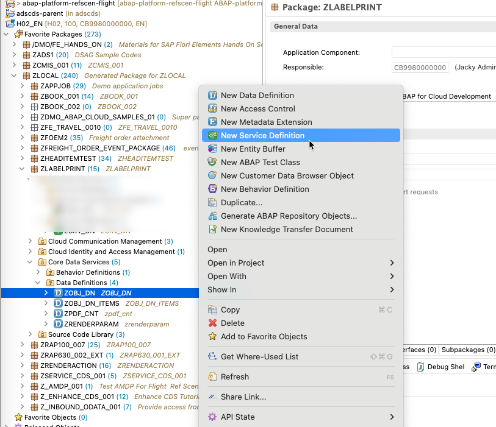

---

### Step 2: Enter the Service Definition Details

Fill in the fields as follows and click **Next**.

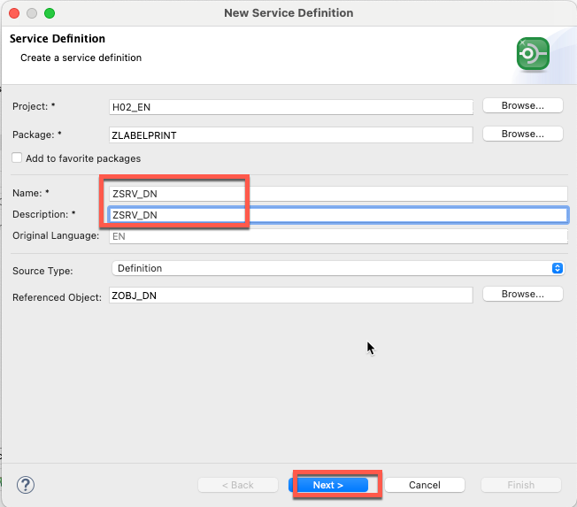

| Field | Value |
|-------|-------|
| Package | `ZLABELPRINT` |
| Name | `ZSRV_DN` |
| Description | `ZSRV_DN` |
| Source Type | `Definition` |
| Referenced Object | `ZOBJ_DN` |

---

### Step 3: Assign the Transport Request

Select the `ZLABELPRINT_PACKAGE` transport request and click **Finish**.

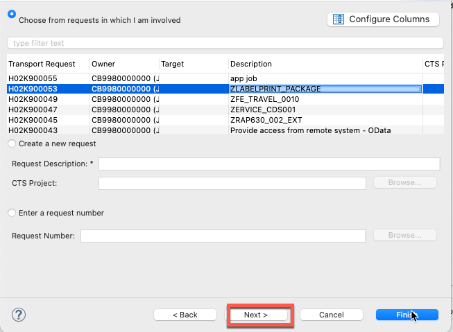

---

### Step 4: Select the Template

On the **Templates** page, select **Define Service** and click **Finish**.

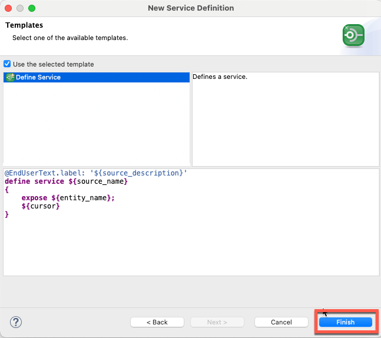

---

### Step 5: Replace the Service Definition Code

Eclipse generates a skeleton. Replace the content with the following, then save (`Cmd+S`) and activate (`Cmd+F3`).

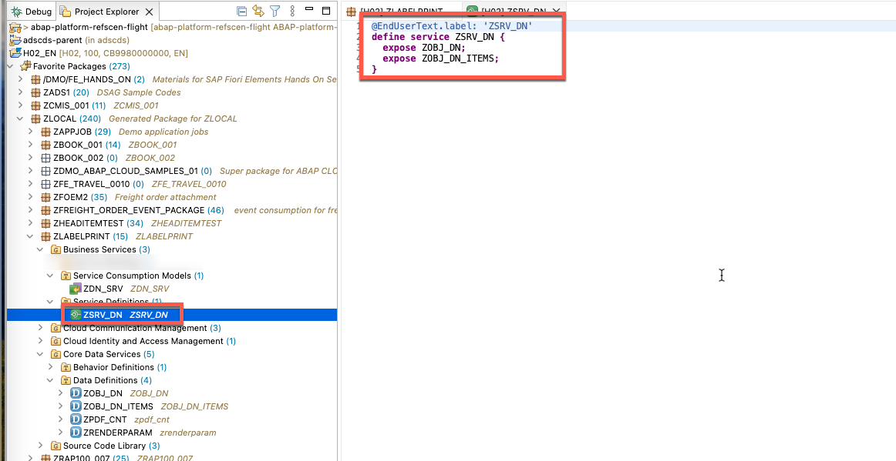

```cds
@EndUserText.label: 'ZSRV_DN'
define service ZSRV_DN {
  expose ZOBJ_DN;
  expose ZOBJ_DN_ITEMS;
}
```

---

## Part 2: Create the Service Binding

The service binding publishes the service definition as a concrete OData V4 endpoint and generates a preview URL you can use to test the service directly from Eclipse.

### Step 6: Open the New Service Binding Wizard

In the **Project Explorer**, right-click `ZSRV_DN` under **Service Definitions** and choose **New → New Service Binding**.

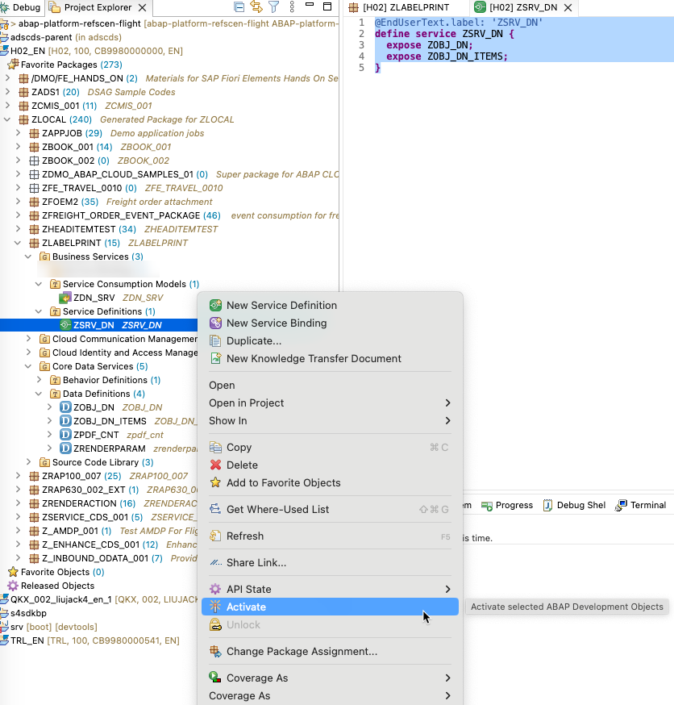

---

### Step 7: Enter the Service Binding Details

Fill in the fields as follows and click **Next**.

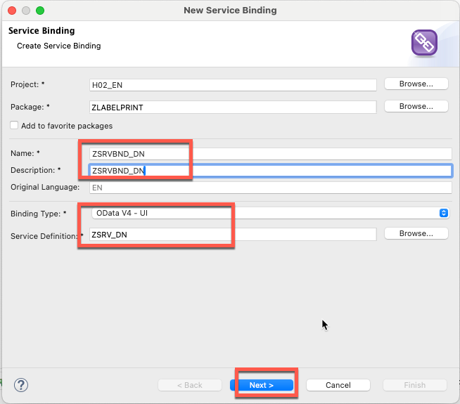

| Field | Value |
|-------|-------|
| Package | `ZLABELPRINT` |
| Name | `ZSRVBND_DN` |
| Description | `ZSRVBND_DN` |
| Binding Type | `OData V4 - UI` |
| Service Definition | `ZSRV_DN` |

---

### Step 8: Assign the Transport Request

Select the `ZLABELPRINT_PACKAGE` transport request and click **Finish**.

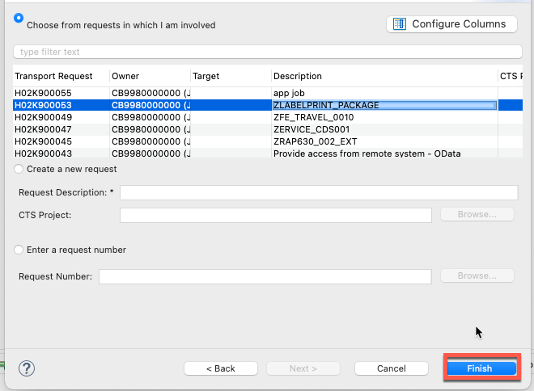

---

### Step 9: Publish the Service

Eclipse opens the service binding editor. Click **Publish** to activate the OData V4 endpoint. After publishing, the **Service Version Details** panel on the right shows the generated service URL.

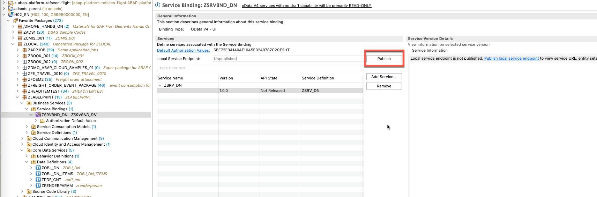

---

### Step 10: Preview the Service

After publishing, the **Service Name** table lists `ZSRV_DN`. Click the **Preview** button to open the Fiori Elements preview in your browser.

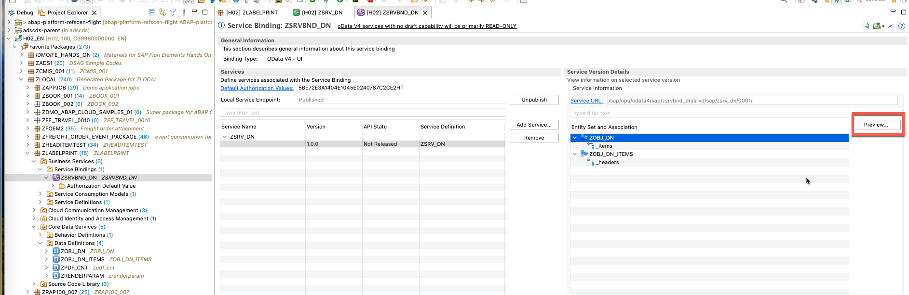

The preview opens a Fiori Elements List Report showing outbound delivery headers fetched live from S/4HANA Cloud.

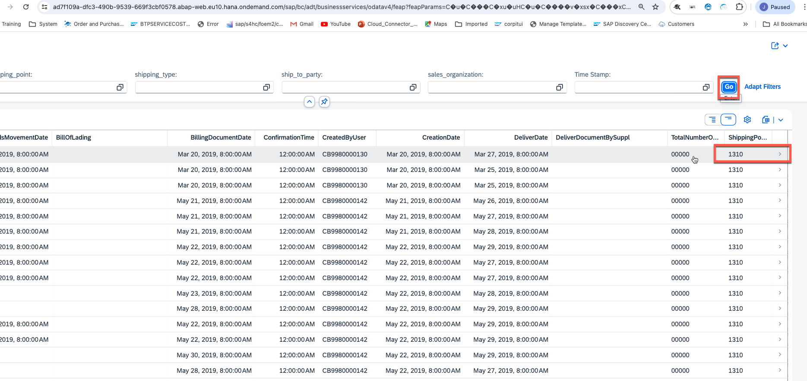

Click on a delivery row to open the Object Page and see the delivery items.

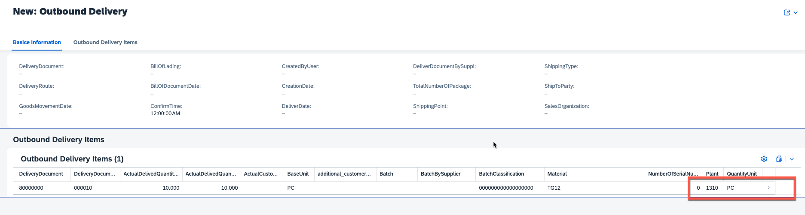

Click on a delivery item to open its detail page. The **Render** button appears in the top-right corner.

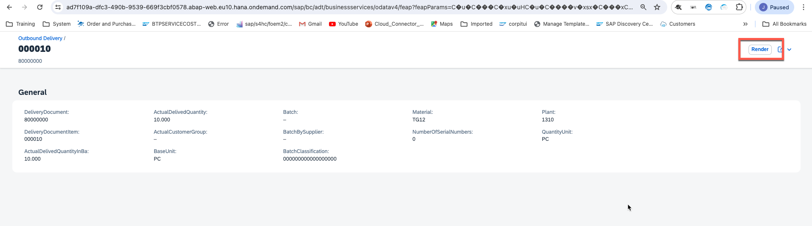

Clicking **Render** opens the action dialog where you enter the label parameters.

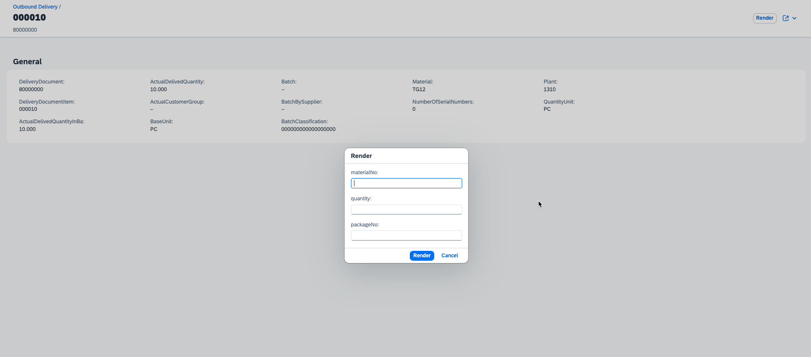

---

## Result

The service definition `ZSRV_DN` and service binding `ZSRVBND_DN` are now active in package `ZLABELPRINT`. The OData V4 UI endpoint exposes `ZOBJ_DN` (delivery headers) and `ZOBJ_DN_ITEMS` (delivery items) including the `render` action.

In **Exercise 13**, you will use SAP Business Application Studio to build a Fiori Elements app on top of this service binding.
