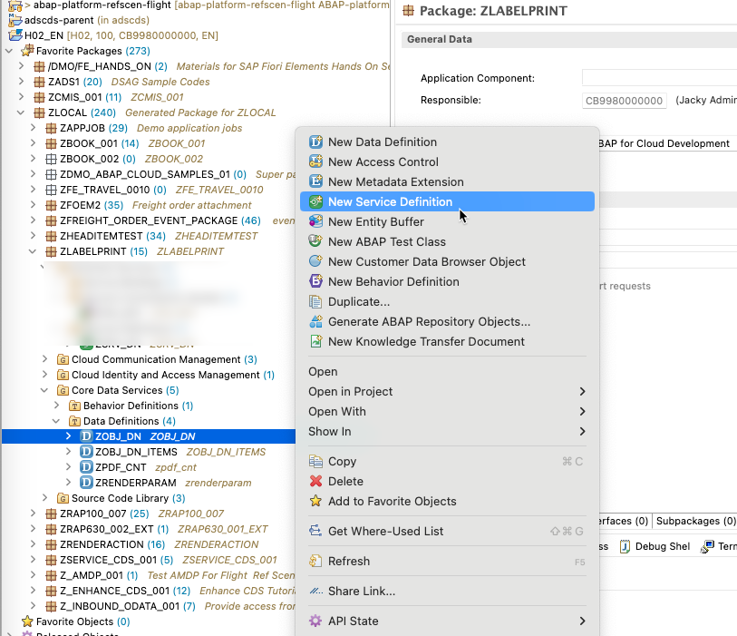
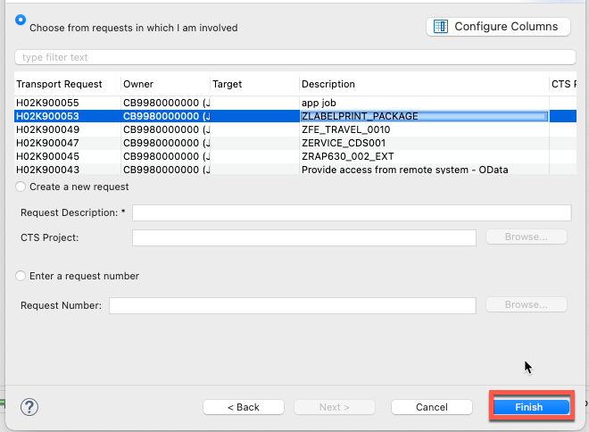

### Step 1,Create service definition in Eclipse




Adjust the service definition as the following
```
@EndUserText.label: 'ZSRV_DN'
define service ZSRV_DN {
  expose ZOBJ_DN;
  expose ZOBJ_DN_ITEMS;
}
```
Activate the service definition


### Step 2, Create service binding in Eclipse





