# Exercise 13: Create the Fiori Application in SAP Business Application Studio

In this exercise you will build a Fiori Elements **List Report** application in SAP Business Application Studio (BAS) that consumes the OData V4 service `ZSRVBND_DN` created in Exercise 12. You will then extend it with a controller extension, a custom PDF viewer section, and a custom action button so that users can trigger label printing directly from the delivery item Object Page.

---

## Prerequisites

Before starting, confirm the following are in place:

- SAP Business Application Studio is set up in the same BTP subaccount as your ABAP Environment. Follow the [SAP BAS onboarding tutorial](https://developers.sap.com/tutorials/appstudio-onboarding.html) if needed.
- Your user has the following BAS roles assigned in the BTP subaccount (**Security → Roles**):

  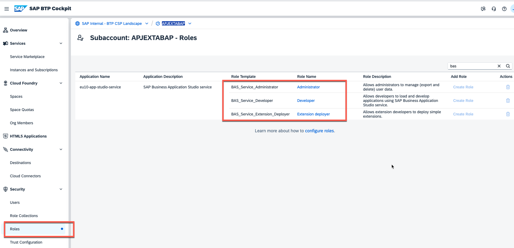

  | Role Template | Role Name |
  |---------------|-----------|
  | `BAS_Service_Administrator` | Administrator |
  | `BAS_Service_Developer` | Developer |
  | `BAS_Service_Extension_Deployer` | Extension Deployer |

- A **Fiori Dev Space** is running in BAS. Follow [Create a Dev Space for SAP Fiori Apps](https://developers.sap.com/tutorials/appstudio-devspace-fiori-create.html) if you have not done this yet.

---

## Part 1: Connect BAS to Cloud Foundry

BAS needs a Cloud Foundry target to discover the ABAP Environment service and its OData services.

### Step 1: Find the Cloud Foundry API Endpoint

In the **SAP BTP Cockpit**, open your subaccount **Overview** page. Under **Cloud Foundry Environment**, copy the **API Endpoint** URL (e.g. `https://api.cf.eu10.hana.ondemand.com`).

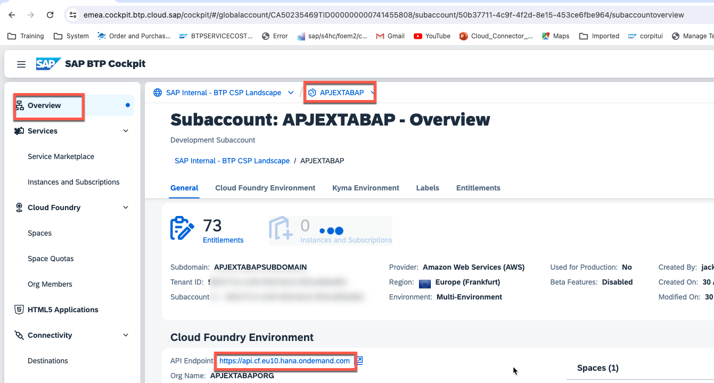

---

### Step 2: Open the Cloud Foundry Targets Panel in BAS

In BAS, click the **Cloud Foundry** icon in the left activity bar (satellite dish icon). In the **Cloud Foundry: Targets** panel header, click the **+** icon to add a new target.

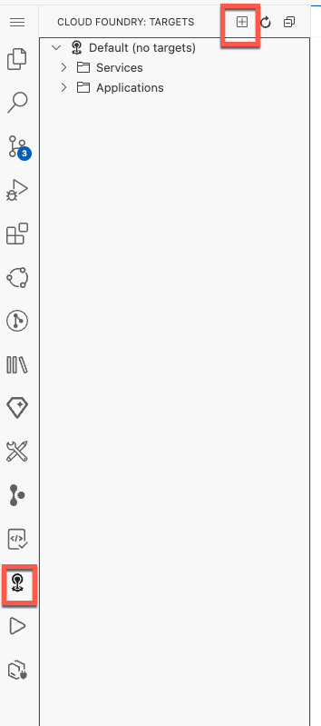

---

### Step 3: Sign In to Cloud Foundry

The **Cloud Foundry Sign In** form opens. Enter the API endpoint you copied in Step 1, enter your BTP username and password, and click **Sign in**.

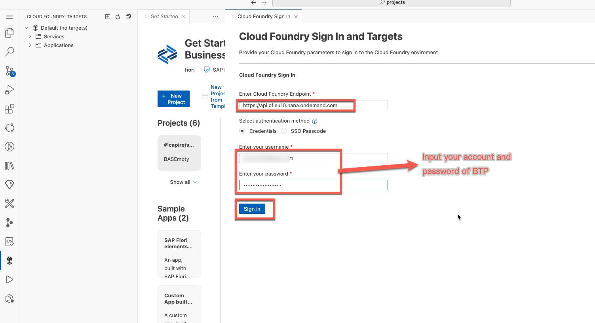

---

### Step 4: Name the Target

When prompted for a target name, type `ABAPAPJ` (or any descriptive name) and press **Enter**.

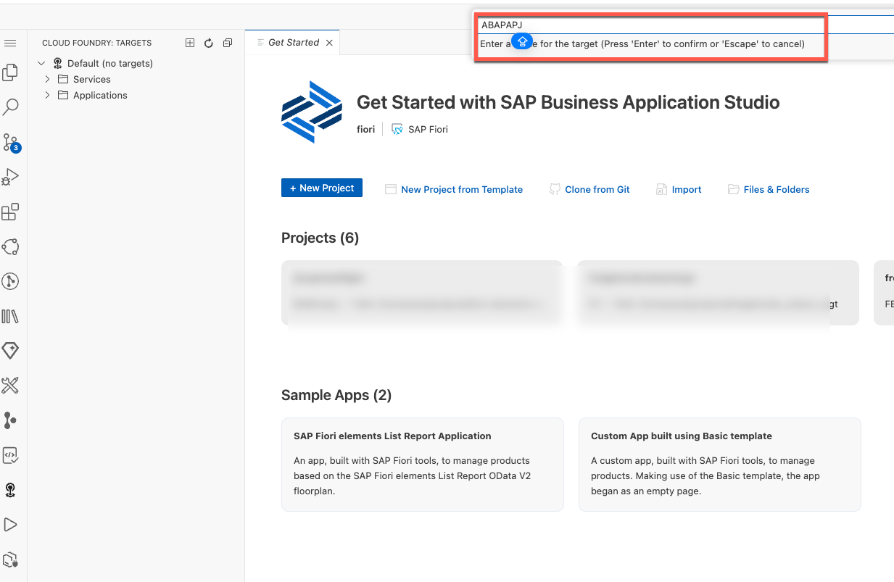

---

### Step 5: Select the Organization and Space

After sign-in, the form shows the **Cloud Foundry Target** section. Select your organization (e.g. `APJEXTABAPORG`) and space (e.g. `dev`), then click **Apply**.

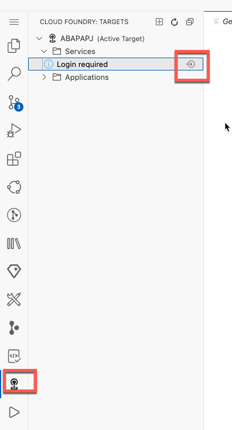

---

### Step 6: Verify the Connection

The **Cloud Foundry: Targets** panel should now show your target as **Active Target** with a list of services. The ABAP Environment service will appear in the list.

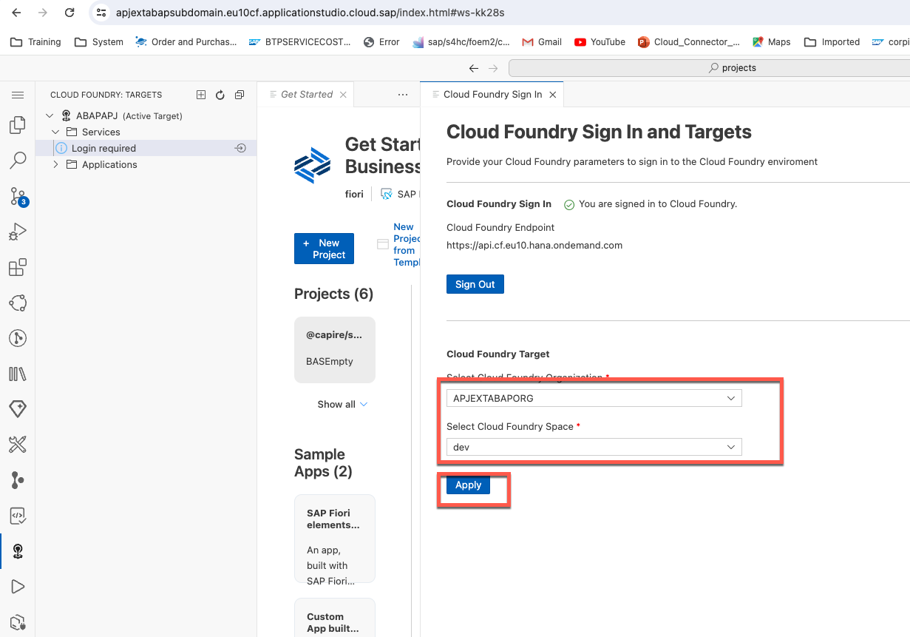

> If you see **Login required** next to a service, click the login icon beside it to authenticate against that specific service instance.

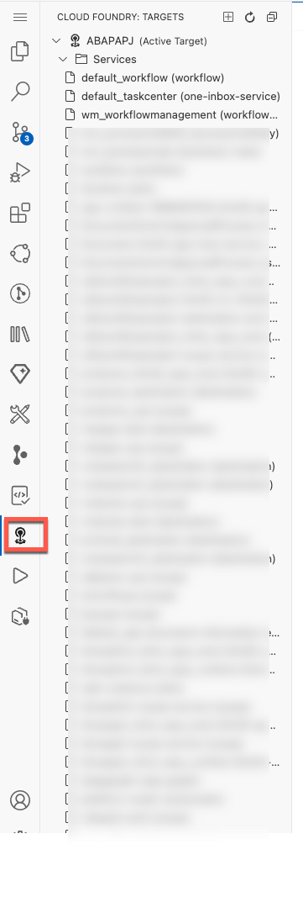

---

## Part 2: Create the Fiori Project from Template

### Step 7: Open the Project Folder

In BAS, go to **File → Open Folder** and navigate to `/home/user/projects`. Click **OK**.

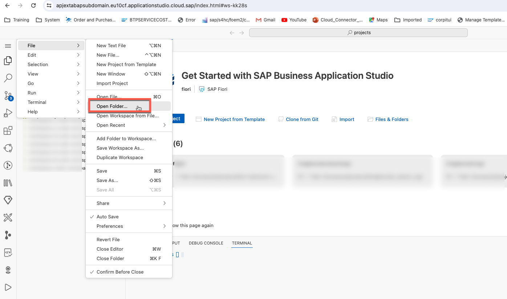

---

### Step 8: Start the Project from Template Wizard

On the **Get Started** page, click **New Project from Template**.

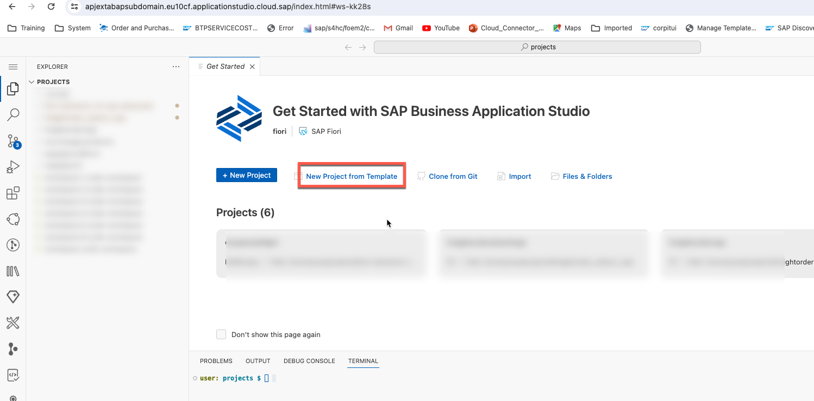

---

### Step 9: Select the Application Type

On the **Select Template and Target Location** page, select **SAP Fiori application** and click **Start**.

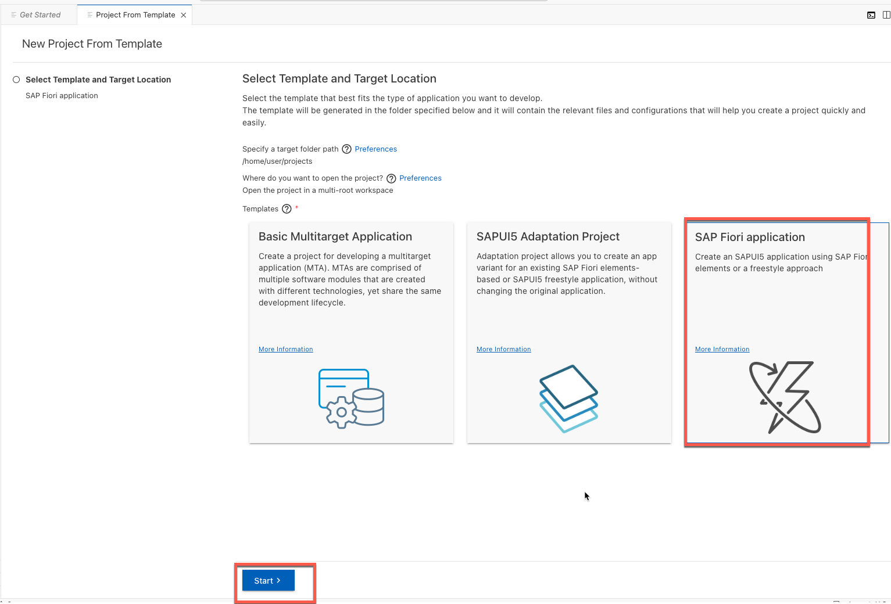

---

### Step 10: Select the Floorplan

On the **Template Selection** page, select **List Report Page** and click **Next**.

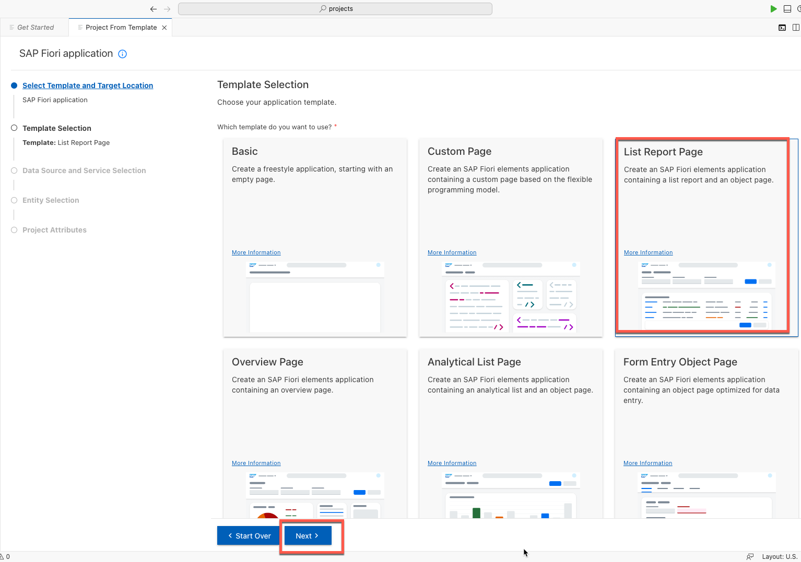

---

### Step 11: Configure the Data Source

On the **Data Source and Service Selection** page, fill in the fields as follows and click **Next**.

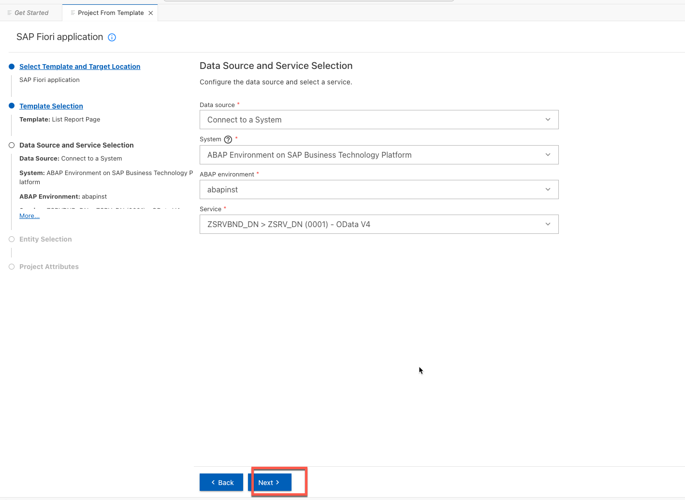

| Field | Value |
|-------|-------|
| Data Source | `Connect to a System` |
| System | `ABAP Environment on SAP Business Technology Platform` |
| ABAP Environment | `abapinst` (your ABAP instance) |
| Service | `ZSRVBND_DN > ZSRV_DN (0001) - OData V4` |

---

### Step 12: Select the Main Entity

On the **Entity Selection** page, fill in the fields as follows and click **Next**.

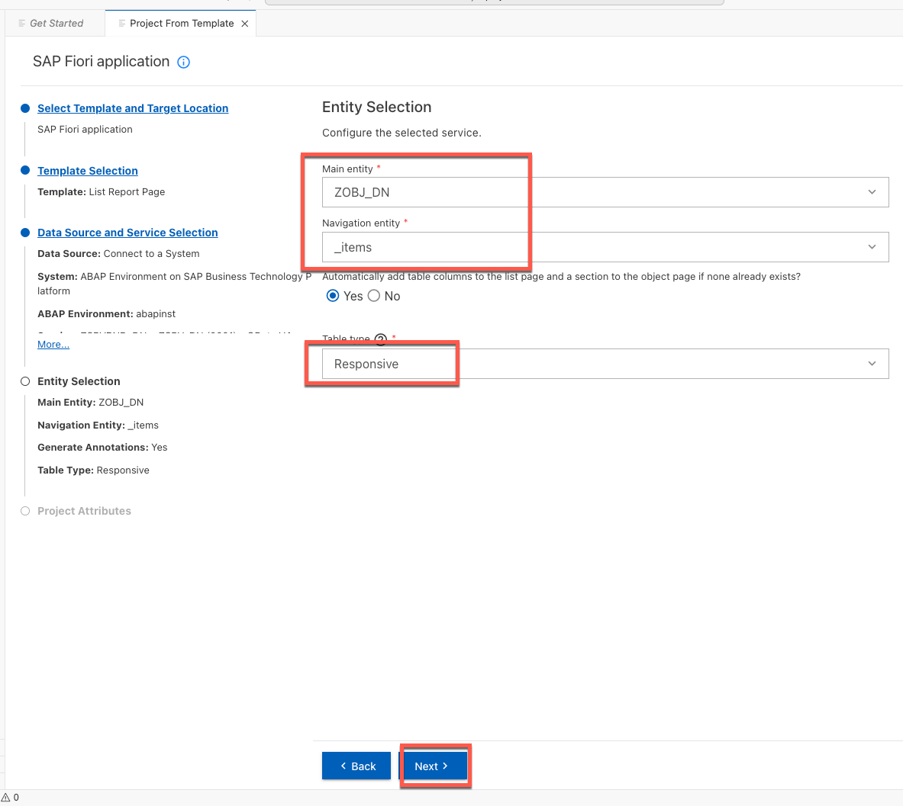

| Field | Value |
|-------|-------|
| Main Entity | `ZOBJ_DN` |
| Navigation Entity | `_items` |
| Automatically add table columns | `Yes` |
| Table Type | `Responsive` |

---

### Step 13: Configure Project Attributes

On the **Project Attributes** page, fill in the fields as follows and click **Next**.

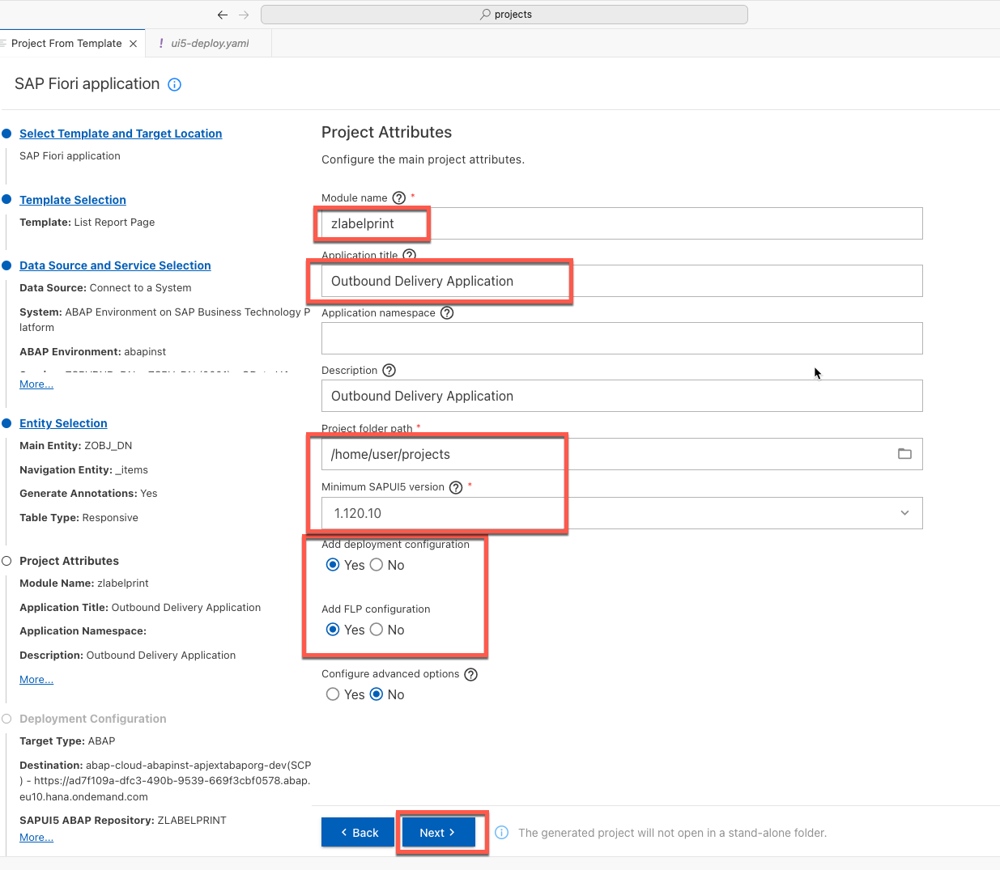

| Field | Value |
|-------|-------|
| Module Name | `zlabelprint` |
| Application Title | `Outbound Delivery Application` |
| Project Folder Path | `/home/user/projects` |
| Add Deployment Configuration | `Yes` |
| Add FLP Configuration | `Yes` |

---

### Step 14: Configure Deployment Settings

On the **Deployment Configuration** page, fill in the fields as follows and click **Next**.

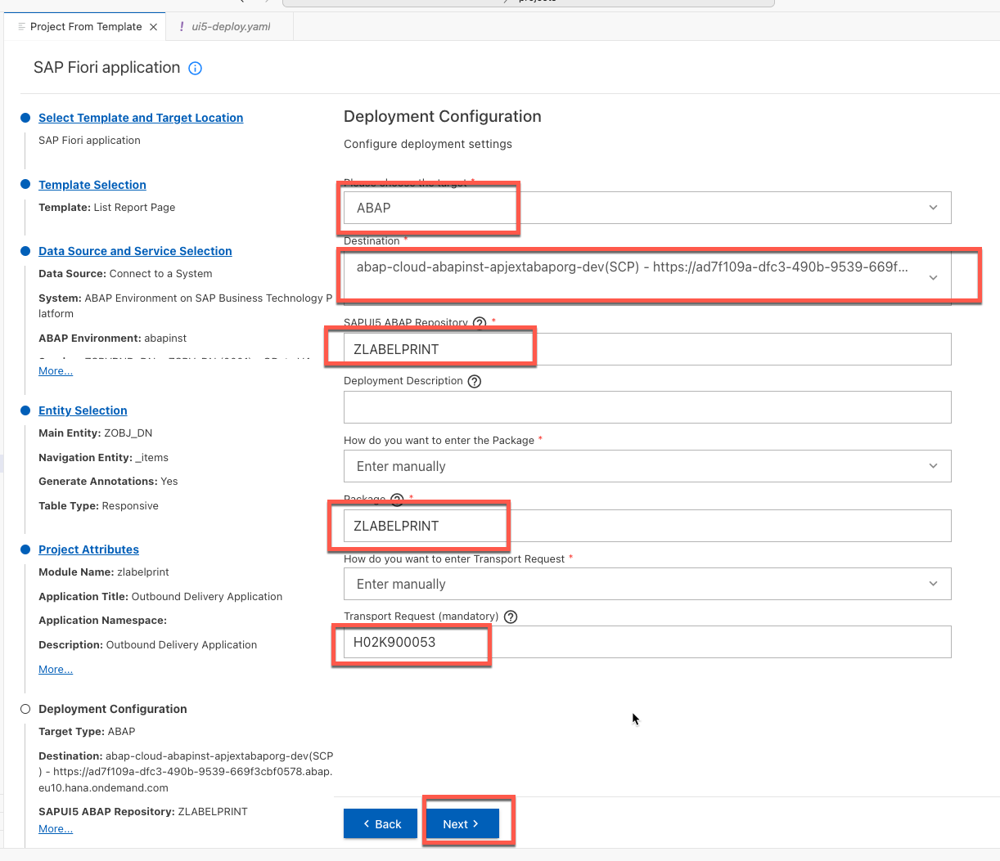

| Field | Value |
|-------|-------|
| Target Type | `ABAP` |
| Destination | Your ABAP Cloud destination (auto-populated) |
| SAPUI5 ABAP Repository | `ZLABELPRINT` |
| Package | `ZLABELPRINT` |
| Transport Request | `H02K900053` (`ZLABELPRINT_PACKAGE`) |

---

### Step 15: Configure the Launchpad Tile

On the **Fiori Launchpad Configuration** page, fill in the semantic object and action, then click **Finish**.

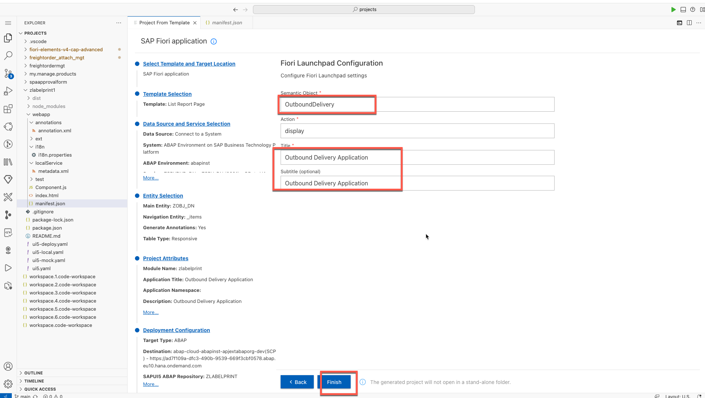

| Field | Value |
|-------|-------|
| Semantic Object | `OutboundDelivery` |
| Action | `display` |
| Title | `Outbound Delivery Application` |
| Subtitle | *(leave blank or enter a subtitle)* |

BAS generates the project and opens the **Storyboard** view.

---

## Part 3: Add the Controller Extension

The controller extension handles the **Render PDF** button click: it reads the delivery item fields, calls the OData `render` function, and displays the returned PDF in the viewer section.

### Step 16: Open the Project Folder

Go to **File → Open Folder**, enter `/home/user/projects/zlabelprint`, and click **OK**.

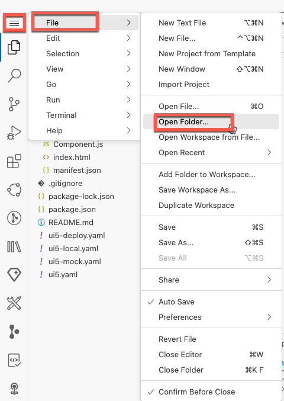

---

### Step 17: Open the Storyboard and Page Map

In the **Storyboard**, hover over the `zlabelprint` application card and click **Open in Page Map**.

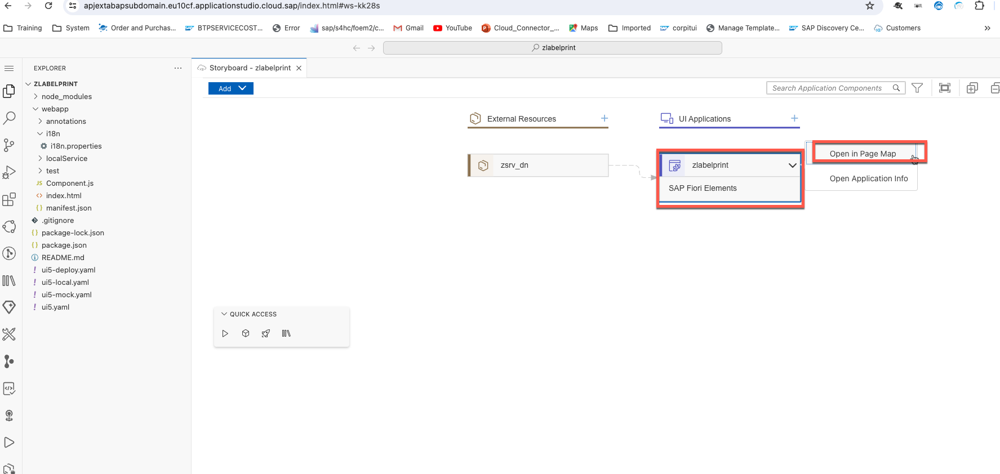

The Page Map shows the three-page hierarchy: **List Report (ZOBJ_DN)** → **Object Page (ZOBJ_DN)** → **Object Page (ZOBJ_DN_ITEMS)**.

---

### Step 18: Add a Controller Extension to the Items Object Page

In the Page Map, click the **edit** (pencil) icon on the bottom **Object Page** (`ZOBJ_DN_ITEMSObjectPage`).

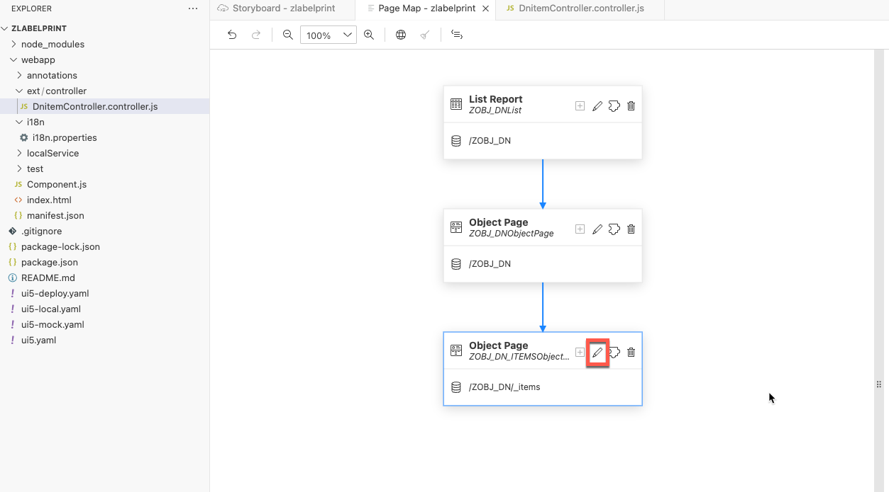

In the **Page Editor** right panel, scroll to **Controller Extensions** for `#ZOBJ_DN_ITEMSObjectPage` and click **Add Controller Extension**.

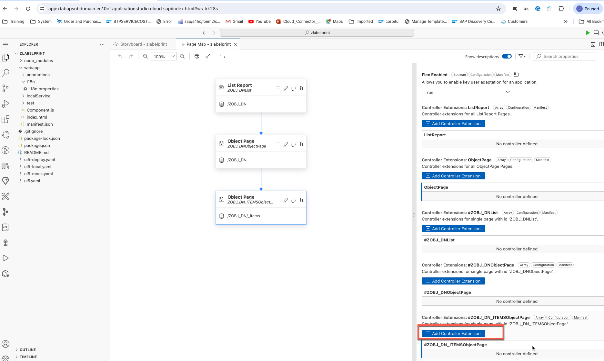

In the **Add Controller Extension** dialog, enter the controller name and click **Add**.

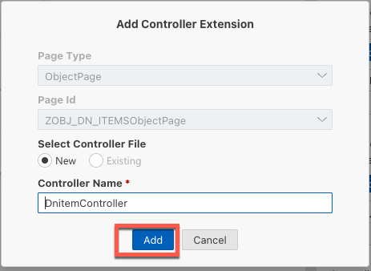

| Field | Value |
|-------|-------|
| Page Type | `ObjectPage` |
| Page Id | `ZOBJ_DN_ITEMSObjectPage` |
| Select Controller File | `New` |
| Controller Name | `DnitemController` |

BAS creates `webapp/ext/controller/DnitemController.controller.js` and opens it.

---

### Step 19: Replace the Controller Code

Replace the entire content of `DnitemController.controller.js` with the following, then save.

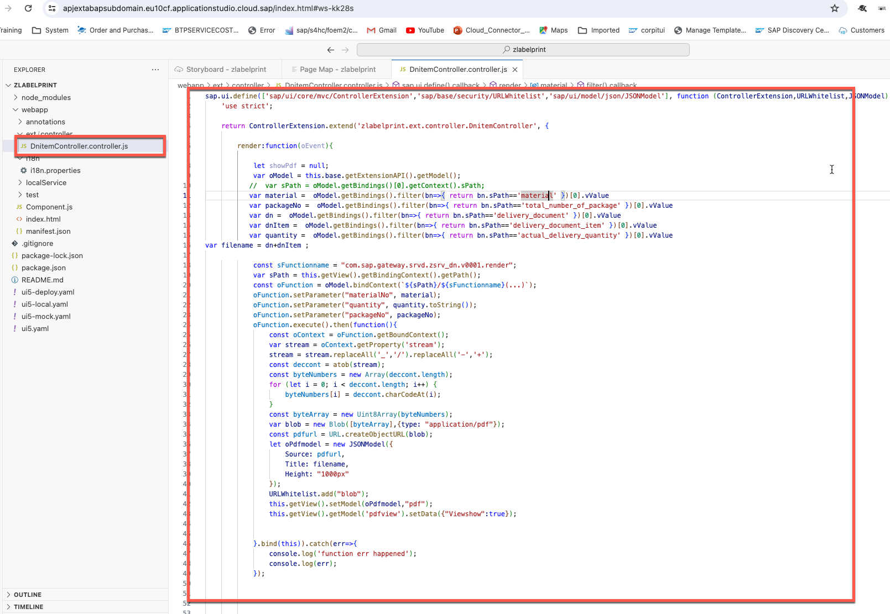

```javascript
sap.ui.define(['sap/ui/core/mvc/ControllerExtension','sap/base/security/URLWhitelist','sap/ui/model/json/JSONModel'], function (ControllerExtension,URLWhitelist,JSONModel) {
	'use strict';

	return ControllerExtension.extend('zlabelprint.ext.controller.DnitemController', {
		// this section allows to extend lifecycle hooks or hooks provided by Fiori elements
		render:function(oEvent){

			let showPdf = null;
			var oModel = this.base.getExtensionAPI().getModel();
		   //  var sPath = oModel.getBindings()[0].getContext().sPath;
		   var material =  oModel.getBindings().filter(bn=>{ return bn.sPath=='material' })[0].vValue
		   var packageNo =  oModel.getBindings().filter(bn=>{ return bn.sPath=='total_number_of_package' })[0].vValue
		   var dn =  oModel.getBindings().filter(bn=>{ return bn.sPath=='delivery_document' })[0].vValue
		   var dnItem =  oModel.getBindings().filter(bn=>{ return bn.sPath=='delivery_document_item' })[0].vValue
		   var quantity =  oModel.getBindings().filter(bn=>{ return bn.sPath=='actual_delivery_quantity' })[0].vValue
var filename = dn+dnItem ;

			const sFunctionname = "com.sap.gateway.srvd.zsrv_dn.v0001.render";
			var sPath = this.getView().getBindingContext().getPath();
			const oFunction = oModel.bindContext(`${sPath}/${sFunctionname}(...)`);
			oFunction.setParameter("materialNo", material);
			oFunction.setParameter("quantity", quantity.toString());
			oFunction.setParameter("packageNo", packageNo);
		    oFunction.execute().then(function(){
				const oContext = oFunction.getBoundContext();
				var stream = oContext.getProperty('stream');
				stream = stream.replaceAll('_','/').replaceAll('-','+');
				const deccont = atob(stream);			
				const byteNumbers = new Array(deccont.length);
				for (let i = 0; i < deccont.length; i++) {
					byteNumbers[i] = deccont.charCodeAt(i);
				}
				const byteArray = new Uint8Array(byteNumbers);
				var blob = new Blob([byteArray],{type: "application/pdf"});
				const pdfurl = URL.createObjectURL(blob);
				let oPdfmodel = new JSONModel({
					Source: pdfurl,
					Title: filename,
					Height: "1000px"
				});
				URLWhitelist.add("blob");
				this.getView().setModel(oPdfmodel,"pdf");
				this.getView().getModel('pdfview').setData({"Viewshow":true});


			}.bind(this)).catch(err=>{
				console.log('function err happened');
				console.log(err);
			});


		},
		override: {
			/**
             * Called when a controller is instantiated and its View controls (if available) are already created.
             * Can be used to modify the View before it is displayed, to bind event handlers and do other one-time initialization.
             * @memberOf zlabelprint.ext.controller.DnitemController
             */
			onInit: function () {
				// you can access the Fiori elements extensionAPI via this.base.getExtensionAPI
				var oModel = this.base.getExtensionAPI().getModel();
				let oPdfview = new JSONModel({
					Viewshow: false
				});

				this.getView().setModel(oPdfview,"pdfview");
			},
			routing:{
				onAfterRendering: function(){
					let oPdfview = new JSONModel({
						Viewshow: false
					});
	
					this.getView().setModel(oPdfview,"pdfview");
	
				}
			}
		}
	});
});
```

---

## Part 4: Add the Custom PDF Viewer Section and Custom Action

### Step 20: Add a Custom Section to the Items Object Page

In the **Page Editor** for `ZOBJ_DN_ITEMSObjectPage`, scroll to **Sections**, click the **+** icon, and select **Add Custom Section**.

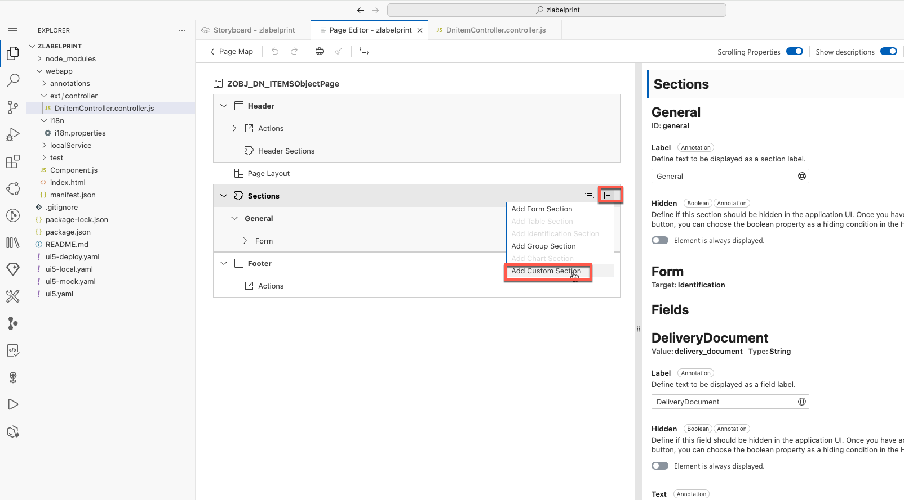

Fill in the **Add Custom Section** dialog as follows and click **Add**.

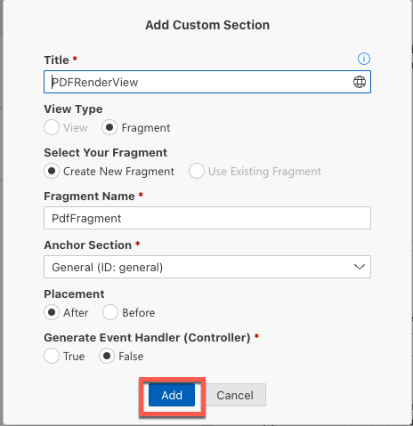

| Field | Value |
|-------|-------|
| Title | `PDFRenderView` |
| View Type | `Fragment` |
| Select Your Fragment | `Create New Fragment` |
| Fragment Name | `PdfFragment` |
| Anchor Section | `General (ID: general)` |
| Placement | `After` |
| Generate Event Handler (Controller) | `False` |

---

### Step 21: Replace the Fragment Code

BAS creates `webapp/ext/fragment/PdfFragment.fragment.xml`. Replace its entire content with the following, then save.

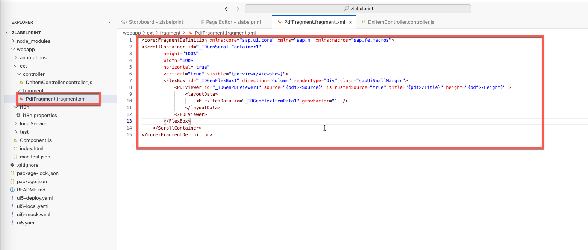

```xml
<core:FragmentDefinition xmlns:core="sap.ui.core" xmlns="sap.m" xmlns:macros="sap.fe.macros">
<ScrollContainer id="_IDGenScrollContainer1"
		height="100%"
		width="100%"
		horizontal="true"
		vertical="true" visible="{pdfview>/Viewshow}">
		<FlexBox id="_IDGenFlexBox1" direction="Column" renderType="Div" class="sapUiSmallMargin">
			<PDFViewer id="_IDGenPDFViewer1" source="{pdf>/Source}" isTrustedSource="true" title="{pdf>/Title}" height="{pdf>/Height}" >
				<layoutData>
					<FlexItemData id="_IDGenFlexItemData1" growFactor="1" />
				</layoutData>
			</PDFViewer>
		</FlexBox>
	</ScrollContainer>
</core:FragmentDefinition>
```

---

### Step 22: Add a Custom Action Button

In the **Page Editor** for `ZOBJ_DN_ITEMSObjectPage`, go to **Header → Actions**, click the **+** icon, and select **Add Custom Action**.

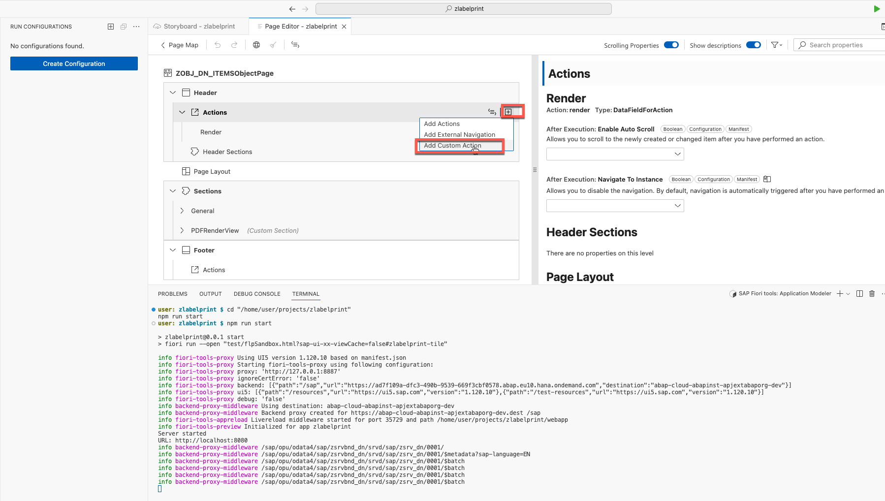

Fill in the **New Custom Action** dialog as follows and click **Add**.

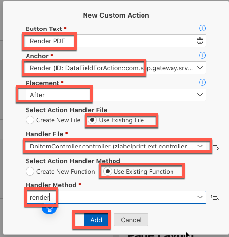

| Field | Value |
|-------|-------|
| Button Text | `Render PDF` |
| Anchor | `Render (ID: DataFieldForAction::com.sap.gateway.srv...)` |
| Placement | `After` |
| Select Action Handler File | `Use Existing File` |
| Handler File | `DnitemController.controller` (`zlabelprint.ext.controller...`) |
| Select Action Handler Method | `Use Existing Function` |
| Handler Method | `render` |

---

## Part 5: Enable Flexible Column Layout

In the **Page Map**, select the root application node. In the properties panel on the right, find **Flexible Column Layout** and set it to **Enabled**.

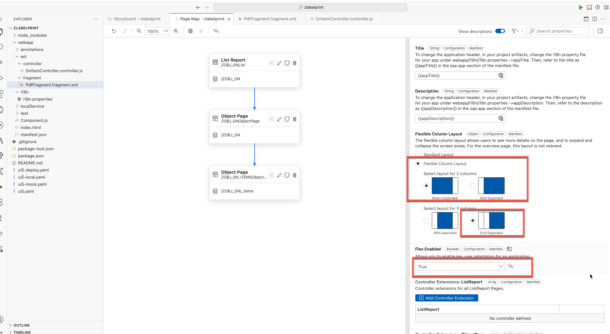

The Flexible Column Layout displays the List Report and Object Page side-by-side so users can see the PDF viewer alongside the delivery list.

---

## Part 6: Preview the Application

### Step 23: Open Application Info

From the **Storyboard**, hover over the `zlabelprint` card and click **Open Application Info**.

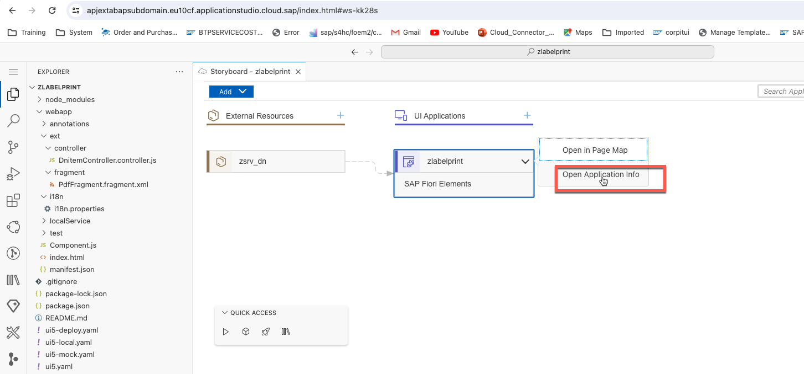

---

### Step 24: Start the Preview

In the **Application Info** panel, click **Preview Application**.

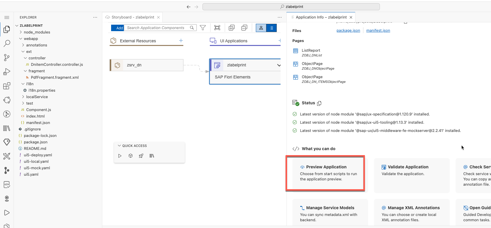

From the preview options dropdown, select the **NPM Script** that uses `ui5-mock.yaml` (or `ui5-local.yaml` to connect to the live backend), then confirm.

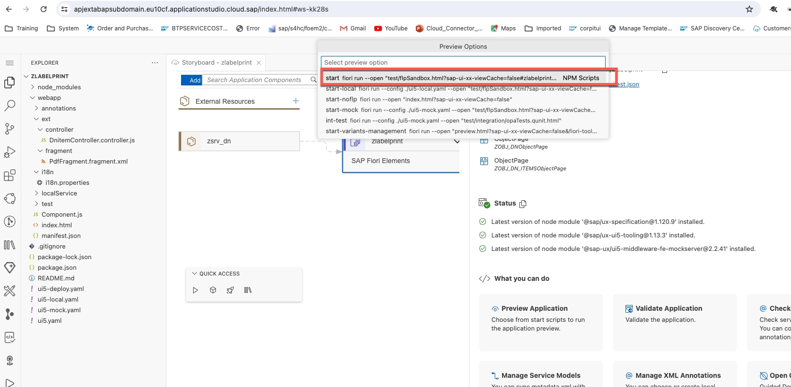

BAS starts a local server and opens the app in a new browser tab.

---

### Step 25: Test the Application

The app opens with the **Outbound Delivery Application** List Report. Click **Go** to load deliveries.

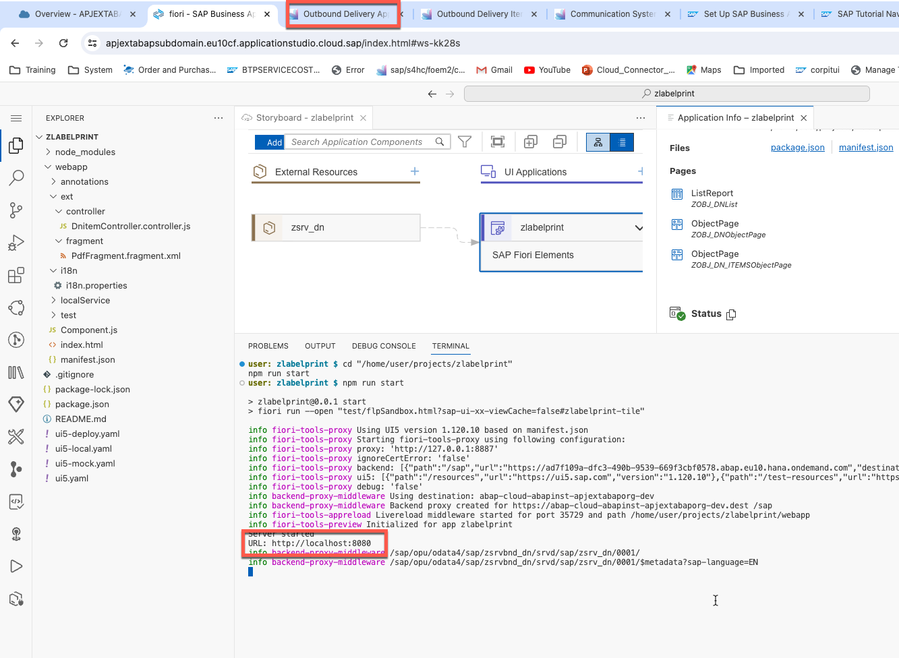

Select a delivery row to open its Object Page, then click on a delivery item to open the items Object Page. Click **Render PDF** to trigger the label print action. The rendered PDF appears in the **PDFRenderView** section on the right.

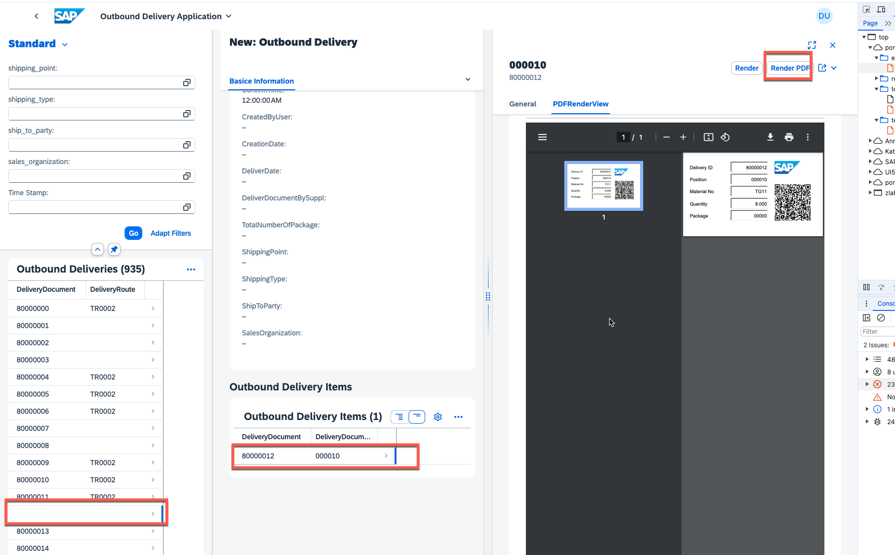

---

## Result

The Fiori Elements application `zlabelprint` is running in BAS with:

- A **List Report** on `ZOBJ_DN` showing outbound deliveries from S/4HANA Cloud
- An **Object Page** on `ZOBJ_DN_ITEMS` showing delivery items
- A **Render PDF** button that calls the `render` OData function and displays the returned PDF inline

In **Exercise 14**, you will deploy this application to the BTP ABAP Environment Fiori Launchpad so that it is accessible to business users.
