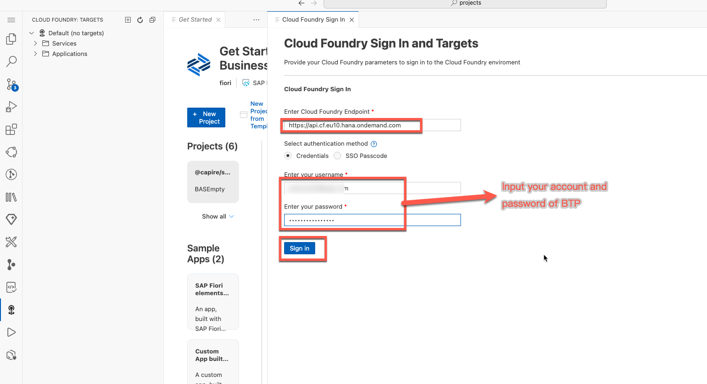
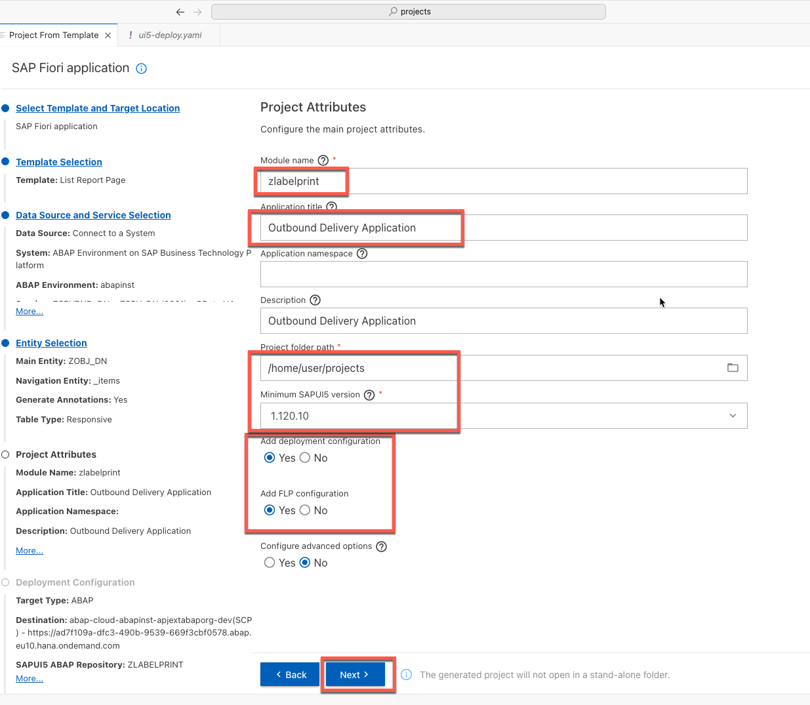
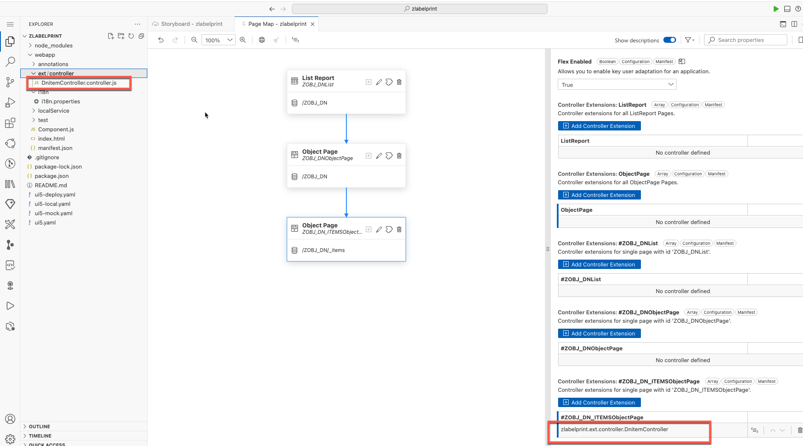

### Prerequisites:

- [Set Up SAP Business Application Studio for Development in the same BTP subaccount](https://developers.sap.com/tutorials/appstudio-devspace-fiori-create.html)
- The following roles has been assigned to your user account in BTP subaccount.

- [Create a Dev Space for SAP Fiori Apps](https://developers.sap.com/tutorials/appstudio-devspace-fiori-create.html)


### 1. Login into SAP BTP cloud foundry in BAS.


Get API endpoint of cloud foundry in BTP Subaccount which include the BTP ABAP Environment.




### 2. Create new Fiori project with from template in BAS.





### 3. Adjust the Fiori project to add controller extension in BAS.


Input the controller name  **DnitemController**




Update the controller's code like the following:


```
sap.ui.define(['sap/ui/core/mvc/ControllerExtension','sap/base/security/URLWhitelist','sap/ui/model/json/JSONModel'], function (ControllerExtension,URLWhitelist,JSONModel) {
	'use strict';

	return ControllerExtension.extend('zlabelprint.ext.controller.DnitemController', {
		// this section allows to extend lifecycle hooks or hooks provided by Fiori elements
		render:function(oEvent){

			let showPdf = null;
			var oModel = this.base.getExtensionAPI().getModel();
		   //  var sPath = oModel.getBindings()[0].getContext().sPath;
		   var material =  oModel.getBindings().filter(bn=>{ return bn.sPath=='material' })[0].vValue
		   var packageNo =  oModel.getBindings().filter(bn=>{ return bn.sPath=='total_number_of_package' })[0].vValue
		   var dn =  oModel.getBindings().filter(bn=>{ return bn.sPath=='delivery_document' })[0].vValue
		   var dnItem =  oModel.getBindings().filter(bn=>{ return bn.sPath=='delivery_document_item' })[0].vValue
		   var quantity =  oModel.getBindings().filter(bn=>{ return bn.sPath=='actual_delivery_quantity' })[0].vValue
var filename = dn+dnItem ;

			const sFunctionname = "com.sap.gateway.srvd.zsrv_dn.v0001.render";
			var sPath = this.getView().getBindingContext().getPath();
			const oFunction = oModel.bindContext(`${sPath}/${sFunctionname}(...)`);
			oFunction.setParameter("materialNo", material);
			oFunction.setParameter("quantity", quantity.toString());
			oFunction.setParameter("packageNo", packageNo);
		    oFunction.execute().then(function(){
				const oContext = oFunction.getBoundContext();
				var stream = oContext.getProperty('stream');
				stream = stream.replaceAll('_','/').replaceAll('-','+');
				const deccont = atob(stream);			
				const byteNumbers = new Array(deccont.length);
				for (let i = 0; i < deccont.length; i++) {
					byteNumbers[i] = deccont.charCodeAt(i);
				}
				const byteArray = new Uint8Array(byteNumbers);
				var blob = new Blob([byteArray],{type: "application/pdf"});
				const pdfurl = URL.createObjectURL(blob);
				let oPdfmodel = new JSONModel({
					Source: pdfurl,
					Title: filename,
					Height: "1000px"
				});
				URLWhitelist.add("blob");
				this.getView().setModel(oPdfmodel,"pdf");
				this.getView().getModel('pdfview').setData({"Viewshow":true});


			}.bind(this)).catch(err=>{
				console.log('function err happened');
				console.log(err);
			});


		},
		override: {
			/**
             * Called when a controller is instantiated and its View controls (if available) are already created.
             * Can be used to modify the View before it is displayed, to bind event handlers and do other one-time initialization.
             * @memberOf zlabelprint.ext.controller.DnitemController
             */
			onInit: function () {
				// you can access the Fiori elements extensionAPI via this.base.getExtensionAPI
				var oModel = this.base.getExtensionAPI().getModel();
				let oPdfview = new JSONModel({
					Viewshow: false
				});

				this.getView().setModel(oPdfview,"pdfview");
			},
			routing:{
				onAfterRendering: function(){
					let oPdfview = new JSONModel({
						Viewshow: false
					});
	
					this.getView().setModel(oPdfview,"pdfview");
	
				}
			}
		}
	});
});
```

### 4. Adjust the Fiori project to add customer fragment and Custom Action in BAS.


Update the fragment code like the following:

```
<core:FragmentDefinition xmlns:core="sap.ui.core" xmlns="sap.m" xmlns:macros="sap.fe.macros">
<ScrollContainer id="_IDGenScrollContainer1"
		height="100%"
		width="100%"
		horizontal="true"
		vertical="true" visible="{pdfview>/Viewshow}">
		<FlexBox id="_IDGenFlexBox1" direction="Column" renderType="Div" class="sapUiSmallMargin">
			<PDFViewer id="_IDGenPDFViewer1" source="{pdf>/Source}" isTrustedSource="true" title="{pdf>/Title}" height="{pdf>/Height}" >
				<layoutData>
					<FlexItemData id="_IDGenFlexItemData1" growFactor="1" />
				</layoutData>
			</PDFViewer>
		</FlexBox>
	</ScrollContainer>
</core:FragmentDefinition>

```


### 5. Adjust the Fiori project to Flexible Column Layout in BAS.


### 6. Preview the application in BAS.


