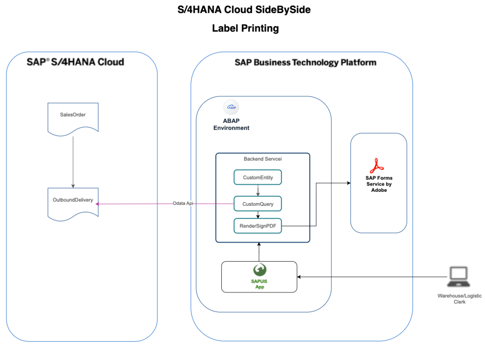

## S/4HANA Cloud side by side label printing in BTP ABAP Environment.

### Architecture:

### [Demo](/demo.mp4)

### [Excercise 01 Configure  for SAP Forms Service by Adobe](/Excercise%2001%20Configure%20%20for%20SAP%20Forms%20Service%20by%20Adobe/README.md)

### [Excercise 02 Configure in ABAP Environment](/Excercise%2002%20Configure%20in%20ABAP%20Environment/README.md)

### [Excercise 03 Set Up SAP Destination service](/Excercise%2003%20Set%20Up%20SAP%20Destination%20service%20/README.md)

### [Excercise 04 Create Package in Eclipse](/Excercise%2004%20%20Create%20Package%20%20in%20Eclipse/README.md)

### [Excercise 05 Create  Custom Entity for Outbound Delivery Header and Items](/Excercise%2005%20%20Create%20%20Custom%20Entity%20for%20Outbound%20Delivery%20Header%20and%20Items/README.md)

### [Excercise 06 Configure Communication in 4/HANA Cloud to Expose Outbound Delivery API](/Excercise%2006%20Confiure%20Communication%20in%20S4HANA%20Cloud%20to%20Expose%20Outbound%20Delivery%20API/README.md)

### [Excercise 07 Create Service Consumption Model for Outbound Delivery API in Eclipse](/Excercise%2007%20Create%20Service%20Consumption%20Model%20for%20Outbound%20Delivery%20API%20in%20Eclipse/README.md)

### [Excercise 08 Create Outbound Service and Communication Arrangement in Eclipse](/Excercise%2008%20%20Create%20Outbound%20Service%20and%20Communication%20Arrangement%20in%20Eclipse/README.md)

### [Excercise 09 Configure Communication in BTP ABAP environment](/Excercise%2009%20%20Configure%20Communication%20in%20BTP%20ABAP%20environment/README.md)

### [Excercise 10 Create query class ZCL_DN_QUERY in Eclipse](/Excercise%2010%20Create%20query%20class%20ZCL_DN_QUERY%20in%20Eclipse/README.md)

### [Excercise 11 Create behavior definition for data definition ZOBJ_DN in Eclipse](/Excercise%2011%20Create%20behavior%20definition%20for%20data%20definition%20ZOBJ_DN%20in%20Eclipse/README.md)

### [Excercise 12 Create service definition and service binding in Eclipse](/Excercise%2012%20Create%20service%20definition%20and%20service%20binding%20in%20Eclipse/README.md)

### [Excercise 13 Create Fiori Application in BTP Business Application Studio](/Excercise%2013%20Create%20Fiori%20Application%20in%20BTP%20Business%20Application%20Studio/README.md)

### [Excercise 14 Deploy the Fiori application to BTP ABAP Environment](/Excercise%2014%20Deploy%20the%20fiori%20application%20to%20BTP%20ABAP%20Environment/README.md)
